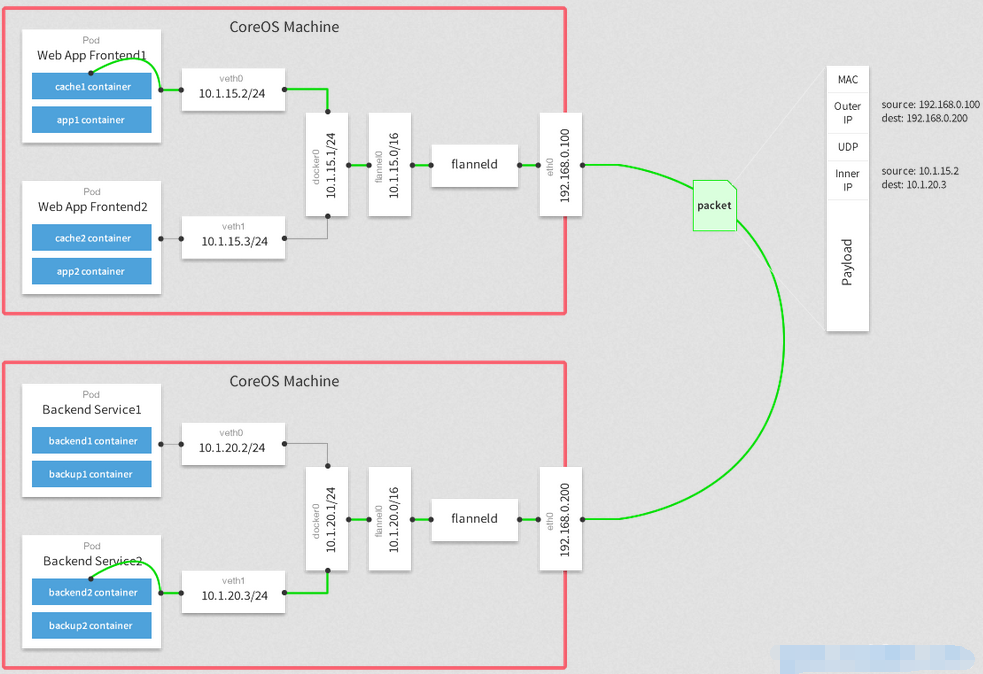

## flannel 网络介绍

### 工作原理

Flannel为每个host分配一个subnet，容器从这个subnet中分配IP，这些IP可以在host间路由，容器间无需使用nat和端口映射即可实现跨主机通信。

每个subnet都是从一个更大的IP池中划分的，flannel会在每个主机上运行一个叫flanneld的agent，其职责就是从池子中分配subnet。

Flannel使用etcd存放网络配置、已分配 的subnet、host的IP等信息。

Flannel数据包在主机间转发是由backend实现的，目前已经支持UDP、VxLAN、host-gw、AWS VPC和GCE路由等多种backend。

### 数据转发流程



1. 容器直接使用目标容器的ip访问，默认通过容器内部的eth0发送出去。
2. 报文通过veth pair被发送到vethXXX。
3. vethXXX是直接连接到虚拟交换机docker0的，报文通过虚拟bridge docker0发送出去。
4. 查找路由表，外部容器ip的报文都会转发到flannel0虚拟网卡，这是一个P2P的虚拟网卡，然后报文就被转发到监听在另一端的flanneld。
5. flanneld通过etcd维护了各个节点之间的路由表，把原来的报文UDP封装一层，通过配置的iface发送出去。
6. 报文通过主机之间的网络找到目标主机。
7. 报文继续往上，到传输层，交给监听在8285端口的flanneld程序处理。
8. 数据被解包，然后发送给flannel0虚拟网卡。
9. 查找路由表，发现对应容器的报文要交给docker0。
10. docker0找到连到自己的容器，把报文发送过去。

## 环境搭建(vxlan)

### 环境介绍

| 主机名   | IP             | 系统            | 安装软件        |
| -------- | -------------- | --------------- | --------------- |
| host1    | 192.168.120.71 | Centos 7.4.1708 | docker、flannel |
| host2    | 192.168.120.72 | Centos 7.4.1708 | docker、flannel |
| C7-node3 | 192.168.120.73 | Centos 7.4.1708 | etcd            |

### 安装配置 etcd

```shell
# yum install -y etcd
# vim /etc/etcd/etcd.conf
......
ETCD_LISTEN_CLIENT_URLS="http://192.168.120.73:2379"
......
ETCD_ADVERTISE_CLIENT_URLS="http://192.168.120.73:2379"
# systemctl start etcd
# etcdctl --endpoints http://192.168.120.73:2379 set foo "bar"  
bar
# etcdctl --endpoints http://192.168.120.73:2379 get foo
bar
# etcdctl -version      
etcdctl version: 3.3.11
API version: 2
```

### 安装配置 flannel

```shell
# wget https://github.com/coreos/flannel/releases/download/v0.11.0/flannel-v0.11.0-linux-amd64.tar.gz
# tar -xf flannel-v0.11.0-linux-amd64.tar.gz
# scp flanneld root@192.168.120.71:/usr/local/bin/
# scp flanneld root@192.168.120.72:/usr/local/bin/
# vim flannel-config.json
{
  "Network": "10.2.0.0/16",
  "SubnetLen": 24,
  "Backend": {
    "Type": "vxlan"
  }
}
```

配置文件说明：

1. Network  定义该网络的 IP 池为 `10.2.0.0/16`。
2. SubnetLen  指定每个主机分配到的 subnet 大小为 24 位，即`10.2.X.0/24`。
3. `Backend` 为 `vxlan`，即主机间通过 vxlan 通信，后面我们还会讨论`host-gw`。

配置写入 etcd 中：

```shell
# etcdctl --endpoints http://192.168.120.73:2379 set /docker-test/network/config < flannel-config.json
```

`/docker-test/network/config` 是此 etcd 数据项的 key，其 value 为 flannel-config.json 的内容。key 可以任意指定，这个 key 后面会作为 flanneld 的一个启动参数。执行 `etcdctl get` 确保设置成功。

```shell
[root@C7-node3 ~]# etcdctl --endpoints http://192.168.120.73:2379 get /docker-test/network/config
{
  "Network": "10.2.0.0/16",
  "SubnetLen": 24,
  "Backend": {
    "Type": "vxlan"
  }
}
```

### 启动flannel

在host1和host2主机执行相同的操作：

```shell
[root@host1 ~]# flanneld -etcd-endpoints http://192.168.120.73:2379 -iface ens33 -etcd-prefix /docker-test/network
I0726 11:13:05.859403    1460 main.go:527] Using interface with name ens33 and address 192.168.120.71
I0726 11:13:05.859504    1460 main.go:544] Defaulting external address to interface address (192.168.120.71)
I0726 11:13:05.859998    1460 main.go:244] Created subnet manager: Etcd Local Manager with Previous Subnet: None
I0726 11:13:05.860016    1460 main.go:247] Installing signal handlers
I0726 11:13:05.868811    1460 main.go:386] Found network config - Backend type: vxlan
I0726 11:13:05.868920    1460 vxlan.go:120] VXLAN config: VNI=1 Port=0 GBP=false DirectRouting=false
I0726 11:13:05.921683    1460 local_manager.go:147] Found lease (10.2.40.0/24) for current IP (192.168.120.71), reusing
I0726 11:13:05.933097    1460 main.go:317] Wrote subnet file to /run/flannel/subnet.env
I0726 11:13:05.933122    1460 main.go:321] Running backend.
I0726 11:13:05.948346    1460 vxlan_network.go:60] watching for new subnet leases
I0726 11:13:05.950826    1460 iptables.go:145] Some iptables rules are missing; deleting and recreating rules
I0726 11:13:05.950902    1460 iptables.go:167] Deleting iptables rule: -s 10.2.0.0/16 -j ACCEPT
I0726 11:13:05.952662    1460 iptables.go:167] Deleting iptables rule: -d 10.2.0.0/16 -j ACCEPT
I0726 11:13:05.954154    1460 iptables.go:155] Adding iptables rule: -s 10.2.0.0/16 -j ACCEPT
I0726 11:13:05.960315    1460 iptables.go:155] Adding iptables rule: -d 10.2.0.0/16 -j ACCEPT
I0726 11:13:05.963541    1460 main.go:429] Waiting for 22h59m59.955725427s to renew lease
[root@host1 ~]# ip addr show flannel.1 
4: flannel.1: <BROADCAST,MULTICAST,UP,LOWER_UP> mtu 1450 qdisc noqueue state UNKNOWN group default 
    link/ether 52:16:f9:8f:ae:68 brd ff:ff:ff:ff:ff:ff
    inet 10.2.40.0/32 scope global flannel.1
       valid_lft forever preferred_lft forever
    inet6 fe80::5016:f9ff:fe8f:ae68/64 scope link 
       valid_lft forever preferred_lft forever
[root@host1 ~]# ip route list 
default via 192.168.120.2 dev ens33 proto static metric 100 
10.2.40.0/24 dev docker0 proto kernel scope link src 10.2.40.1 
10.2.90.0/24 via 10.2.90.0 dev flannel.1 onlink 
192.168.120.0/24 dev ens33 proto kernel scope link src 192.168.120.71 metric 100 
```

```shell
[root@host2 ~]# flanneld -etcd-endpoints http://192.168.120.73:2379 -iface ens33 -etcd-prefix /docker-test/network
I0726 11:13:15.557602    1451 main.go:527] Using interface with name ens33 and address 192.168.120.72
I0726 11:13:15.557804    1451 main.go:544] Defaulting external address to interface address (192.168.120.72)
I0726 11:13:15.558203    1451 main.go:244] Created subnet manager: Etcd Local Manager with Previous Subnet: None
I0726 11:13:15.558231    1451 main.go:247] Installing signal handlers
I0726 11:13:15.563978    1451 main.go:386] Found network config - Backend type: vxlan
I0726 11:13:15.564107    1451 vxlan.go:120] VXLAN config: VNI=1 Port=0 GBP=false DirectRouting=false
I0726 11:13:15.595320    1451 local_manager.go:147] Found lease (10.2.90.0/24) for current IP (192.168.120.72), reusing
I0726 11:13:15.602313    1451 main.go:317] Wrote subnet file to /run/flannel/subnet.env
I0726 11:13:15.602332    1451 main.go:321] Running backend.
I0726 11:13:15.612115    1451 iptables.go:145] Some iptables rules are missing; deleting and recreating rules
I0726 11:13:15.612220    1451 iptables.go:167] Deleting iptables rule: -s 10.2.0.0/16 -j ACCEPT
I0726 11:13:15.617103    1451 iptables.go:167] Deleting iptables rule: -d 10.2.0.0/16 -j ACCEPT
I0726 11:13:15.618573    1451 vxlan_network.go:60] watching for new subnet leases
I0726 11:13:15.619575    1451 iptables.go:155] Adding iptables rule: -s 10.2.0.0/16 -j ACCEPT
I0726 11:13:15.627148    1451 iptables.go:155] Adding iptables rule: -d 10.2.0.0/16 -j ACCEPT
I0726 11:13:15.632376    1451 main.go:429] Waiting for 22h59m59.958828598s to renew lease
[root@host2 ~]# ip addr show flannel.1 
4: flannel.1: <BROADCAST,MULTICAST,UP,LOWER_UP> mtu 1450 qdisc noqueue state UNKNOWN group default 
    link/ether 06:3b:8d:23:7b:f1 brd ff:ff:ff:ff:ff:ff
    inet 10.2.90.0/32 scope global flannel.1
       valid_lft forever preferred_lft forever
    inet6 fe80::43b:8dff:fe23:7bf1/64 scope link 
       valid_lft forever preferred_lft forever
[root@host2 ~]# ip route list 
default via 192.168.120.2 dev ens33 proto static metric 100 
10.2.40.0/24 via 10.2.40.0 dev flannel.1 onlink 
10.2.90.0/24 dev docker0 proto kernel scope link src 10.2.90.1 
192.168.120.0/24 dev ens33 proto kernel scope link src 192.168.120.72 metric 100 
```

flannel 启动时做了如下的操作：

* 从etcd中获取network的配置信息
* 划分subnet，并在etcd中进行注册
* 将子网信息记录到`/run/flannel/subnet.env`中

### 配置Docker

host1 和 host2 主机分别执行如下操作：

```shell
[root@host1 ~]# cat /run/flannel/subnet.env 
FLANNEL_NETWORK=10.2.0.0/16
FLANNEL_SUBNET=10.2.40.1/24
FLANNEL_MTU=1450
FLANNEL_IPMASQ=false
[root@host1 ~]# cat /etc/systemd/system/docker.service.d/10-machine.conf 
[Service]
ExecStart=
ExecStart=/usr/bin/dockerd -H tcp://0.0.0.0:2376 -H unix:///var/run/docker.sock --storage-driver overlay2 --tlsverify --tlscacert /etc/docker/ca.pem --tlscert /etc/docker/server.pem --tlskey /etc/docker/server-key.pem --label provider=generic --registry-mirror https://2980aqtg.mirror.aliyuncs.com --bip=10.2.40.1/24 --mtu=1450
Environment=
```

```shell
[root@host2 ~]# cat /run/flannel/subnet.env 
FLANNEL_NETWORK=10.2.0.0/16
FLANNEL_SUBNET=10.2.90.1/24
FLANNEL_MTU=1450
FLANNEL_IPMASQ=false
[root@host2 ~]# cat /etc/systemd/system/docker.service.d/10-machine.conf 
[Service]
ExecStart=
ExecStart=/usr/bin/dockerd -H tcp://0.0.0.0:2376 -H unix:///var/run/docker.sock --storage-driver overlay2 --tlsverify --tlscacert /etc/docker/ca.pem --tlscert /etc/docker/server.pem --tlskey /etc/docker/server-key.pem --label provider=generic --registry-mirror https://2980aqtg.mirror.aliyuncs.com --bip=10.2.90.1/24 --mtu=1450
Environment=
```

**注意：**
上述配置中 `--bip` 和 `--mtu` 这两个参数的值必须与 /run/flannel/subnet.env 中 `FLANNEL_SUBNET` 和`FLANNEL_MTU` 一致。

重新载入配置文件并重启docker：

```shell
systemctl daemon-reload
systemctl daemon-reload
```

### 容器连接到 flannel 网络

```shell

[root@host1 ~]# docker run -itd --name busybox_1 busybox
[root@host1 ~]# docker exec busybox_1 ip r
default via 10.2.40.1 dev eth0 
10.2.40.0/24 dev eth0 scope link  src 10.2.40.2 
```

```shell
[root@host2 ~]# docker run -itd --name busybox_2 busybox
[root@host2 ~]# docker exec busybox_2 ip r
default via 10.2.90.1 dev eth0 
10.2.90.0/24 dev eth0 scope link  src 10.2.90.2 
```

### flannel 网络的连通

```shell
[root@host1 ~]# docker exec busybox_1 ping -c 1 10.2.90.2 
PING 10.2.90.2 (10.2.90.2): 56 data bytes
64 bytes from 10.2.90.2: seq=0 ttl=62 time=9.314 ms
[root@host2 ~]# docker exec busybox_2 ping -c 1 10.2.40.2 
PING 10.2.40.2 (10.2.40.2): 56 data bytes
64 bytes from 10.2.40.2: seq=0 ttl=62 time=6.871 ms
```

busybox_1  能够 ping 到位于不同 subnet 的 busybox_2 ，通过 `traceroute` 查看一下路由：

```shell
[root@host1 ~]# docker exec busybox_1 traceroute 10.2.90.2       
traceroute to 10.2.90.2 (10.2.90.2), 30 hops max, 46 byte packets
 1  10.2.40.1 (10.2.40.1)  0.012 ms  0.014 ms  0.008 ms
 2  10.2.90.0 (10.2.90.0)  2.794 ms  2.536 ms  3.843 ms
 3  10.2.90.2 (10.2.90.2)  0.335 ms  0.054 ms  0.009 ms
```

busybox_1 和 busybox_2 不是在同一个 subnet，通过路由可以查看到数据包默认是发送到网关 10.2.40.1 （docker0），之后根据目标地址的不同使用不同的路由。而由于目标地址是 10.2.90.2 则数据包会发送到flannel.1。

```shell
[root@host1 ~]# ip r
default via 192.168.120.2 dev ens33 proto static metric 100 
10.2.40.0/24 dev docker0 proto kernel scope link src 10.2.40.1 
10.2.90.0/24 via 10.2.90.0 dev flannel.1 onlink 
192.168.120.0/24 dev ens33 proto kernel scope link src 192.168.120.71 metric 100 
```

通过查询etcd中的数据，找到10.2.90.0/24 对应的地址为host2。flannel.1 将数据包封装成 VxLAN，通过 ens33 发送给 host2。

```shell
[root@C7-node3 ~]# /usr/bin/etcdctl --endpoints http://192.168.120.73:2379 get  /docker-test/network/subnets/10.2.90.0-24
{"PublicIP":"192.168.120.72","BackendType":"vxlan","BackendData":{"VtepMAC":"7a:fb:c9:9a:b2:60"}}
```

host2 收到包解封装，发现数据包目的地址为 10.2.90.2，根据路由表将数据包发送给 flannel.1，并通过 docker0 到达 busybox_2。

```shell
[root@host2 ~]# ip r
default via 192.168.120.2 dev ens33 proto static metric 100 
10.2.40.0/24 via 10.2.40.0 dev flannel.1 onlink 
10.2.90.0/24 dev docker0 proto kernel scope link src 10.2.90.1 
192.168.120.0/24 dev ens33 proto kernel scope link src 192.168.120.72 metric 100 
```

## 环境搭建（host-gw）

与 vxlan 不同，host-gw 不会封装数据包，而是在主机的路由表中创建到其他主机 subnet 的路由条目，从而实现容器跨主机通信。

### etcd 配置修改

使用 host-gw 首先修改 flannel 的配置 flannel-config.json：

```shell
[root@C7-node3 ~]# cat flannel-config.json
{
  "Network": "10.2.0.0/16",
  "SubnetLen": 24,
  "Backend": {
    "Type": "host-gw"
  }
}
```

更新 etcd 数据库：

```shell
[root@C7-node3 ~]# etcdctl --endpoints http://192.168.120.73:2379  set /docker-test/network/config < flannel-config.json
{
  "Network": "10.2.0.0/16",
  "SubnetLen": 24,
  "Backend": {
    "Type": "host-gw"
  }
}
```

关闭  host1 和 host2 的 flanneld 进程并重启：

```shell
[root@host1 ~]# flanneld -etcd-endpoints http://192.168.120.73:2379 -iface ens33 -etcd-prefix /docker-test/network
I0729 14:55:15.290874    3622 main.go:527] Using interface with name ens33 and address 192.168.120.71
I0729 14:55:15.290984    3622 main.go:544] Defaulting external address to interface address (192.168.120.71)
I0729 14:55:15.291760    3622 main.go:244] Created subnet manager: Etcd Local Manager with Previous Subnet: 10.2.40.0/24
I0729 14:55:15.291771    3622 main.go:247] Installing signal handlers
I0729 14:55:15.295995    3622 main.go:386] Found network config - Backend type: host-gw
I0729 14:55:15.299711    3622 local_manager.go:147] Found lease (10.2.40.0/24) for current IP (192.168.120.71), reusing
I0729 14:55:15.303754    3622 main.go:317] Wrote subnet file to /run/flannel/subnet.env
I0729 14:55:15.303786    3622 main.go:321] Running backend.
I0729 14:55:15.313070    3622 route_network.go:53] Watching for new subnet leases
I0729 14:55:15.314174    3622 main.go:429] Waiting for 22h59m59.986810016s to renew lease
I0729 14:55:15.316883    3622 route_network.go:85] Subnet added: 10.2.90.0/24 via 192.168.120.72
W0729 14:55:15.316937    3622 route_network.go:88] Ignoring non-host-gw subnet: type=vxlan
I0729 14:55:26.869228    3622 route_network.go:85] Subnet added: 10.2.90.0/24 via 192.168.120.72
W0729 14:55:26.869714    3622 route_network.go:102] Replacing existing route to 10.2.90.0/24 via 10.2.90.0 dev index 4 with 10.2.90.0/24 via 192.168.120.72 dev index 2.
```

```shell
[root@host2 ~]# flanneld -etcd-endpoints http://192.168.120.73:2379 -iface ens33 -etcd-prefix /docker-test/network
I0729 14:55:26.856038    3093 main.go:527] Using interface with name ens33 and address 192.168.120.72
I0729 14:55:26.856110    3093 main.go:544] Defaulting external address to interface address (192.168.120.72)
I0729 14:55:26.856350    3093 main.go:244] Created subnet manager: Etcd Local Manager with Previous Subnet: 10.2.90.0/24
I0729 14:55:26.856359    3093 main.go:247] Installing signal handlers
I0729 14:55:26.861440    3093 main.go:386] Found network config - Backend type: host-gw
I0729 14:55:26.865119    3093 local_manager.go:147] Found lease (10.2.90.0/24) for current IP (192.168.120.72), reusing
I0729 14:55:26.868079    3093 main.go:317] Wrote subnet file to /run/flannel/subnet.env
I0729 14:55:26.868107    3093 main.go:321] Running backend.
I0729 14:55:26.876916    3093 route_network.go:53] Watching for new subnet leases
I0729 14:55:26.877765    3093 main.go:429] Waiting for 22h59m59.989915091s to renew lease
I0729 14:55:26.879709    3093 route_network.go:85] Subnet added: 10.2.40.0/24 via 192.168.120.71
W0729 14:55:26.879963    3093 route_network.go:102] Replacing existing route to 10.2.40.0/24 via 10.2.40.0 dev index 4 with 10.2.40.0/24 via 192.168.120.71 dev index 2.
```

### docker 配置修改

host1 和 host2 修改docker 启动参数 MTU 的配置：

```shell
[root@host1 ~]# cat /run/flannel/subnet.env 
FLANNEL_NETWORK=10.2.0.0/16
FLANNEL_SUBNET=10.2.40.1/24
FLANNEL_MTU=1500
FLANNEL_IPMASQ=false
[root@host1 ~]# cat /etc/systemd/system/docker.service.d/10-machine.conf 
[Service]
ExecStart=
ExecStart=/usr/bin/dockerd -H tcp://0.0.0.0:2376 -H unix:///var/run/docker.sock --storage-driver overlay2 --tlsverify --tlscacert /etc/docker/ca.pem --tlscert /etc/docker/server.pem --tlskey /etc/docker/server-key.pem --label provider=generic --registry-mirror https://2980aqtg.mirror.aliyuncs.com --bip=10.2.40.1/24 --mtu=1500
Environment=
```

```shell
[root@host2 ~]# cat /run/flannel/subnet.env 
FLANNEL_NETWORK=10.2.0.0/16
FLANNEL_SUBNET=10.2.90.1/24
FLANNEL_MTU=1500
FLANNEL_IPMASQ=false
[root@host2 ~]# cat /etc/systemd/system/docker.service.d/10-machine.conf
[Service]
ExecStart=
ExecStart=/usr/bin/dockerd -H tcp://0.0.0.0:2376 -H unix:///var/run/docker.sock --storage-driver overlay2 --tlsverify --tlscacert /etc/docker/ca.pem --tlscert /etc/docker/server.pem --tlskey /etc/docker/server-key.pem --label provider=generic --registry-mirror https://2980aqtg.mirror.aliyuncs.com --bip=10.2.90.1/24 --mtu=1500
Environment=
```

重新载入配置文件并重启docker：

```shell
systemctl daemon-reload
systemctl restart docker
```

查看host1 和 host2 主机网络的变动：

```shell
[root@host1 ~]# ip r
default via 192.168.120.2 dev ens33 proto static metric 100 
10.2.40.0/24 dev docker0 proto kernel scope link src 10.2.40.1 
10.2.90.0/24 via 192.168.120.72 dev ens33 
192.168.120.0/24 dev ens33 proto kernel scope link src 192.168.120.71 metric 100 
[root@host2 ~]# ip r
default via 192.168.120.2 dev ens33 proto static metric 100 
10.2.40.0/24 via 192.168.120.71 dev ens33 
10.2.90.0/24 dev docker0 proto kernel scope link src 10.2.90.1 
192.168.120.0/24 dev ens33 proto kernel scope link src 192.168.120.72 metric 100 
```

查看 host1 的路由表，增加了一条到 10.2.90.0/24 的路由，网关为 host2 的 IP 192.168.120.72。

同样的host2 的路由表，增加一条 10.2.40.0/24 的路由，网关为host1 的IP 192.168.120.71。

### 创建容器测试

```shell
[root@host1 ~]# docker run -itd --name busybox_3 busybox
[root@host1 ~]# docker exec busybox_3  ip r
default via 10.2.40.1 dev eth0 
10.2.40.0/24 dev eth0 scope link  src 10.2.40.3
[root@host1 ~]# docker exec busybox_3  ping -c 1 10.2.90.3
PING 10.2.90.3 (10.2.90.3): 56 data bytes
64 bytes from 10.2.90.3: seq=0 ttl=62 time=7.731 ms
```

```shell
[root@host2 ~]#  docker run -itd --name busybox_4 busybox
[root@host2 ~]# docker exec busybox_4 ip r
default via 10.2.90.1 dev eth0 
10.2.90.0/24 dev eth0 scope link  src 10.2.90.3 
[root@host2 ~]# docker exec busybox_4  ping -c 1  10.2.40.3 
PING 10.2.40.3 (10.2.40.3): 56 data bytes
64 bytes from 10.2.40.3: seq=0 ttl=62 time=6.787 ms
```

### vxlan 和 host-gw 比较

* host-gw 把每个主机都配置成网关，主机知道其他主机的 subnet 和转发地址。vxlan 则在主机间建立隧道，不同主机的容器都在一个大的网段内（比如 10.2.0.0/16）。
* 虽然 vxlan 与 host-gw 使用不同的机制建立主机之间连接，但对于容器则无需任何改变，bbox1 仍然可以与 bbox2 通信。
* 由于 vxlan 需要对数据进行额外打包和拆包，性能会稍逊于 host-gw。


<https://www.cnblogs.com/breezey/p/9419612.html>