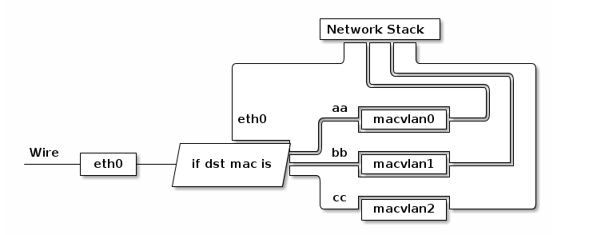
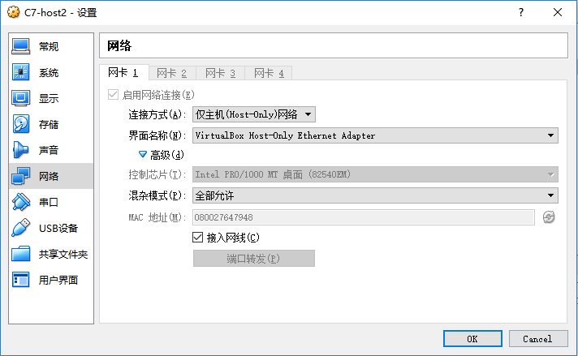

## macvlan 构建 Docker 网络

### macvlan 网络说明

- Macvlan是Linux内核支持的网络接口。要求的Linux内部版本是v3.9–3.19和4.0+。
- 通过为物理网卡创建Macvlan子接口，允许一块物理网卡拥有多个独立的MAC地址和IP地址。虚拟出来的子接口将直接暴露在底层物理网络中。从外界看来，就像是把网线分成多股，分别接到了不同的主机上一样。
- Macvlan有四种工作模式：Private、VEPA、Bridge和Passthru。
- 物理网卡收到包后，会根据收到包的目的MAC地址判断这个包需要交给哪个虚拟网卡。



- 如果配合Network Namespace 使用，可以构建这样的网络：


macvlan和overlay网络不同，overlay是global scope类型的网络，而macvlan是local scope。scope指的是网络作用的范围。global类型的网络其作用于一组docker daemon集群，local类型的网络只作用于单一主机。

每台主机创建的macvlan网络是独立的，A机器上创建的macvlan网络并不影响B机器上的网络，但两台主机在网卡配置混杂模式、两台主机上macvlan存在overlap、两个macvlan网络没有分配过同样IP，这三个条件满足时，同样可以实现跨主机通信。

### 开启网卡混杂模式

由于网卡需要开启混杂模式，所以无法使用vmware workstations 创建的虚拟机进行实验。下面的实验测试是通过virtualbox 创建的虚拟机做的实验。请注意要开启网卡的混杂模式。



在host1 和 host2 主机上分别执行如下命令开启虚拟机网卡的混杂模式：

```shell
[root@host1 ~]# ip link set enp0s3 promisc on 
[root@host2 ~]# ip link set enp0s3 promisc on
[root@host1 ~]# ifconfig enp0s3
enp0s3: flags=4419<UP,BROADCAST,RUNNING,PROMISC,MULTICAST>  mtu 1500
......
[root@host2 ~]# ifconfig enp0s3
enp0s3: flags=4419<UP,BROADCAST,RUNNING,PROMISC,MULTICAST>  mtu 1500
......
```

如果出现 `PROMISC` 项则说明混杂模式已经开通。 

关闭混杂模式：

```shell
# ip link set enp0s3  promisc off
```

通过ifconfig 命令开启和关闭：

```shell
# ifconfig enp0s3 promisc
# ifconfig enp0s3 -promisc
```

### 创建 macvlan 网络 

```shell
[root@host1 ~]# docker network create -d macvlan --subnet=172.16.86.0/24 --gateway=172.16.86.1 -o parent=enp0s3 mac_net1
[root@host1 ~]# docker network ls
NETWORK ID          NAME                DRIVER              SCOPE
88d285421ae8        bridge              bridge              local
abd644df492c        host                host                local
de3a209305c5        mac_net1            macvlan             local
1065320f6233        none                null                local
[root@host2 ~]# docker network create -d macvlan --subnet=172.16.86.0/24 --gateway=172.16.86.1 -o parent=enp0s3 mac_net1
[root@host2 ~]# docker network ls
NETWORK ID          NAME                DRIVER              SCOPE
9e5592268925        bridge              bridge              local
bdae55fc4b85        host                host                local
d86f1224dedd        mac_net1            macvlan             local
957c6fd03b79        none                null                local
```

* `-d macvlan` 指定 driver 为 macvlan。

* macvlan 网络是 local 网络，为了保证跨主机能够通信，用户需要自己管理 IP subnet。

* 与其他网络不同，docker 不会为 macvlan 创建网关，这里的网关应该是真实存在的，否则容器无法路由。

* `-o parent` 指定使用的网络 interface。

### 创建容器

```shell
[root@host1 ~]# docker run -itd --name busybox_1 --ip=172.16.86.10 --network mac_net1 busybox
[root@host2 ~]# docker run -itd --name busybox_2 --ip=172.16.86.11 --network mac_net1 busybox
[root@host1 ~]# docker run -itd --name busybox_3 --ip=172.16.86.12 --network mac_net1 busybox
[root@host2 ~]# docker run -itd --name busybox_4 --ip=172.16.86.13 --network mac_net1 busybox
```

### 验证容器网络互通

**host1主机**

```shell
[root@host1 ~]# docker exec busybox_1 ping -c 1 172.16.86.11
PING 172.16.86.11 (172.16.86.11): 56 data bytes
64 bytes from 172.16.86.11: seq=0 ttl=64 time=6.613 ms
[root@host1 ~]# docker exec busybox_1 ping -c 1 172.16.86.12
PING 172.16.86.12 (172.16.86.12): 56 data bytes
64 bytes from 172.16.86.12: seq=0 ttl=64 time=0.239 ms
[root@host1 ~]# docker exec busybox_1 ping -c 1 172.16.86.13
PING 172.16.86.13 (172.16.86.13): 56 data bytes
64 bytes from 172.16.86.13: seq=0 ttl=64 time=5.953 ms
[root@host1 ~]# docker exec busybox_3 ping -c 1 172.16.86.10
PING 172.16.86.10 (172.16.86.10): 56 data bytes
64 bytes from 172.16.86.10: seq=0 ttl=64 time=0.061 ms
[root@host1 ~]# docker exec busybox_3 ping -c 1 172.16.86.11
PING 172.16.86.11 (172.16.86.11): 56 data bytes
64 bytes from 172.16.86.11: seq=0 ttl=64 time=6.610 ms
[root@host1 ~]# docker exec busybox_3 ping -c 1 172.16.86.13
PING 172.16.86.13 (172.16.86.13): 56 data bytes
64 bytes from 172.16.86.13: seq=0 ttl=64 time=6.093 ms
------------------------------------------------
[root@host1 ~]# docker exec busybox_1 ping -c 1 busybox_2
ping: bad address 'busybox_2'
[root@host1 ~]# docker exec busybox_1 ping -c 1 busybox_3
PING busybox_3 (172.16.86.12): 56 data bytes
64 bytes from 172.16.86.12: seq=0 ttl=64 time=0.069 ms
[root@host1 ~]# docker exec busybox_1 ping -c 1 busybox_4
ping: bad address 'busybox_4'
[root@host1 ~]# docker exec busybox_1 ping -c 1 172.16.86.1
PING 172.16.86.1 (172.16.86.1): 56 data bytes

--- 172.16.86.1 ping statistics ---
1 packets transmitted, 0 packets received, 100% packet loss
[root@host1 ~]# docker exec busybox_1 ip r
default via 172.16.86.1 dev eth0 
172.16.86.0/24 dev eth0 scope link  src 172.16.86.10 
```

**host2主机**

```shell
[root@host2 ~]# docker exec busybox_2 ping -c 1 172.16.86.10 
PING 172.16.86.10 (172.16.86.10): 56 data bytes
64 bytes from 172.16.86.10: seq=0 ttl=64 time=6.714 ms
[root@host2 ~]# docker exec busybox_2 ping -c 1 172.16.86.12
PING 172.16.86.12 (172.16.86.12): 56 data bytes
64 bytes from 172.16.86.12: seq=0 ttl=64 time=6.686 ms
[root@host2 ~]# docker exec busybox_2 ping -c 1 172.16.86.13
PING 172.16.86.13 (172.16.86.13): 56 data bytes
64 bytes from 172.16.86.13: seq=0 ttl=64 time=0.268 ms
[root@host2 ~]# docker exec busybox_4 ping -c 1 172.16.86.10
PING 172.16.86.10 (172.16.86.10): 56 data bytes
64 bytes from 172.16.86.10: seq=0 ttl=64 time=12.012 ms
[root@host2 ~]# docker exec busybox_4 ping -c 1 172.16.86.11
PING 172.16.86.11 (172.16.86.11): 56 data bytes
64 bytes from 172.16.86.11: seq=0 ttl=64 time=0.065 ms
[root@host2 ~]# docker exec busybox_4 ping -c 1 172.16.86.12
PING 172.16.86.12 (172.16.86.12): 56 data bytes
64 bytes from 172.16.86.12: seq=0 ttl=64 time=6.979 ms
```

**总结**

* 各容器之间可以通过 IP 地址进行相互通信，但是无法和外部网络进行通信（需要配置好网关）。这种通信模式类是vmware 虚拟机的host only 仅主机通信的模式。
* 同一属主机的容器可以用容器名进行互相访问，如果跨主机就无法通过容器名进行访问。

### macvlan 网络分析

macvlan 不依赖 Linux bridge，`brctl show` 可以确认没有创建新的 bridge。

```shell
[root@host1 ~]# brctl show
bridge name     bridge id               STP enabled     interfaces
docker0         8000.0242569f83b1       no
```

查看一下容器 busybox_1 的网络设备：

```shell
[root@host1 ~]# docker exec busybox_1 ip link show
1: lo: <LOOPBACK,UP,LOWER_UP> mtu 65536 qdisc noqueue qlen 1000
    link/loopback 00:00:00:00:00:00 brd 00:00:00:00:00:00
6: eth0@if2: <BROADCAST,MULTICAST,UP,LOWER_UP,M-DOWN> mtu 1500 qdisc noqueue 
    link/ether 02:42:ac:10:56:0a brd ff:ff:ff:ff:ff:ff
```

除了 lo，容器只有一个 eth0，请注意 eth0 后面的 `@if2`，这表明该 interface 有一个对应的 interface，其全局的编号为 `2`。根据 macvlan 的原理，我们有理由猜测这个 interface 就是主机的 enp0s3，确认如下：

```shell
[root@host1 ~]# ip link show enp0s3 
2: enp0s3: <BROADCAST,MULTICAST,PROMISC,UP,LOWER_UP> mtu 1500 qdisc pfifo_fast state UP mode DEFAULT group default qlen 1000
    link/ether 08:00:27:30:bf:80 brd ff:ff:ff:ff:ff:ff
```

可见，容器的 eth0 就是 enp0s3 通过 macvlan 虚拟出来的 interface。容器的 interface 直接与主机的网卡连接，这种方案使得容器无需通过 NAT 和端口映射就能与外网直接通信（只要有网关），在网络上与其他独立主机没有区别。

## 使用Macvlan+VLAN构建Docker网络

macvlan 会独占主机的网卡，也就是说一个网卡只能创建一个 macvlan 网络，否则会报错：

```shell
[root@host1 ~]# docker network create -d macvlan -o parent=enp0s3 mac_net2
Error response from daemon: network dm-1ea133d48887 is already using parent interface enp0s3
```

如果想构建多个macvlan 网络可以通过把VLAN技术进行配置。

### 创建VLAN

#### host1 主机

```shell
[root@host1 ~]# ip link add link enp0s3 name enp0s3.200 type vlan id 200
[root@host1 ~]# ip link list enp0s3.200
7: enp0s3.200@enp0s3: <BROADCAST,MULTICAST> mtu 1500 qdisc noop state DOWN mode DEFAULT group default qlen 1000
    link/ether 08:00:27:30:bf:80 brd ff:ff:ff:ff:ff:ff
[root@host1 ~]# ip link set enp0s3.200 up
[root@host1 ~]# ip link list enp0s3.200  
7: enp0s3.200@enp0s3: <BROADCAST,MULTICAST,UP,LOWER_UP> mtu 1500 qdisc noqueue state UP mode DEFAULT group default qlen 1000
    link/ether 08:00:27:30:bf:80 brd ff:ff:ff:ff:ff:ff
[root@host1 ~]# ip link set enp0s3.200 promisc on
[root@host1 ~]# ip link list enp0s3.200          
7: enp0s3.200@enp0s3: <BROADCAST,MULTICAST,PROMISC,UP,LOWER_UP> mtu 1500 qdisc noqueue state UP mode DEFAULT group default qlen 1000
    link/ether 08:00:27:30:bf:80 brd ff:ff:ff:ff:ff:ff
[root@host1 ~]# ip addr show enp0s3.200
7: enp0s3.200@enp0s3: <BROADCAST,MULTICAST,PROMISC,UP,LOWER_UP> mtu 1500 qdisc noqueue state UP group default qlen 1000
    link/ether 08:00:27:30:bf:80 brd ff:ff:ff:ff:ff:ff
    inet6 fe80::a00:27ff:fe30:bf80/64 scope link 
       valid_lft forever preferred_lft forever
[root@host1 ~]# ifconfig enp0s3.200
enp0s3.200: flags=4419<UP,BROADCAST,RUNNING,PROMISC,MULTICAST>  mtu 1500
        inet6 fe80::a00:27ff:fe30:bf80  prefixlen 64  scopeid 0x20<link>
        ether 08:00:27:30:bf:80  txqueuelen 1000  (Ethernet)
        RX packets 0  bytes 0 (0.0 B)
        RX errors 0  dropped 0  overruns 0  frame 0
        TX packets 8  bytes 656 (656.0 B)
        TX errors 0  dropped 0 overruns 0  carrier 0  collisions 0
```

#### host2主机

```shell
[root@host2 ~]# ip link add link enp0s3 name enp0s3.200 type vlan id 200
[root@host2 ~]# ip link set enp0s3.200 up
[root@host2 ~]# ip link set enp0s3.200 promisc on
[root@host2 ~]# ip link list enp0s3.200
8: enp0s3.200@enp0s3: <BROADCAST,MULTICAST,PROMISC,UP,LOWER_UP> mtu 1500 qdisc noqueue state UP mode DEFAULT group default qlen 1000
    link/ether 08:00:27:64:79:48 brd ff:ff:ff:ff:ff:ff
```

### 设置macvlan的ip和网关

#### host1 主机

```shell
[root@host1 ~]# ip addr add 192.168.200.10/24 dev enp0s3.200
[root@host1 ~]# ip route add default via 192.168.200.1 dev enp0s3.200
```

#### host2 主机

```shell
[root@host2 ~]# ip addr add 192.168.200.10/24 dev enp0s3.200
[root@host2 ~]# ip route add default via 192.168.200.1 dev enp0s3.200
```

### 创建Docker macvlan 网络

#### host1 主机

```shell
[root@host1 ~]# docker network create -d macvlan --subnet=192.168.200.0/24 --gateway=192.168.200.1 -o parent=enp0s3.200 mac_net200
```

#### host2 主机

```shell
[root@host2 ~]# docker network create -d macvlan --subnet=192.168.200.0/24 --gateway=192.168.200.1 -o parent=enp0s3.200 mac_net200
```

### 创建容器

#### host1 主机

```shell
[root@host1 ~]# docker run -itd --network mac_net200 --ip=192.168.200.100 --name busybox_200_1 busybox
```

#### host2 主机

```shell
[root@host2 ~]# docker run -itd --network mac_net200 --ip=192.168.200.101 --name busybox_200_2 busybox 
```

### 测试容器网络

```shell
[root@host1 ~]# docker exec  busybox_200_1 ping -c 1 192.168.200.100
PING 192.168.200.100 (192.168.200.100): 56 data bytes
64 bytes from 192.168.200.100: seq=0 ttl=64 time=0.052 ms
[root@host1 ~]# docker exec  busybox_200_1 ping -c 1 192.168.200.101
PING 192.168.200.101 (192.168.200.101): 56 data bytes
64 bytes from 192.168.200.101: seq=0 ttl=64 time=6.782 ms
[root@host2 ~]# docker exec  busybox_200_2 ping -c 1 192.168.200.100 
PING 192.168.200.100 (192.168.200.100): 56 data bytes
64 bytes from 192.168.200.100: seq=0 ttl=64 time=6.509 ms
[root@host2 ~]# docker exec  busybox_200_2 ping -c 1 192.168.200.101
PING 192.168.200.101 (192.168.200.101): 56 data bytes
64 bytes from 192.168.200.101: seq=0 ttl=64 time=0.056 ms
```

## 扩展学习

<https://www.cnblogs.com/bigberg/p/8656963.html>

<https://www.hi-linux.com/posts/40904.html>

https://mp.weixin.qq.com/s/DvzQIDzdHgSX2QMjokfVOg