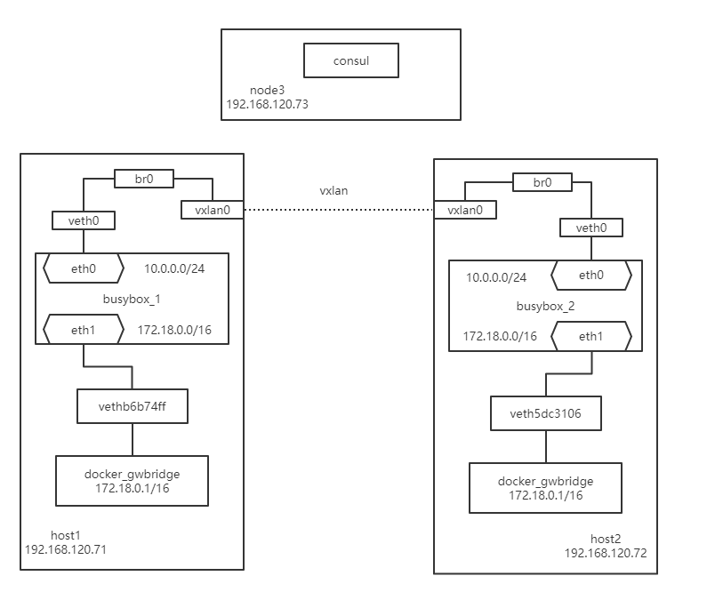

## overlay 网络

为支持容器跨主机通信，Docker 提供了 overlay driver，使用户可以创建基于 VxLAN 的 overlay 网络。VxLAN 可将二层数据封装到 UDP 进行传输，VxLAN 提供与 VLAN 相同的以太网二层服务，但是拥有更强的扩展性和灵活性。

使用 overlay 网络需要满足下面的这些条件：

- 正常工作的 key-value 存储服务，比如 consul、etcd、zookeeper 等
- 可以访问到 key-value 服务的主机集群
- 集群中每台机器都安装并运行 docker daemon
- 集群中每台机器的 hostname 都是唯一的，因为 key-value 服务是通过 hostname 标识每台主机的

### Consul 搭建 overlay 网络集群

#### 环境介绍

| 主机名 |       IP       | 安装软件       |
| :----: | :------------: | -------------- |
| host1  | 192.168.120.71 | Docker         |
| host2  | 192.168.120.72 | Docker         |
| node3  | 192.168.120.73 | Docker、Consul |

#### 创建网络环境

node3 主机运行 Consul 容器：

```shell
# docker run -d -p 8500:8500 -h consul --name consul progrium/consul -server -bootstrap
# curl http://localhost:8500/v1/catalog/nodes
[{"Node":"consul","Address":"172.17.0.2"}]
```

运行容器后可以通过命令行进行验证Consul时候正常运行，也可以通过浏览器访问 `http://192.168.120.73:8500` Consul进行查看。

下面需要分别在host1和host2主机的docker启动参数中添加如下内容：

```shell
# cat /etc/systemd/system/docker.service.d/10-machine.conf 
[Service]
ExecStart=
ExecStart=/usr/bin/dockerd -H tcp://0.0.0.0:2376 -H unix:///var/run/docker.sock --storage-driver overlay2 --tlsverify --tlscacert /etc/docker/ca.pem --tlscert /etc/docker/server.pem --tlskey /etc/docker/server-key.pem --label provider=generic --registry-mirror --cluster-store=consul://192.168.120.73:8500 --cluster-advertise=ens33:2376
Environment=
```

添加的内容未`--cluster-store=consul://192.168.120.73:8500 --cluster-advertise=ens33:2376` ，其中 ens33 为能访问 `192.168.120.73`  网络的网卡名称，添加参数对应的意思为：

* `--cluster-store` 指定 consul 的地址。

* `--cluster-advertise` 告知 consul 自己的连接地址。

说明：docker配置文件的路径和你安装的方式不同而存储的位置不同，我这边是通过docker-machine安装的docker。

host1 和 host2 修改docker配置文件之后载入并重启：

```shell
systemctl daemon-reload
systemctl restart docker.service
```

通过浏览器访问可以发现host1 和 host2 已经自动注册到 consul 中：


#### 创建overlay网络

在host1 主机中创建 overlay 网络 ov_net1：

```shell
[root@host1 ~]# docker network create -d overlay ov_net1
b640ccae7650c636de9d2dc6ac91d4e13e6bd95ecd3a8a272faa283edd0f6965
[root@host1 ~]# docker network ls
NETWORK ID          NAME                DRIVER              SCOPE
1e2bcc70a085        bridge              bridge              local
b4367e71a1ae        host                host                local
65d5164f984f        none                null                local
b640ccae7650        ov_net1             overlay             global
[root@host2 ~]# docker network ls
NETWORK ID          NAME                DRIVER              SCOPE
53890e8bc91d        bridge              bridge              local
217ae2b634ca        host                host                local
9244c508018b        none                null                local
b640ccae7650        ov_net1             overlay             global
[root@host2 ~]# docker network inspect -f "{{.IPAM.Config}}" ov_net1  
[{10.0.0.0/24  10.0.0.1 map[]}]
```

#### 创建容器

```shell
[root@host1 ~]# docker run -itd --name busybox_1 --network ov_net1 busybox
[root@host1 ~]# docker exec busybox_1 ip r
default via 172.18.0.1 dev eth1 
10.0.0.0/24 dev eth0 scope link  src 10.0.0.2 
172.18.0.0/16 dev eth1 scope link  src 172.18.0.2 
[root@host1 ~]# docker network ls
NETWORK ID          NAME                DRIVER              SCOPE
1e2bcc70a085        bridge              bridge              local
b8c5b4c1f852        docker_gwbridge     bridge              local
b4367e71a1ae        host                host                local
65d5164f984f        none                null                local
b640ccae7650        ov_net1             overlay             global
[root@host1 ~]# docker network inspect -f "{{.IPAM.Config}}" docker_gwbridge 
[{172.18.0.0/16  172.18.0.1 map[]}]
```

上面的操作中我们在host1 中创建一个容器时，docker 会默认创建一个 docker_gwbridge 的桥，为所有连接到 overlay 网络的容器提供访问外网的能力。其网段为 172.18.0.0/16。

#### overlay 网络的跨主机通信

```shell
[root@host2 ~]# docker run -itd --name busybox_2 --network ov_net1 busybox
9c484f832fc9051ced0145f435f742b053cde4bbf8682ddce5c7a54c4fcad972
[root@host2 ~]# docker exec busybox_2 ip r
default via 172.18.0.1 dev eth1 
10.0.0.0/24 dev eth0 scope link  src 10.0.0.3 
172.18.0.0/16 dev eth1 scope link  src 172.18.0.2 
[root@host2 ~]# docker exec busybox_2 ping -c 1 busybox_1
PING busybox_1 (10.0.0.2): 56 data bytes
64 bytes from 10.0.0.2: seq=0 ttl=64 time=3.895 ms

--- busybox_1 ping statistics ---
1 packets transmitted, 1 packets received, 0% packet loss
round-trip min/avg/max = 3.895/3.895/3.895 ms
[root@host2 ~]# docker network ls
NETWORK ID          NAME                DRIVER              SCOPE
53890e8bc91d        bridge              bridge              local
ccf14d6a360a        docker_gwbridge     bridge              local
217ae2b634ca        host                host                local
9244c508018b        none                null                local
b640ccae7650        ov_net1             overlay             global
[root@host2 ~]# docker network inspect -f "{{.IPAM.Config}}" docker_gwbridge 
[{172.18.0.0/16  172.18.0.1 map[]}]
[root@host1 ~]# docker exec busybox_1 ping -c 1 busybox_2
PING busybox_2 (10.0.0.3): 56 data bytes
64 bytes from 10.0.0.3: seq=0 ttl=64 time=4.227 ms

--- busybox_2 ping statistics ---
1 packets transmitted, 1 packets received, 0% packet loss
round-trip min/avg/max = 4.227/4.227/4.227 ms
```

我们在host2主机新建容器时，也是和host1创建的情况一样。配了两个IP，其中eth0网卡是和host1主机上busybox_1容器相连，而eth1网卡是通过docker_gwbridge网络创建的，其主要功能是通外部网络。仔细观察两个容器的eth1的网络地址相同，这是由于docker_gwbridge是分别属于不同主机的网络。

#### overlay 网络的具体实现

* docker 会为每个 overlay 网络创建一个独立的 network namespace，其中会有一个 linux bridge br0，endpoint 还是由 veth pair 实现，一端连接到容器中（即 eth0），另一端连接到 namespace 的 br0 上。
* br0 除了连接所有的 endpoint，还会连接一个 vxlan 设备，用于与其他 host 建立 vxlan tunnel。容器之间的数据就是通过这个 tunnel 通信的。



先在host1 和host1 主机上执行 `ln -s /var/run/docker/netns /var/run/netns` ，然后通过`ip netns` 命令进行查看overlay 网络的 namespace。

```shell
[root@host1 ~]# ln -s /var/run/docker/netns /var/run/netns
[root@host1 ~]# ip netns
811143987c40 (id: 1)
1-b640ccae76 (id: 0)
[root@host1 ~]# ip netns exec 1-b640ccae76 brctl show
bridge name     bridge id               STP enabled     interfaces
br0             8000.06a504bf7713       no              veth0
                                                        vxlan0
[root@host2 ~]# ln -s /var/run/docker/netns /var/run/netns
[root@host2 ~]# ip netns
7a8e1af7e427 (id: 1)
1-b640ccae76 (id: 0)
[root@host2 ~]# ip netns exec 1-b640ccae76 brctl show
bridge name     bridge id               STP enabled     interfaces
br0             8000.06a336923736       no              veth0
                                                        vxlan0
[root@host1 ~]# ip netns exec 1-b640ccae76 ip -d l show vxlan0
5: vxlan0: <BROADCAST,MULTICAST,UP,LOWER_UP> mtu 1450 qdisc noqueue master br0 state UNKNOWN mode DEFAULT group default 
    link/ether 9e:a1:2b:a8:f9:ba brd ff:ff:ff:ff:ff:ff link-netnsid 0 promiscuity 1 
    vxlan id 256 srcport 0 0 dstport 4789 proxy l2miss l3miss ageing 300 noudpcsum noudp6zerocsumtx noudp6zerocsumrx 
......
```

####  overlay 的网络隔离特性

不同的 overlay 网络是相互隔离的。我们创建第二个 overlay 网络 ov_net2 并运行容器 busybox_3。

```shell
[root@host1 ~]# docker network create -d overlay ov_net2
b48b77ead59e36919af8af3a4a731de79e40332eb894515a013d5ab0e1341153
[root@host1 ~]# docker run -itd --name busybox_3 --network ov_net2 busybox
74c6d495dd218e803b7f86885a0cc981755fa75cc2bb7bedc5f89f488c02e504
[root@host1 ~]# docker exec busybox_3 ip r
default via 172.18.0.1 dev eth1 
10.0.1.0/24 dev eth0 scope link  src 10.0.1.2 
172.18.0.0/16 dev eth1 scope link  src 172.18.0.3 
[root@host1 ~]# docker exec -it  busybox_3 ping -c 1 10.0.0.2 
PING 10.0.0.2 (10.0.0.2): 56 data bytes

--- 10.0.0.2 ping statistics ---
1 packets transmitted, 0 packets received, 100% packet loss
```

ping 失败，可见不同 overlay 网络之间是隔离的。即便是通过 docker_gwbridge 也不能通信。

```shell
[root@host1 ~]# docker exec -it  busybox_3 ping -c 1 172.18.0.2
PING 172.18.0.2 (172.18.0.2): 56 data bytes

--- 172.18.0.2 ping statistics ---
1 packets transmitted, 0 packets received, 100% packet loss
```

如果要实现 busybox_3 与 buxybox_1 通信，可以将 busybox_3 也连接到 ov_net1。

```shell
[root@host1 ~]# docker network connect ov_net1 busybox_3 
[root@host1 ~]# docker exec busybox_3 ip r 
default via 172.18.0.1 dev eth2 
10.0.0.0/24 dev eth0 scope link  src 10.0.0.4 
10.0.1.0/24 dev eth1 scope link  src 10.0.1.2 
172.18.0.0/16 dev eth2 scope link  src 172.18.0.3 
[root@host1 ~]# docker exec -it  busybox_3 ping -c 1 10.0.0.2 
PING 10.0.0.2 (10.0.0.2): 56 data bytes
64 bytes from 10.0.0.2: seq=0 ttl=64 time=0.157 ms

--- 10.0.0.2 ping statistics ---
1 packets transmitted, 1 packets received, 0% packet loss
round-trip min/avg/max = 0.157/0.157/0.157 ms
[root@host1 ~]# docker exec -it  busybox_3 ping -c 1 busybox_1
PING busybox_1 (10.0.0.2): 56 data bytes
64 bytes from 10.0.0.2: seq=0 ttl=64 time=0.156 ms

--- busybox_1 ping statistics ---
1 packets transmitted, 1 packets received, 0% packet loss
round-trip min/avg/max = 0.156/0.156/0.156 ms
```

docker 默认为 overlay 网络分配 24 位掩码的子网（10.0.X.0/24），所有主机共享这个 subnet，容器启动时会顺序从此空间分配 IP。当然我们也可以通过 `--subnet` 指定 IP 空间。

```she
# docker network create -d overlay --subnet 10.22.1.0/24 ov_net3
```

#### 搭建遇到的问题

host2 注册失败

在配置host2主机中docker的启动参数时，是直接从host1上粘贴过来的，由于换行的原因导致启动中的参数缺失，从而导致host2死活无法注册成功。

```shell
[root@host2 ~]# ps aux |grep docker
root      29932  0.0  5.4 593320 54512 ?        Ssl  16:17   0:00 /usr/bin/dockerd -H tcp://0.0.0.0:2376 -H unix:///var/run/docker.sock --storage-driver overlay2 --tlsverify --tlscacert /etc/docker/ca.pem --tlscert /etc/docker/server.pem --tlskey /etc/docker/server-key.pem --label provider=generic --registry-mirror https://2980aqtg.mirror.aliyuncs.com --cluster-store=consul://192.
root      30075  0.0  0.0 112708   980 pts/0    R+   16:24   0:00 grep --color=auto docker
# 请注意观察两个启动参数中的不同。
[root@host2 ~]# ps aux |grep docker                                      
root      30102  0.5  6.2 534124 62636 ?        Ssl  16:24   0:01 /usr/bin/dockerd -H tcp://0.0.0.0:2376 -H unix:///var/run/docker.sock --storage-driver overlay2 --tlsverify --tlscacert /etc/docker/ca.pem --tlscert /etc/docker/server.pem --tlskey /etc/docker/server-key.pem --label provider=generic --registry-mirror https://2980aqtg.mirror.aliyuncs.com --cluster-store=consul://192.168.120.73:8500 --cluster-advertise=ens33:2376
root      30220  0.0  0.0 112708   984 pts/0    R+   16:27   0:00 grep --color=auto docker
```

### 拓展学习

#### vxlan协议

<https://cizixs.com/2017/09/25/vxlan-protocol-introduction/>

<https://blog.csdn.net/octopusflying/article/details/77609199>