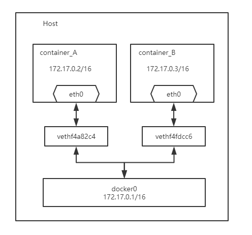

## 前言

目前在 Linux 系统使用容器进行网络接口配置有两种标准：由 Docker 公司提出提出的 Container Network Model （容器网络模型），和由 CoreOS 提出的 Container Network Interface（容器网络接口）。本文主要是介绍这两种网络标准的基础概念，在介绍前先了解下下面几个概念。

### 网络虚拟化

网络虚拟化技术可在物理网络上虚拟多个相互隔离的虚拟网络，从而使得不同用户之间使用独立的网络资源切片，从而提高网络资源利用率，实现弹性的网络。目前比较常见的网络虚拟化应用包括虚拟局域网，即VLAN，虚拟专用网，VPN，以及虚拟网络设备等。

### 软件定义网络

软件定义网络（英语：software-defined networking，缩写作 SDN）是一种新型网络架构。它利用 `OpenFlow`协议将路由器的控制平面（control plane）从数据平面（data plane）中分离，改以软件方式实现。该架构可使网络管理员在不更动硬件设备的前提下，以中央控制方式用程序重新规划网络，为控制网络流量提供了新方案，也为核心网络和应用创新提供了良好平台。

### Libnetwork && CNM

Libnetwork是从docker1.6开始，逐渐将docker项目中的网络部分抽离出来形成的Lib，作用是为其他应用程序(如docker engine)提供一套抽象的容器网络模型，该模型也被称为Container Network Model，简称CNM。

### Linux Namespace

Linux Namespace是Linux提供的一种内核级别环境隔离的方法。提供了对UTS、IPC、mount、PID、network、User等的隔离机制。

## Container Network Model(CNM)

Container network model (CNM)是Docker的网络模型，主要由Sandbox、Network以及Endpoint组成。

* **Sandbox**: sandbox 实现了容器内部的网络栈，它定义容器的虚拟网卡，路由表和 DNS 等配置，其实就是一个标准的 linux network namespace 实现。在Linux系统上的docker环境中，Container，Network namespace，Sandbox 这三者是绑定在一起的。一个Sandbox中可以有多个Endpoint，这些Endpoint可以属于不同的Network。
* **Endpoint**: network 实现了一个第三方的网络栈，sandbox 则实现了容器内部的网络栈，那这两者怎么联系起来呢？答案就是通过 endpoint，endpoint 实现了 veth pair，一个 endpoint 就表示一对 veth pair，一端挂在容器中，另一端挂在 network 中。
*  **Network**: network 是一个抽象的概念，你可以把它理解成一个网络的插件，或者是网络的 Driver，比如说单主机网络的 Driver 就有 none、host、bridge，joined container 这四种，多主机网络就有 overlay、macvlan、flannel 这些。network 可以独立出去做，只需调用 Docker 对外提供的 API 就可以作为插件集成到 Docker 网络中使用。


network、sandbox 和 endpoint 三者之间的关系：

- 一个 network 可以包含多个 endpoint，自然也就包含多个 sandbox。
- 一个 sandbox 可以包含多个 endpoint，可以属于多个 network。
- 一个 endpoint 只可以属于一个 network，并且只属于一个 sandbox。

### Libnetwork 实现

Libnetwork对于CNM的实现包括以下5类对象：

* **NetworkController**： 使用命令 docker network create 创建一个Network对象时，就会相应地生成一个NetworkController对象，NetworkController对象将Network对象的API暴露给用户，以便用户对libnetwork进行调用，然后驱动特定的Driver对象实现Network对象的功能。NetworkController允许用户绑定Network对象所使用的Driver对象。
* **Driver**： Driver对象真正实现Network功能（包括通信和管理），它并不直接暴露API给用户。Libnetwork支持多种Driver，其中包括内置的bridge，host，container、overlay和macvlan，也对remote driver（即第三方，或用户自定义的网络驱动）进行了支持。
* **Network**：Network对象是CNM Network的一种实现。
* **Endpoint**：Endpoint对象是CNM Endpoint的一种实现。
* **Sandbox**：Sandbox对象是CNM Sandbox的一种实现。

## CNI (Container Network Interface)

Container Network Interface (CNI) 最早是由CoreOS发起的容器网络规范，是Kubernetes网络插件的基础。其基本思想为：Container Runtime在创建容器时，先创建好network namespace，然后调用CNI插件为这个netns配置网络，其后再启动容器内的进程。

CNI插件包括两部分：

- CNI Plugin负责给容器配置网络，它包括两个基本的接口
  - 配置网络: AddNetwork(net *NetworkConfig, rt* RuntimeConf) (types.Result, error)
  - 清理网络: DelNetwork(net *NetworkConfig, rt* RuntimeConf) error
- IPAM Plugin负责给容器分配IP地址，主要实现包括host-local和dhcp。


[CNI扩展学习](<https://cizixs.com/2017/05/23/container-network-cni/>)

## Docker 网络基础

 ### 网络驱动

* bridge：默认网络驱动程序。如果未指定驱动程序，则这是您要创建的网络类型。当您的应用程序在需要通信的独立容器中运行时，通常会使用桥接网络。

* host：对于独立容器，删除容器和Docker主机之间的网络隔离，并直接使用主机的网络。 host仅适用于Docker 17.06及更高版本的swarm服务。

* Overlay：Overlay网络将多个Docker守护程序连接在一起，并使群集服务能够相互通信。您还可以使用Overlay网络来促进群集服务和独立容器之间的通信，或者在不同Docker守护程序上的两个独立容器之间进行通信。此策略消除了在这些容器之间执行OS级别路由的需要。

* macvlan：Macvlan网络允许您为容器分配MAC地址，使其显示为网络上的物理设备。 Docker守护程序通过其MAC地址将流量路由到容器。在处理期望直接连接到物理网络的传统应用程序时，使用macvlan驱动程序有时是最佳选择，而不是通过Docker主机的网络堆栈进行路由。

* none：对于此容器，禁用所有网络。通常与自定义网络驱动程序一起使用。 none不适用于群组服务。

### bridge 模式

当你安装Docker时，它会自动创建三个网络。你可以使用docker network ls命令列出这些网络：

```shell
# docker network ls
NETWORK ID          NAME                DRIVER              SCOPE
bc0f7b3ee184        bridge              bridge              local
6da031a29290        host                host                local
d8a8ec5897ae        none                null                local
```

而在我们启动一个容器时默认是使用的是bridge网络，如果不想使用默认网络可以通过--network 选项选择自己需要的网络驱动。而在使用 bridge 模式时，默认是通过 docker0 来桥接访问外部网络。

```sh
# brctl show
bridge name     bridge id               STP enabled     interfaces
docker0         8000.0242945ff0c1       no
# ip addr show docker0
3: docker0: <NO-CARRIER,BROADCAST,MULTICAST,UP> mtu 1500 qdisc noqueue state DOWN 
    link/ether 02:42:94:5f:f0:c1 brd ff:ff:ff:ff:ff:ff
    inet 172.17.0.1/16 brd 172.17.255.255 scope global docker0
       valid_lft forever preferred_lft forever
# docker run -itd --name container_A busybox
# docker run -itd --name container_B busybox
# brctl  show
bridge name     bridge id               STP enabled     interfaces
docker0         8000.0242e3e6ba18       no              vethf4a82c4
                                                        vethf4fdcc6
```

bridge 模式启动容器网络拓扑图如下：



bridge 模式创建容器说明：

- 创建容器时默认使用的模式是 bridge，bridge名称为 docker0
- Docker将veth pair设备的一端放在新创建的容器中，并命名为eth0。另一端放在主机中，以veth*这样类似的名字命名，并将这个网络设备加入到docker0网桥中，可以通过`brctl show`命令查看。
- 该模式下Docker Container不具有一个公有IP，因为宿主机的IP地址与veth pair的 IP地址不在同一个网段内
- Docker采用 NAT 方式，将容器内部的服务监听的端口与宿主机的某一个端口port 进行“绑定”，使得宿主机以外的世界可以主动将网络报文发送至容器内部
- 外界访问容器内的服务时，需要访问宿主机的 IP 以及宿主机的端口 port
- NAT 模式由于是在三层网络上的实现手段，故肯定会影响网络的传输效率。
- 容器拥有独立、隔离的网络栈；让容器和宿主机以外的世界通过NAT建立通信

### Host 模式

- 这种模式下的容器将不会获得一个独立的Network Namespace，而是和宿主机共用一个Network Namespace。
- 容器的 IP 地址同 Docker host 的 IP 地址
- 需要注意容器中服务的端口号不能与 Docker host 上已经使用的端口号相冲突
- host 模式能够和其它模式共存

```shell
# docker run -it --name host_busybox1 --network host busybox     
/ # ifconfig 
docker0   Link encap:Ethernet  HWaddr 02:42:01:D3:02:E9  
          inet addr:172.17.0.1  Bcast:172.17.255.255  Mask:255.255.0.0
          inet6 addr: fe80::42:1ff:fed3:2e9/64 Scope:Link
          UP BROADCAST MULTICAST  MTU:1500  Metric:1
          RX packets:0 errors:0 dropped:0 overruns:0 frame:0
          TX packets:8 errors:0 dropped:0 overruns:0 carrier:0
          collisions:0 txqueuelen:0 
          RX bytes:0 (0.0 B)  TX bytes:648 (648.0 B)
......
```

### container 模式

- 这个模式指定新创建的容器和已经存在的一个容器共享一个Network Namespace，而不是和宿主机共享。
- 至少这两个容器之间不存在网络隔离，而这两个容器又与宿主机以及除此之外其他的容器存在网络隔离。
- 新创建的容器不会创建自己的网卡，配置自己的IP，而是和一个指定的容器共享IP、端口范围等。
- 两个容器除了网络方面，其他的如文件系统、进程列表等还是隔离的。
- 两个容器的进程可以通过lo网卡设备通信。

```shell
# docker run -itd --name busybox_1 busybox
# docker inspect -f '{{.NetworkSettings.Networks.bridge.IPAddress}}' busybox_1
172.17.0.2
# docker run -itd --name busybox_2 --network container:busybox_1 busybox
# docker inspect -f '{{.NetworkSettings.Networks.bridge.IPAddress}}' busybox_2
<no value>
# docker exec -it busybox_2 ip addr show  eth0
8: eth0@if9: <BROADCAST,MULTICAST,UP,LOWER_UP,M-DOWN> mtu 1500 qdisc noqueue 
    link/ether 02:42:ac:11:00:02 brd ff:ff:ff:ff:ff:ff
    inet 172.17.0.2/16 brd 172.17.255.255 scope global eth0
       valid_lft forever preferred_lft forever
# docker exec -it busybox_1  hostname -i 
172.17.0.2
# docker exec -it busybox_2  hostname -i
172.17.0.2
```

### none 模式

- 容器内部就只能使用loopback网络设备，不会再有其他的网络资源
- 容器只能使用127.0.0.1的本机网络

```shell
# docker run -it --name none_busybox1 --network none busybox
/ # ifconfig 
lo        Link encap:Local Loopback  
          inet addr:127.0.0.1  Mask:255.0.0.0
          UP LOOPBACK RUNNING  MTU:65536  Metric:1
          RX packets:0 errors:0 dropped:0 overruns:0 frame:0
          TX packets:0 errors:0 dropped:0 overruns:0 carrier:0
          collisions:0 txqueuelen:1 
          RX bytes:0 (0.0 B)  TX bytes:0 (0.0 B)
```

### 自定义网络

创建 `bridge` ：

```shell
# docker network create --driver bridge my_net
# brctl show
bridge name     bridge id               STP enabled     interfaces
br-9c76badf38f0         8000.02422973ba99       no
docker0         8000.024201d302e9       no
# docker network inspect -f '{{.IPAM.Config}}' my_net 
[{172.18.0.0/16  172.18.0.1 map[]}]
# docker network create --driver bridge --subnet 172.19.0.0/16 --gateway 172.19.0.1 my_net2
# brctl show
bridge name     bridge id               STP enabled     interfaces
br-353099f259a0         8000.0242da4aad9d       no
br-9c76badf38f0         8000.02422973ba99       no
docker0         8000.024201d302e9       no
```

通过新建的 `bridge` 创建容器：

```shell
# docker run -d -it --name my_net2_busybox1 --network my_net2 busybox       
/ # hostname -i
172.19.0.2
# docker run -d -it --name my_net2_busybox2 --network my_net2 --ip 172.19.0.88  busybox
/ # hostname -i
172.19.0.88
```

**只有使用 --subnet 创建的网络才能指定静态 IP。**
通过 my_net 创建容器，然后绑定 my_net2 上的网络，从而实现通过 my_net2 创建的容易访问 my_net 上的资源： 

```shell
# docker run -d -it --name my_net_httpd --network my_net httpd
# docker network connect my_net2 my_net_httpd 
# docker exec -it my_net_httpd bash
root@a664e6e16bca:/usr/local/apache2# hostname  -I
172.18.0.2 172.19.0.3 
```

```shell
# docker exec -it my_net2_busybox2 sh
# hostname -i
172.19.0.88
# wget 172.19.0.3
# cat index.html 
<html><body><h1>It works!</h1></body></html>
```

容器可以通过“容器名”通信：

```shell
# docker exec -it my_net2_busybox2 sh
/ # hostname -i
172.19.0.88
/ # ping -c 1 my_net2_busybox2
PING my_net2_busybox2 (172.19.0.88): 56 data bytes
64 bytes from 172.19.0.88: seq=0 ttl=64 time=0.036 ms

--- my_net2_busybox2 ping statistics ---
1 packets transmitted, 1 packets received, 0% packet loss
round-trip min/avg/max = 0.036/0.036/0.036 ms
/ # ping -c 1 my_net2_busybox1
PING my_net2_busybox1 (172.19.0.2): 56 data bytes
64 bytes from 172.19.0.2: seq=0 ttl=64 time=0.186 ms

--- my_net2_busybox1 ping statistics ---
1 packets transmitted, 1 packets received, 0% packet loss
round-trip min/avg/max = 0.186/0.186/0.186 ms
/ # ping -c 1 my_net_httpd
PING my_net_httpd (172.19.0.3): 56 data bytes
64 bytes from 172.19.0.3: seq=0 ttl=64 time=0.200 ms

--- my_net_httpd ping statistics ---
1 packets transmitted, 1 packets received, 0% packet loss
round-trip min/avg/max = 0.200/0.200/0.200 ms
```

**注意：只能在自定义的网络中执行上面的操作。**

## Docker 网络扩展

### 外部网络访问容器

容器中可以运行一些网络应用，要让外部也可以访问这些应用，可以通过 `-P` 或 `-p` 参数来指定端口映射。其中`-P` 是随机映射一个端口到内部容器开放的网络端口。

```shell
# docker run -itd -P --name website_1 nginx:1.14.2
# docker container ls
CONTAINER ID        IMAGE               COMMAND                  CREATED             STATUS              PORTS                   NAMES
d9b261868b43        nginx:1.14.2        "nginx -g 'daemon of…"   35 seconds ago      Up 34 seconds       0.0.0.0:32769->80/tcp   website_1
# docker port website_1 
80/tcp -> 0.0.0.0:32769
```

`-p` 则可以指定要映射的端口，并且，在一个指定端口上只可以绑定一个容器。同时 `-p` 选项可以使用多次，前提是宿主机上没有被占用。支持的格式有：

`ip:hostPort:containerPort | ip::containerPort | hostPort:containerPort`

#### 映射所有接口地址

使用 `hostPort:containerPort` 格式将本地的 80 端口映射到容器的 80 端口，可以执行：

```shell
# docker run -itd -p 80:80 --name website_2 nginx:1.14.2
# docker port website_2 
80/tcp -> 0.0.0.0:80
```

通过这种方式会将宿主机所有IP地址的80端口绑定到容器。

#### 映射到指定地址的指定端口

可以使用 `ip:hostPort:containerPort` 格式指定映射使用一个特定地址，比如 localhost 地址 127.0.0.1

```shell
# docker run -itd -p 127.0.0.1:8080:80 --name website_3 nginx:1.14.2
# docker port website_3 
80/tcp -> 127.0.0.1:8080
```

#### 映射到指定地址的任意端口

使用 `ip::containerPort` 绑定 localhost 的任意端口到容器的 80 端口，本地主机会自动分配一个端口。

```shell
# docker run -itd -p 127.0.0.1::80 --name website_4 nginx:1.14.2
# docker port website_4 
80/tcp -> 127.0.0.1:32768
```

### 端口映射的实现

#### 容器访问外部实现

容器所有到外部网络的连接，源地址都会被 NAT 成本地系统的 IP 地址。这是使用 `iptables` 的源地址伪装操作实现的。

```shell
# iptables -t nat -nvL
......
Chain POSTROUTING (policy ACCEPT 12 packets, 862 bytes)
 pkts bytes target     prot opt in     out     source               destination         
    0     0 MASQUERADE  all  --  *      !docker0  172.17.0.0/16        0.0.0.0/0 
......
```

其中，上述规则将所有源地址在 `172.17.0.0/16` 网段，目标地址为其他网段（外部网络）的流量动态伪装为从系统网卡发出。MASQUERADE 跟传统 SNAT 的好处是它能动态从网卡获取地址。

#### 外部访问容器实现

前面在启动容器时使用的 `-p` 和`-P`选项来让外部网络访问容器内部，不管用那种办法，其实也是在本地的 `iptable` 的 nat 表中添加相应的规则。

website_1 容器创建时所对应的配置：

```shell
# iptables -t nat -nL
......
Chain DOCKER (2 references)
DNAT       tcp  --  0.0.0.0/0            0.0.0.0/0            tcp dpt:32769 to:172.17.0.2:80
......
```

website_2、website_3、website_4  容器创建是所对应的配置：

```shell
# iptables -t nat -nvL
......
DNAT       tcp  --  0.0.0.0/0            0.0.0.0/0            tcp dpt:80 to:172.17.0.3:80
DNAT       tcp  --  0.0.0.0/0            127.0.0.1            tcp dpt:8080 to:172.17.0.4:80
DNAT       tcp  --  0.0.0.0/0            127.0.0.1            tcp dpt:32768 to:172.17.0.5:80
......
```

### 容器访问控制

#### 容器访问外部网络

容器要想访问外部网络，需要本地系统的转发支持，查看是否打开和开启此选项通过如下操作：

```shell
# cat /proc/sys/net/ipv4/ip_forward  # 查看是否开启
1
# sysctl -w net.ipv4.ip_forward=1  # 开启系统转发
```

#### 访问所有端口

当启动 Docker 服务（即 dockerd）的时候，默认会添加一条转发策略到本地主机 iptables 的 FORWARD 链上。策略为通过（`ACCEPT`）还是禁止（`DROP`）取决于配置`--icc=true`（缺省值）还是 `--icc=false`。当然，如果手动指定 `--iptables=false` 则不会添加 `iptables` 规则。

可见，默认情况下，不同容器之间是允许网络互通的。如果为了安全考虑，可以在 `/etc/docker/daemon.json` 文件中配置 `{"icc": false}` 来禁止它。

### 