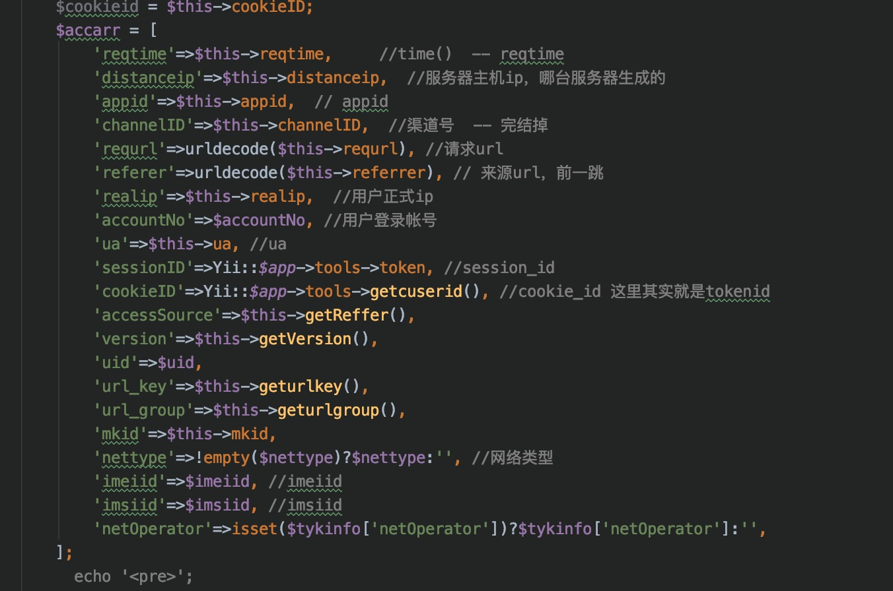

## nginx

```
log_format  json  '{ "time_local": "$time_local", '
                      '"remote_addr": "$remote_addr", '
                      '"http_referer": "$http_referer", '
                      '"request": "$request", '               
                      '"status": "$status", '
                      '"body_bytes_sent": "$body_bytes_sent", '
                      '"request_body": "$request_body", '
                      '"http_user_agent": "$http_user_agent", '
                      '"http_x_forwarded_for": "$http_x_forwarded_for", '
                      '"upstream_addr": "$upstream_addr", '
                      '"upstream_http_host": "$upstream_http_host", '
                      '"upstream_response_time": "$upstream_response_time", '
                      '"upstream_status": "$upstream_status", '
                      '"request_time": "$request_time", '
                      '"http_cookie": "$http_cookie"'
'}';
```

## filebeat

```yaml
filebeat.inputs:
##################nginx#######################
- type: log
  enabled: false
  paths:
    - /var/log/nginx/access.log
  json.keys_under_root: true
  json.overwrite_keys: true
  tags: ["api-access"]
  fields:
    server_ip: 172.18.250.162

- type: log
  enabled: false
  paths:
    - /var/log/nginx/error.log
  tags: ["api-error"]
  fields:
    server_ip: 172.18.250.162

- type: log
  enabled: true
  paths:
    - /opt/app/api_tyzb/webLog/info.log
  tags: ["api-java"]
  multiline.pattern: ^\[
  multiline.negate: true
  multiline.match: after
  fields:
    server_ip: 172.18.250.162

- type: log
  enabled: true
  paths:
    - /opt/app/api_tyzb/webLog/error.log
  tags: ["api-java-error"]
  multiline.pattern: ^\[
  multiline.negate: true
  multiline.match: after
  fields:
    server_ip: 172.18.250.162

###################output#######################
setup.kibana:
  host: "172.18.1.220:5601"

output.redis:
  hosts: ["172.18.1.220"]
  key: "filebeat"
  db: 0
  timeout: 5
```

## redis

## elasticsearch

```
node.name: tyzb-elk
path.data: /opt/elk/data/
path.logs: logs
bootstrap.memory_lock: false
bootstrap.system_call_filter: false
network.host: 172.18.1.220
http.port: 9200
discovery.seed_hosts: ["172.18.1.220"]
cluster.initial_master_nodes: ["tyzb-elk"]
```

## logstash

```
input {
  redis {
    host  => "172.18.1.220"
    port  => "6379"
    db    => "0"
    key   => "filebeat"
    data_type => "list"
  }
}

filter {
  mutate {
    convert => ["upstream_response_time", "float"]
    convert => ["request_time", "float"]
  }
}

output {
  stdout { }
    if "api-access" in [tags] {
      elasticsearch {
        hosts => "http://172.18.1.220:9200"
        manage_template => false
        index => "api-access-%{+yyyy.MM}"
      }
    }
    if "api-error" in [tags] {
      elasticsearch {
        hosts => "http://172.18.1.220:9200"
        manage_template => false
        index => "api-error-%{+yyyy.MM}"
      }
    }
    if "api-java" in [tags] {
      elasticsearch {
        hosts => "http://172.18.1.220:9200"
        manage_template => false
        index => "api-java-%{+yyyy.MM}"
      }
    }
    if "qiyezz-access" in [tags] {
      elasticsearch {
        hosts => "http://172.18.1.220:9200"
        manage_template => false
        index => "qiyezz-access-%{+yyyy.MM}"
      }
    }
    if "qiyezz-error" in [tags] {
      elasticsearch {
        hosts => "http://172.18.1.220:9200"
        manage_template => false
        index => "qiyezz-error-%{+yyyy.MM}"
      }
    }
    if "qiyezz-java" in [tags] {
      elasticsearch {
        hosts => "http://172.18.1.220:9200"
        manage_template => false
        index => "qiyezz-java-%{+yyyy.MM}"
      }
    }
    if "qiyebg-access" in [tags] {
      elasticsearch {
        hosts => "http://172.18.1.220:9200"
        manage_template => false
        index => "qiyebg-access-%{+yyyy.MM}"
      }
    }
     if "qiyebg-error" in [tags] {
      elasticsearch {
        hosts => "http://172.18.1.220:9200"
        manage_template => false
        index => "qiyebg-error-%{+yyyy.MM}"
      }
    }   
    if "qiyebg-java" in [tags] {
      elasticsearch {
        hosts => "http://172.18.1.220:9200"
        manage_template => false
        index => "qiyebg-java-%{+yyyy.MM}"
      }
    }
    if "tongjixt-access" in [tags] {
      elasticsearch {
        hosts => "http://172.18.1.220:9200"
        manage_template => false
        index => "tongjixt-access-%{+yyyy.MM}"
      }
    }
    if "tongjixt-error" in [tags] {
      elasticsearch {
        hosts => "http://172.18.1.220:9200"
        manage_template => false
        index => "tongjixt-error-%{+yyyy.MM}"
      }
    }
    if "tongjixt-java" in [tags] {
      elasticsearch {
        hosts => "http://172.18.1.220:9200"
        manage_template => false
        index => "tongjixt-java-%{+yyyy.MM}"
      }
    }
    if "yunyingjf-access" in [tags] {
      elasticsearch {
        hosts => "http://172.18.1.220:9200"
        manage_template => false
        index => "yunyingjf-access-%{+yyyy.MM}"
      }
    }
    if "yunyingjf-error" in [tags] {
      elasticsearch {
        hosts => "http://172.18.1.220:9200"
        manage_template => false
        index => "yunyingjf-error-%{+yyyy.MM}"
      }
    }
    if "yunyingjf-java" in [tags] {
      elasticsearch {
        hosts => "http://172.18.1.220:9200"
        manage_template => false
        index => "yunyingjf-java-%{+yyyy.MM}"
      }
    }
}
```

## kibana

```
server.port: 5601
server.host: "172.18.1.220"
server.name: "tyzb-elk"
elasticsearch.hosts: ["http://172.18.1.220:9200"]
```

# vod5G

## nginx

```
    log_format  main    '[$server_addr]'
                        '[$remote_addr] [$remote_user]'
                        '[$request_length] [0] [#0]'
                        '[$time_iso8601] [$request_time] [$time_local] [$request_uri]'
                        '[$status] [$body_bytes_sent] [$http_referer]'
                        '[$http_user_agent] [$http_x_forwarded_for] [$host] [$upstream_response_time]';
```

```
[172.18.17.94][172.20.2.187] [-][464] [0] [#0][2021-03-04T16:14:37+08:00] [0.037] [04/Mar/2021:16:14:37 +0800] [/vod/dist/1579/656/042/915/00666.ts?owner=100189&vid=2019121700000649eyZW][206] [1023657] [-][tyyd] [101.227.29.23] [source.xxx.xxx.xxx.com] [-]
```

## filebeat

```yaml
filebeat.inputs:
- type: log
  enabled: true
  paths:
    - /var/log/trafficserver/stream_access.log
  tags: ["vod5g"]
  fields:
    server_ip: 172.18.17.94

###################output#######################
setup.kibana:
  host: "192.168.191.60:5601"

output.redis:
  hosts: ["192.168.187.248"]
  key: "vod5g"
  db: 0
  timeout: 5
```

## logstash

```
input {
  redis {
    host  => "172.18.1.220"
    port  => "6379"
    db    => "0"
    key   => "vod5g"
    data_type => "list"
  }
}

filter{
  grok{
    match => {
      "message" => "\[%{IP:server_addr}\]\[%{IP:remote_addr}\] \[(?<remote_user>.*?)\]\[(?<request_length>.*?)\] \[0\] \[#0\]\[(?<time_iso8601>.*?)\] \[(?<request_time>.*?)\] \[(?<time_local>.*?)\] \[(?<request_uri>.*?)\]\[(?<status>.*?)\] \[(?<body_bytes_sent>.*?)\] \[(?<http_referer>.*?)\]\[(?<http_user_agent>.*)\] \[%{IP:http_x_forwarded_for}\] \[(?<host>.*?)\] \[(?<upstream_response_time>.*?)\]"
    }
  }
    mutate {
    convert => ["upstream_response_time", "float"]
    convert => ["request_time", "float"]
  }
}

output {
  stdout { }
    if "vod5g" in [tags] {
      elasticsearch {
        hosts => "http://192.168.191.60:9200"
        manage_template => false
        index => "vod5g-%{+yyyy.MM}"
      }
    }
}
```

# H5

## 日志



```
2021-01-14 10:22:14|192.168.187.189|115010310149|01833310|http://dev.nty.tv189.com/zt/defaultact/dxhyr?url=/clt4/xtysxkhd/hd/2020/5ghyr/index.json||192.168.103.173|UID1609144321886792|Mozilla/5.0 (iPhone; CPU iPhone OS 11_0 like Mac OS X) AppleWebKit/604.1.38 (KHTML, like Gecko) Version/11.0 Mobile/15A372 Safari/604.1|963aba152cbe7e1180dbbc53c12166fb|1609144321886792|4||999991609144321886792|http://dev.xxx.xxx.com/zt/defaultact/dxhyr||||||
```

## filebeat

```
filebeat.inputs:
- type: log
  enabled: true
  paths:
    - /data/logs/h5portal/access_logs/202009*.log
  tags: ["test"]
  fields:
    server_ip: 192.168.187.189

###################output#######################
setup.kibana:
  host: "192.168.187.248:5601"

output.redis:
  hosts: ["192.168.187.248"]
  key: "filebeat"
  db: 0
  timeout: 5
```

## logstash

```
input {
  redis {
    host  => "192.168.187.248"
    port  => "6379"
    db    => "0"
    key   => "filebeat"
    data_type => "list"
  }
}
filter{
  grok{
    match => {
      "message" => "(?<reqtime>.*?)\|%{IP:distanceip}\|(?<appid>.*?)\|(?<channelID>.*?)\|(?<requrl>.*?)\|(?<referer>.*?)\|%{IP:realip}\|(?<accountNo>.*?)\|(?<ua>.*?)\|(?<sessionID>.*?)\|(?<cookieID>.*?)\|(?<accessSource>.*?)\|(?<version>.*?)\|(?<uid>.*)\|(?<url_key>.*?)\|(?<url_group>.*?)\|(?<mkid>.*?)\|(?<nettype>.*?)\|(?<imeiid>.*?)\|(?<imsiid>.*?)\|(?<netOperator>.*?)"
    }
  }
}

output {
  stdout { }
    if "test" in [tags] {
      elasticsearch {
        hosts => "http://192.168.187.248:9200"
        manage_template => false
        index => "h5-test-%{+yyyy.MM}"
      }
    }
    if "prod" in [tags] {
      elasticsearch {
        hosts => "http://192.168.187.248:9200"
        manage_template => false
        index => "h5-prod-%{+yyyy.MM}"
      }
    }
}
```


