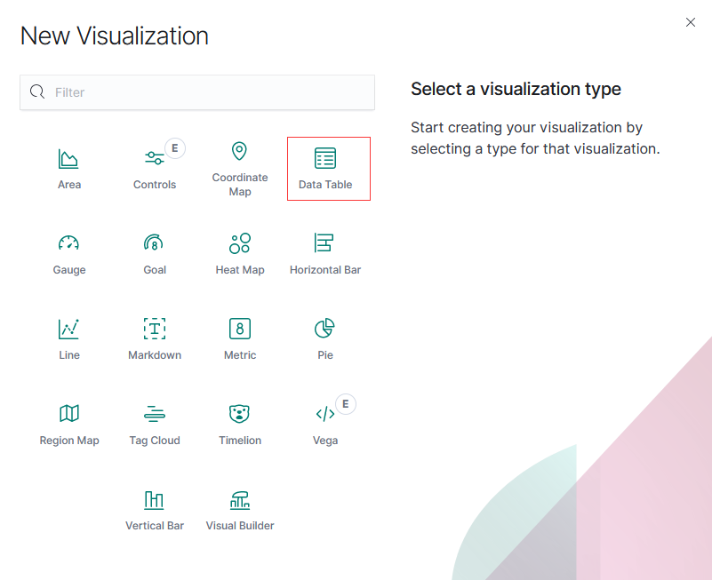
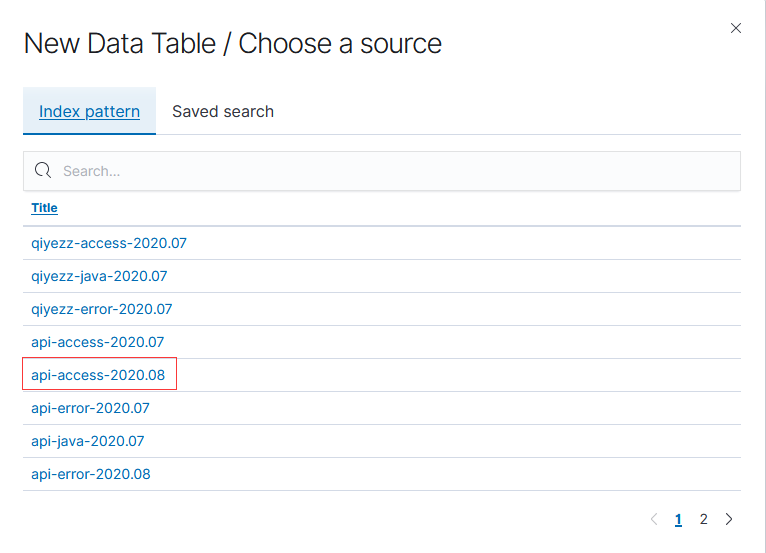
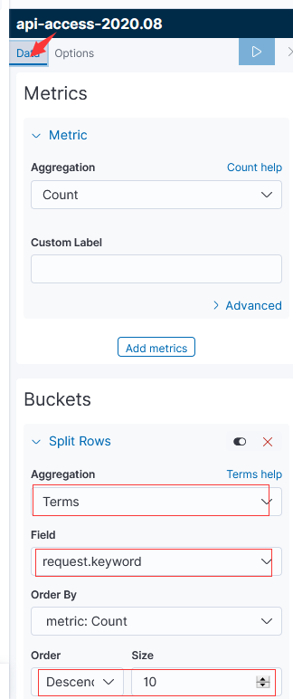
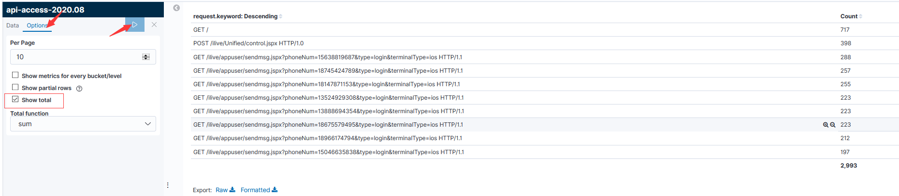
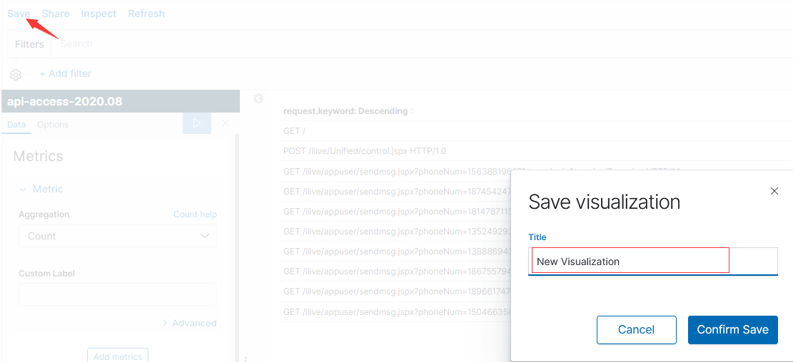
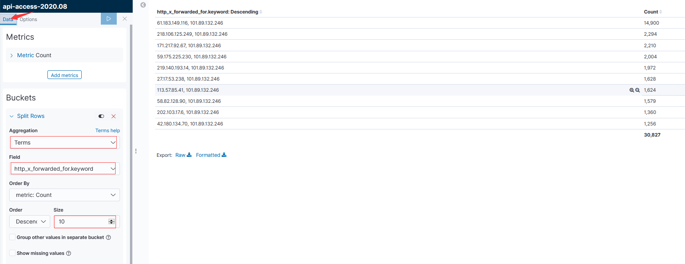
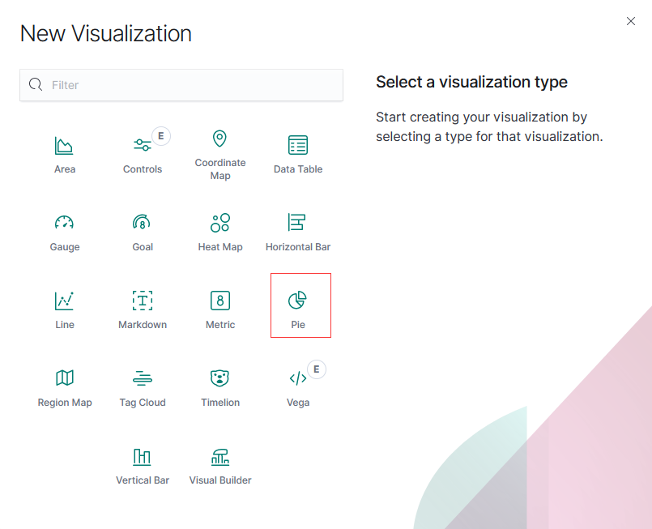
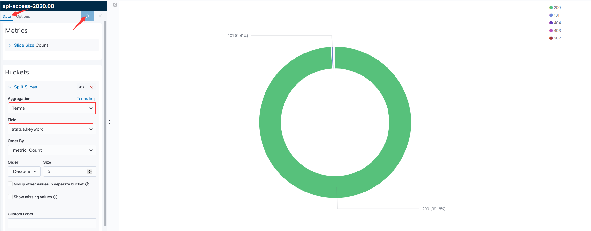

## 收集Nginx日志

### elasticsearch

```shell
$ egrep '^[a-Z]' config/elasticsearch.yml 
node.name: elk
path.data: /data/elk/data
path.logs: logs
network.host: 192.168.23.55
http.port: 9200
discovery.seed_hosts: ["192.168.23.55"]
cluster.initial_master_nodes: ["elk"]
```

### kibana

```shell
$ egrep '^[a-Z]' config/kibana.yml 
server.port: 5601
server.host: "192.168.23.55"
server.name: "elk"
elasticsearch.hosts: ["http://192.168.23.55:9200"]
```

### filebeat

```shell
# egrep -v '#|^$' filebeat.yml 
filebeat.inputs:
- type: log
  enabled: true
  paths:
    - /var/log/nginx/access.log
output.elasticsearch:
  hosts: ["192.168.23.55:9200"]
```

## 收集Nginx JSON 日志

### Nginx 日志格式配置

```
log_format  json  '{ "time_local": "$time_local", '
                      '"remote_addr": "$remote_addr", '
                      '"http_referer": "$http_referer", '
                      '"request": "$request", '               
                      '"status": "$status", '
                      '"body_bytes_sent": "$body_bytes_sent", '
                      '"request_body": "$request_body", '
                      '"http_user_agent": "$http_user_agent", '
                      '"http_x_forwarded_for": "$http_x_forwarded_for", '
                      '"upstream_addr": "$upstream_addr", '
                      '"upstream_http_host": "$upstream_http_host", '
                      '"upstream_response_time": "$upstream_response_time", '
                      '"upstream_status": "$upstream_status", '
                      '"request_time": "$request_time", '
                      '"http_cookie": "$http_cookie"'
'}';
```

#### filebeat 6.x

```
filebeat.inputs:
- type: log
  enabled: true
  paths:
    - /var/log/nginx/access.log
  json.keys_under_root: true
  json.overwrite_keys: true

setup.kibana:
  host: "192.168.23.55:5601"

output.elasticsearch:
  hosts: ["192.168.23.55:9200"]
  index: "nginx-%{[beat.version]}-%{+yyyy.MM}"

setup.template.enabled: false
setup.template.name: "nginx"
setup.template.pattern: "nginx-*"
setup.template.overwrite: true
```

#### filebeat 7.x

```
filebeat.inputs:
- type: log
  enabled: true
  paths:
    - /var/log/nginx/access.log
  json.keys_under_root: true
  json.overwrite_keys: true

setup.kibana:
  host: "192.168.23.55:5601"

output.elasticsearch:
  hosts: ["192.168.23.55:9200"]
  index: "nginx-%{[agent.version]}-%{+yyyy.MM}"

setup.ilm.enabled: false
setup.template.name: "nginx"
setup.template.pattern: "nginx-*"
setup.ilm.overwrite: true
```

说明：后面使用的全部基于filebeat 7.x 进行搭建。

## 收集 Nginx 访问和错误日志

 ```
filebeat.inputs:
- type: log
  enabled: true
  paths:
    - /var/log/nginx/access.log
  json.keys_under_root: true
  json.overwrite_keys: true
  tags: ["access"]

- type: log
  enabled: true
  paths:
    - /var/log/nginx/error.log
  tags: ["error"]

setup.kibana:
  host: "192.168.23.55:5601"

output.elasticsearch:
  hosts: ["192.168.23.55:9200"]
  indices:
    - index: "nginx-access-%{[agent.version]}-%{+yyyy.MM}"
      when.contains:
        tags: "access"
    - index: "nginx-error-%{[agent.version]}-%{+yyyy.MM}"
      when.contains:
        tags: "error"
        
setup.ilm.enabled: false
setup.template.name: "nginx"
setup.template.pattern: "nginx-*"
setup.ilm.overwrite: true
 ```

## 收集 tomcat 日志

#### tomcat 日志格式配置

```
    <Valve className="org.apache.catalina.valves.AccessLogValve" directory="logs"
           prefix="localhost_access_log" suffix=".log"
           pattern="{&quot;client&quot;:&quot;%h&quot;,  &quot;client user&quot;:&quot;%l&quot;,   &quot;authenticated&quot;:&quot;%u&quot;,   &quot;access time&quot;:&quot;%t&quot;,     &quot;method&quot;:&quot;%r&quot;,   &quot;status&quot;:&quot;%s&quot;,  &quot;send bytes&quot;:&quot;%b&quot;,  &quot;Query?string&quot;:&quot;%q&quot;,  &quot;partner&quot;:&quot;%{Referer}i&quot;,  &quot;Agent version&quot;:&quot;%{User-Agent}i&quot;}"/>
```

#### filebeat 7.x

```
filebeat.inputs:
##################nginx#######################
- type: log
  enabled: true
  paths:
    - /var/log/nginx/access.log
  json.keys_under_root: true
  json.overwrite_keys: true
  tags: ["access"]

- type: log
  enabled: true
  paths:
    - /var/log/nginx/error.log
  tags: ["error"]
####################tomcat#######################
- type: log
  enabled: true
  paths:
    - /opt/app/apache-tomcat-7.0.104/logs/localhost_access_log.*.txt
  json.keys_under_root: true
  json.overwrite_keys: true
  tags: ["tomcat"]

###################output#######################
setup.kibana:
  host: "192.168.23.55:5601"

output.elasticsearch:
  hosts: ["192.168.23.55:9200"]
  indices:
    - index: "nginx-access-%{[agent.version]}-%{+yyyy.MM}"
      when.contains:
        tags: "access"
    - index: "nginx-error-%{[agent.version]}-%{+yyyy.MM}"
      when.contains:
        tags: "error"
    - index: "tomcat-access-%{[agent.version]}-%{+yyyy.MM}"
      when.contains:
        tags: "tomcat"

setup.ilm.enabled: false
setup.template.name: "nginx"
setup.template.pattern: "nginx-*"
setup.ilm.overwrite: true
```

## 收集 java 日志

```
filebeat.inputs:
##################nginx#######################
- type: log
  enabled: true
  paths:
    - /var/log/nginx/access.log
  json.keys_under_root: true
  json.overwrite_keys: true
  tags: ["access"]

- type: log
  enabled: true
  paths:
    - /var/log/nginx/error.log
  tags: ["error"]
####################tomcat#######################
- type: log
  enabled: true
  paths:
    - /opt/app/apache-tomcat-7.0.104/logs/localhost_access_log.*.txt
  json.keys_under_root: true
  json.overwrite_keys: true
  tags: ["tomcat"]
####################java########################  
- type: log
  enabled: true
  paths:
    - /opt/app/apache-tomcat-7.0.104/logs/catalina.out
  tags: ["java"]
  multiline.pattern: ^\[
  multiline.negate: true
  multiline.match: after

###################output#######################
setup.kibana:
  host: "192.168.23.55:5601"

output.elasticsearch:
  hosts: ["192.168.23.55:9200"]
  indices:
    - index: "nginx-access-%{[agent.version]}-%{+yyyy.MM}"
      when.contains:
        tags: "access"
    - index: "nginx-error-%{[agent.version]}-%{+yyyy.MM}"
      when.contains:
        tags: "error"
    - index: "tomcat-access-%{[agent.version]}-%{+yyyy.MM}"
      when.contains:
        tags: "tomcat"
    - index: "java-%{[agent.version]}-%{+yyyy.MM}"
      when.contains:
        tags: "java"    

setup.ilm.enabled: false
setup.template.name: "nginx"
setup.template.pattern: "nginx-*"
setup.ilm.overwrite: true
```

## 收集docker日志

#### 单容器

```
filebeat.inputs:
- type: docker
  containers.ids:
    - 'cb21c35f9b36b65cea5cd28067edc4fded6e3f838d8bf52a6fd951c4547287cd'

setup.kibana:
  host: "192.168.23.55:5601"

output.elasticsearch:
  hosts: ["192.168.23.55:9200"]
  indices:
    - index: "docker-access-%{[agent.version]}-%{+yyyy.MM}"
      when.contains:
        stream: "stdout"
    - index: "docker-error-%{[agent.version]}-%{+yyyy.MM}"
      when.contains:
        stream: "stderr"
        
setup.ilm.enabled: false
setup.template.name: "docker"
setup.template.pattern: "docker-*"
setup.ilm.overwrite: true
```

#### 多容器

多个容器需通过docker-compose 打标签：

```
version: '3'
services:
  nginx: 
    image: nginx:latest
    labels:
      service: nginx
    logging:
      options:
        labels: "service"
    ports:
      - "80:80"
  db:
    image: mysql:latest
    labels:
      service: db
    logging:
      options:
        labels: "service"
    ports:
      - "3306:3306"
```

#### filebeat 配置

```
filebeat.inputs:
- type: log
  enabled: true
  paths:
    - /var/lib/docker/containers/*/*json.log
  json.keys_under_root: true
  json.overwrite_keys: true

setup.kibana:
  host: "192.168.23.55:5601"

output.elasticsearch:
  hosts: ["192.168.23.55:9200"]
  indices:
    - index: "docker-nginx-access-%{[agent.version]}-%{+yyyy.MM}"
      when.contains:
        attrs.service: "nginx"
        stream: "stdout"
    - index: "docker-nginx-error-%{[agent.version]}-%{+yyyy.MM}"
      when.contains:
        attrs.service: "nginx"
        stream: "stderr"         
    - index: "docker-db-access-%{[agent.version]}-%{+yyyy.MM}"
      when.contains:
        attrs.service: "db"
        stream: "stdout"
    - index: "docker-db-error-%{[agent.version]}-%{+yyyy.MM}"
      when.contains:
        attrs.service: "db"
        stream: "stderr"

setup.ilm.enabled: false
setup.template.name: "docker"
setup.template.pattern: "docker-*"
setup.ilm.overwrite: true
```

## filebeat 自带模块收集日志

#### filebeat 配置

```
filebeat.config.modules:
  path: ${path.config}/modules.d/*.yml
  reload.enabled: true
  reload.period: 10s

output.elasticsearch:
  hosts: ["192.168.23.55:9200"]
  indices:
    - index: "nginx-access-%{[agent.version]}-%{+yyyy.MM}"
      when.contains:
        fileset.name: "access"
    - index: "nginx-error-%{[agent.version]}-%{+yyyy.MM}"
      when.contains:
        fileset.name: "error"

setup.ilm.enabled: false
setup.template.name: "nginx"
setup.template.pattern: "nginx-*"
setup.ilm.overwrite: true
```

#### 启动 nginx 模块

```
# ./filebeat modules enable nginx
```

#### nginx 模块的配置文件

```
# egrep -v '#|^$' modules.d/nginx.yml
- module: nginx
  access:
    enabled: true
    var.paths: ["/var/log/nginx/access.log"]
  error:
    enabled: true
    var.paths: ["/var/log/nginx/error.log"]
```

## redis 作为缓存收集日志

#### filebat 配置

```
filebeat.inputs:
##################nginx#######################
- type: log
  enabled: true
  paths:
    - /var/log/nginx/access.log
  json.keys_under_root: true
  json.overwrite_keys: true
  tags: ["api-access"]
  fields:
    server_ip: 172.18.250.178

- type: log
  enabled: true
  paths:
    - /var/log/nginx/error.log
  tags: ["api-error"]
  fields:
    server_ip: 172.18.250.178

- type: log
  enabled: true
  paths:
    - /opt/app/api_tyzb/logs/catalina-2020-08*.out
  tags: ["api-java"]
  multiline.pattern: ^\[
  multiline.negate: true
  multiline.match: after
  fields:
    server_ip: 172.18.250.178

###################output#######################
setup.kibana:
  host: "172.18.1.220:5601"

output.redis:
  hosts: ["172.18.1.220"]
  key: "filebeat"
  db: 0
  timeout: 5
```

#### logstash 配置文件

```
input {
  redis {
    host  => "172.18.1.220"
    port  => "6379"
    db    => "0"
    key   => "filebeat"
    data_type => "list"
  }
}

filter {
  mutate {
    convert => ["upstream_response_time", "float"]
    convert => ["request_time", "float"]
  }
}

output {
  stdout { }
    if "api-access" in [tags] {
      elasticsearch {
        hosts => "http://172.18.1.220:9200"
        manage_template => false
        index => "api-access-%{+yyyy.MM}"
      }
    }
    if "api-error" in [tags] {
      elasticsearch {
        hosts => "http://172.18.1.220:9200"
        manage_template => false
        index => "api-error-%{+yyyy.MM}"
      }
    }
    if "api-java" in [tags] {
      elasticsearch {
        hosts => "http://172.18.1.220:9200"
        manage_template => false
        index => "api-java-%{+yyyy.MM}"
      }
    }
}
```

1.通过在filebeat 打上tag 模式可以将日志写入到redis的一个列表中，这样会简化logstash的配置。

2.连入redis，可以使用 `LLEN filebeat` 查看该列表的临时存储数据。

3.filter 模块是将有些字符串转换为浮点数，这样在 kibana 可以做数字的筛选，不然只能通过字符串匹配。

## 自定义日志格式

#### 日志格式如下

```
2020-08-01 00:00:05|192.168.187.82|115020310221|00433220|http://h5.nty.tv189.com/api/portal/task/festival-check?0.8277011654648219|http://h5.nty.tv189.com/csite/tysx/task/index?appid=115020310221&token=e472730e2669fb159430f2cfd06e8654&devid=000001&version=5.5.8.4&time=20200801000003&tyk=JmAXQCvVqMZfg48P2ehO8UZLhC0OcMpuoUlR8eqi1i8=&NetType=4G&channelid=00433220|1.68.44.167|13613588757|Mozilla/5.0 (Linux; Android 9; BND-AL10 Build/HONORBND-AL10; wv) AppleWebKit/537.36 (KHTML, like Gecko) Version/4.0 Chrome/79.0.3945.116 Mobile Safari/537.36/newtysx-android-ua-5.5.8.4|e472730e2669fb159430f2cfd06e8654|1596211187453500|1|5.5.8.4|104300271233011200302|http://h5.nty.tv189.com/api/portal/task/festival-check|||4G|6d383ed99c6fdad1|null|0
```

#### filebeat 配置

```
filebeat.inputs:
- type: log
  enabled: true
  paths:
    - /data/file/h5portal/access_logs/h5_access_202008*.txt
  tags: ["prod"]
  fields:
    server_ip: 192.168.187.249

###################output#######################
setup.kibana:
  host: "192.168.187.248:5601"

output.redis:
  hosts: ["192.168.187.248"]
  key: "filebeat"
  db: 0
  timeout: 5
```

#### logstash 配置

```
input {
  redis {
    host  => "192.168.187.248"
    port  => "6379"
    db    => "0"
    key   => "filebeat"
    data_type => "list"
  }
}
filter{
  grok{
    match => {
      "message" => "(?<reqtime>.*?)\|%{IP:distanceip}\|(?<appid>.*?)\|(?<channelID>.*?)\|(?<requrl>.*?)\|(?<referer>.*?)\|%{IP:realip}\|(?<accountNo>.*?)\|(?<ua>.*?)\|(?<sessionID>.*?)\|(?<cookieID>.*?)\|(?<accessSource>.*?)\|(?<version>.*?)\|(?<uid>.*)\|(?<url_key>.*?)\|(?<url_group>.*?)\|(?<mkid>.*?)\|(?<nettype>.*?)\|(?<imeiid>.*?)\|(?<imsiid>.*?)\|(?<netOperator>.*?)"
    }
  }
}

output {
  stdout { }
    if "test" in [tags] {
      elasticsearch {
        hosts => "http://192.168.187.248:9200"
        manage_template => false
        index => "h5-test-%{+yyyy.MM}"
      }
    }
    if "prod" in [tags] {
      elasticsearch {
        hosts => "http://192.168.187.248:9200"
        manage_template => false
        index => "h5-prod-%{+yyyy.MM}"
      }
    }
}
```

1.logstash 有提前定义好的变量，位置在 `vendor/bundle/jruby/2.5.0/gems/logstash-patterns-core-4.1.2/patterns/grok-patterns` 可以参考配置。

2.上面配置的大部分都是正则全部匹配，这种会消耗更多的资源，但是配置简单易读。

## kibana 配置

### 访问前十的url

#### 创建图类型

在 kibana 的  Visualize  中点击 `+` 图标，选择如下： 



#### 选择相对应得索引



#### 指定数据得格式



#### 应用配置格式



#### 保存图配置



#### 访问前十的IP

创建步骤和前面得相同，不同之处在于值得选择，配置如下：



#### http 状态码统计

创建图选择饼图：



选择和前面的差不多，配置好如下：

