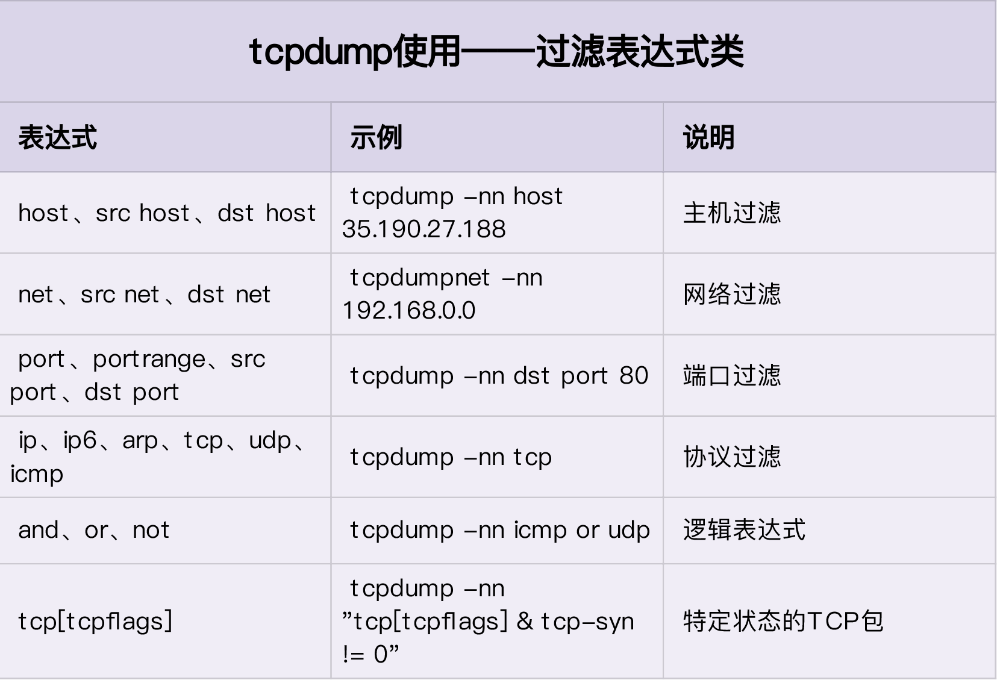
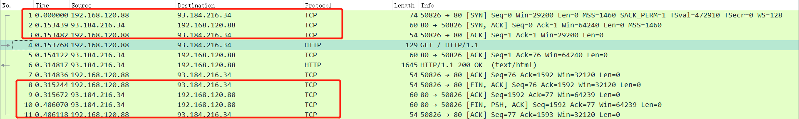
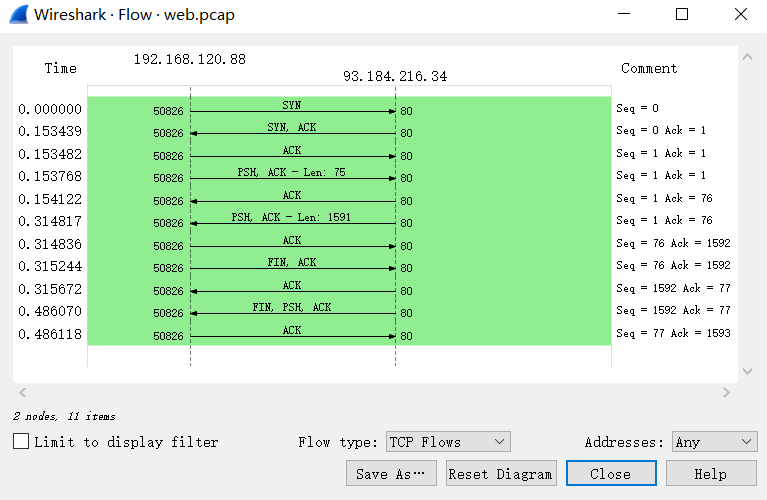
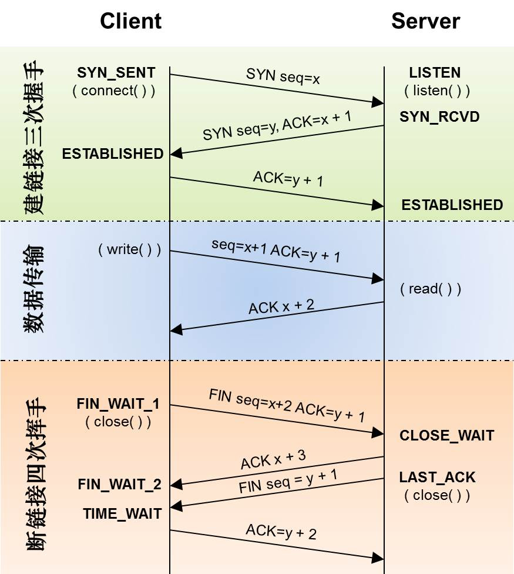

## 基础知识

###  网络包的接收流程 

1. 当一个网络帧到达网卡后，网卡会通过 DMA 方式，把这个网络包放到收包队列中；然后通过硬中断，告诉中断处理程序已经收到了网络包。
2.  接着，网卡中断处理程序会为网络帧分配内核数据结构（sk_buff），并将其拷贝到 sk_buff 缓冲区中；然后再通过软中断，通知内核收到了新的网络帧。 
3.  接下来，内核协议栈从缓冲区中取出网络帧，并通过网络协议栈，从下到上逐层处理这个网络帧。 
   1.  在链路层检查报文的合法性，找出上层协议的类型（比如 IPv4 还是 IPv6），再去掉帧头、帧尾，然后交给网络层。 
   2.  网络层取出 IP 头，判断网络包下一步的走向，比如是交给上层处理还是转发。当网络层确认这个包是要发送到本机后，就会取出上层协议的类型（比如 TCP 还是 UDP），去掉 IP 头，再交给传输层处理。 
   3.  传输层取出 TCP 头或者 UDP 头后，根据 < 源 IP、源端口、目的 IP、目的端口 > 四元组作为标识，找出对应的 Socket，并把数据拷贝到 Socket 的接收缓存中。 
4.  最后，应用程序就可以使用 Socket 接口，读取到新接收到的数据了。 


###  网络包的发送流程 

1.  首先，应用程序调用 Socket API（比如 sendmsg）发送网络包。 由于这是一个系统调用，所以会陷入到内核态的套接字层中。套接字层会把数据包放到 Socket 发送缓冲区中。  
2.  接下来，网络协议栈从 Socket 发送缓冲区中，取出数据包；再按照 TCP/IP 栈，从上到下逐层处理。比如，传输层和网络层，分别为其增加 TCP 头和 IP 头，执行路由查找确认下一跳的 IP，并按照 MTU 大小进行分片。 
3.  分片后的网络包，再送到网络接口层，进行物理地址寻址，以找到下一跳的 MAC 地址。然后添加帧头和帧尾，放到发包队列中。这一切完成后，会有软中断通知驱动程序：发包队列中有新的网络帧需要发送。 
4.  最后，驱动程序通过 DMA ，从发包队列中读出网络帧，并通过物理网卡把它发送出去。 

###  性能指标 

* 带宽，表示链路的最大传输速率，单位通常为 b/s （比特 / 秒）。 
* 吞吐量，表示单位时间内成功传输的数据量，单位通常为 b/s（比特 / 秒）或者 B/s（字节 / 秒）。吞吐量受带宽限制，而吞吐量 / 带宽，也就是该网络的使用率。 
* 延时，表示从网络请求发出后，一直到收到远端响应，所需要的时间延迟。在不同场景中，这一指标可能会有不同含义。比如，它可以表示，建立连接需要的时间（比如 TCP 握手延时），或一个数据包往返所需的时间（比如 RTT）。 
* PPS，是 Packet Per Second（包 / 秒）的缩写，表示以网络包为单位的传输速率。PPS 通常用来评估网络的转发能力，比如硬件交换机，通常可以达到线性转发（即 PPS 可以达到或者接近理论最大值）。而基于 Linux 服务器的转发，则容易受网络包大小的影响。 

除了这些指标，网络的可用性（网络能否正常通信）、并发连接数（TCP 连接数量）、丢包率（丢包百分比）、重传率（重新传输的网络包比例）等也是常用的性能指标。 

### 网络配置

```
# ifconfig ens33
ens33: flags=4163<UP,BROADCAST,RUNNING,MULTICAST>  mtu 1500
        inet 192.168.120.88  netmask 255.255.255.0  broadcast 192.168.120.255
        inet6 fe80::20c:29ff:fee1:977c  prefixlen 64  scopeid 0x20<link>
        ether 00:0c:29:e1:97:7c  txqueuelen 1000  (Ethernet)
        RX packets 198  bytes 20133 (19.6 KiB)
        RX errors 0  dropped 0  overruns 0  frame 0
        TX packets 171  bytes 25201 (24.6 KiB)
        TX errors 0  dropped 0 overruns 0  carrier 0  collisions 0
```

```
# ip -s addr show dev ens33
2: ens33: <BROADCAST,MULTICAST,UP,LOWER_UP> mtu 1500 qdisc pfifo_fast state UP group default qlen 1000
    link/ether 00:0c:29:e1:97:7c brd ff:ff:ff:ff:ff:ff
    inet 192.168.120.88/24 brd 192.168.120.255 scope global ens33
       valid_lft forever preferred_lft forever
    inet6 fe80::20c:29ff:fee1:977c/64 scope link
       valid_lft forever preferred_lft forever
    RX: bytes  packets  errors  dropped overrun mcast
    24183      248      0       0       0       0
    TX: bytes  packets  errors  dropped carrier collsns
    28037      199      0       0       0       0
```

1. 网络接口的状态标志。ifconfig 输出中的 RUNNING ，或 ip 输出中的 LOWER_UP ，都表示物理网络是连通的，即网卡已经连接到了交换机或者路由器中。如果你看不到它们，通常表示网线被拔掉了。 

2. 第二，MTU 的大小。MTU 默认大小是 1500，根据网络架构的不同（比如是否使用了 VXLAN 等叠加网络），你可能需要调大或者调小 MTU 的数值。 
3. 第三，网络接口的 IP 地址、子网以及 MAC 地址。这些都是保障网络功能正常工作所必需的，你需要确保配置正确。 
4.  网络收发的字节数、包数、错误数以及丢包情况，特别是 TX 和 RX 部分的 errors、dropped、overruns、carrier 以及 collisions 等指标不为 0 时，通常表示出现了网络 I/O 问题。其中： 
   1. errors 表示发生错误的数据包数，比如校验错误、帧同步错误等； 
   2. dropped 表示丢弃的数据包数，即数据包已经收到了 Ring Buffer，但因为内存不足等原因丢包； 
   3. overruns 表示超限数据包数，即网络 I/O 速度过快，导致 Ring Buffer 中的数据包来不及处理（队列满）而导致的丢包； 
   4. carrier 表示发生 carrirer 错误的数据包数，比如双工模式不匹配、物理电缆出现问题等； 
   5. collisions 表示碰撞数据包数。 

###  套接字信息 

```
# netstat -nlp |  head -n 3
Active Internet connections (only servers)
Proto Recv-Q Send-Q Local Address           Foreign Address         State       PID/Program name
tcp        0      0 0.0.0.0:111             0.0.0.0:*               LISTEN      1/systemd
```

```
# ss -ltnp | head -n 3
State      Recv-Q Send-Q Local Address:Port               Peer Address:Port
LISTEN     0      128          *:111                      *:*                   users:(("rpcbind",pid=8841,fd=4),("systemd",pid=1,fd=39))
LISTEN     0      128          *:22                       *:*                   users:(("sshd",pid=9172,fd=3))
```

当套接字处于连接状态（Established）时：

* Recv-Q 表示套接字缓冲还没有被应用程序取走的字节数（即接收队列长度）。
* 而 Send-Q 表示还没有被远端主机确认的字节数（即发送队列长度）。 

 当套接字处于监听状态（Listening）时：

* Recv-Q 表示全连接队列的长度。
* 而 Send-Q 表示全连接队列的最大长度。 

###  协议栈统计信息 

```
# netstat -s
...
Tcp:
    0 active connections openings
    2 passive connection openings
    0 failed connection attempts
    0 connection resets received
    2 connections established
    180 segments received
    125 segments send out
    0 segments retransmited
    0 bad segments received.
    0 resets sent
...
```

```
# ss -s
Total: 572 (kernel 663)
TCP:   8 (estab 2, closed 0, orphaned 0, synrecv 0, timewait 0/0), ports 0

Transport Total     IP        IPv6
*         663       -         -
RAW       0         0         0
UDP       6         3         3
TCP       8         5         3
INET      14        8         6
FRAG      0         0         0
```

###  网络吞吐和 PPS 

```
# sar -n DEV 1
Linux 3.10.0-957.el7.x86_64 (localhost.localdomain)     05/30/2021      _x86_64_        (2 CPU)

05:48:45 PM     IFACE   rxpck/s   txpck/s    rxkB/s    txkB/s   rxcmp/s   txcmp/s  rxmcst/s
05:48:46 PM        lo      0.00      0.00      0.00      0.00      0.00      0.00      0.00
05:48:46 PM     ens33      1.00      1.00      0.06      0.06      0.00      0.00      0.00
```

* rxpck/s 和 txpck/s 分别是接收和发送的 PPS，单位为包 / 秒。
* rxkB/s 和 txkB/s 分别是接收和发送的吞吐量，单位是 KB/ 秒。
* rxcmp/s 和 txcmp/s 分别是接收和发送的压缩数据包数，单位是包 / 秒。
* %ifutil 是网络接口的使用率，即半双工模式下为 (rxkB/s+txkB/s)/Bandwidth，而全双工模式下为 max(rxkB/s, txkB/s)/Bandwidth。 (Ubuntu 系统显示)

Bandwidth 可以用 ethtool 来查询，它的单位通常是 Gb/s 或者 Mb/s，不过注意这里小写字母 b ，表示比特而不是字节。

```
# ethtool ens33 |grep Speed
        Speed: 1000Mb/s
```

###  连通性和延时 

```
# ping qq.com
PING qq.com (123.151.137.18) 56(84) bytes of data.
64 bytes from 123.151.137.18 (123.151.137.18): icmp_seq=1 ttl=128 time=30.0 ms
64 bytes from 123.151.137.18 (123.151.137.18): icmp_seq=2 ttl=128 time=31.0 ms

--- qq.com ping statistics ---
4 packets transmitted, 4 received, 0% packet loss, time 3028ms
rtt min/avg/max/mdev = 30.015/30.733/31.273/0.525 ms
```

* 第一部分，是每个 ICMP 请求的信息，包括 ICMP 序列号（icmp_seq）、TTL（生存时间，或者跳数）以及往返延时。
* 第二部分，则是三次 ICMP 请求的汇总。 

## 基准测试

###  转发性能 

我们首先来看，网络接口层和网络层，它们主要负责网络包的封装、寻址、路由以及发送和接收。在这两个网络协议层中，每秒可处理的网络包数 PPS，就是最重要的性能指标。特别是 64B 小包的处理能力，值得我们特别关注。 

```
# modprobe pktgen
# ps -ef | grep pktgen | grep -v grep
root      10173      2  0 18:59 ?        00:00:00 [kpktgend_0]
root      10175      2  0 18:59 ?        00:00:00 [kpktgend_1]
# ls /proc/net/pktgen/
kpktgend_0  kpktgend_1  pgctrl
```

下面是 一个发包测试的示例：

```
# cat pgset.sh
#!/bin/bash
# 定义一个工具函数，方便后面配置各种测试选项
function pgset() {
    local result
    echo $1 > $PGDEV

    result=`cat $PGDEV | fgrep "Result: OK:"`
    if [ "$result" = "" ]; then
         cat $PGDEV | fgrep Result:
    fi
}

# 为0号线程绑定eth0网卡
PGDEV=/proc/net/pktgen/kpktgend_0
pgset "rem_device_all"   # 清空网卡绑定
pgset "add_device ens33"  # 添加eth0网卡

# 配置eth0网卡的测试选项
PGDEV=/proc/net/pktgen/ens33
pgset "count 1000000"    # 总发包数量
pgset "delay 5000"       # 不同包之间的发送延迟(单位纳秒)
pgset "clone_skb 0"      # SKB包复制
pgset "pkt_size 64"      # 网络包大小
pgset "dst 192.168.120.88" # 目的IP
pgset "dst_mac 00:0c:29:e1:97:7c"  # 目的MAC

# 启动测试
PGDEV=/proc/net/pktgen/pgctrl
pgset "start"
```

```
# chmod +x pgset.sh
# ./pgset.sh
```

```
# cat /proc/net/pktgen/ens33
Params: count 1000000  min_pkt_size: 64  max_pkt_size: 64
     frags: 0  delay: 5000  clone_skb: 0  ifname: ens33
     flows: 0 flowlen: 0
     queue_map_min: 0  queue_map_max: 0
     dst_min: 192.168.120.88  dst_max:
        src_min:   src_max:
     src_mac: 00:0c:29:e5:d6:5b dst_mac: 00:0c:29:e1:97:7c
     udp_src_min: 9  udp_src_max: 9  udp_dst_min: 9  udp_dst_max: 9
     src_mac_count: 0  dst_mac_count: 0
     Flags:
Current:
     pkts-sofar: 1000000  errors: 0
     started: 7891269577us  stopped: 7908710706us idle: 7740us
     seq_num: 1000001  cur_dst_mac_offset: 0  cur_src_mac_offset: 0
     cur_saddr: 192.168.120.74  cur_daddr: 192.168.120.88
     cur_udp_dst: 9  cur_udp_src: 9
     cur_queue_map: 0
     flows: 0
Result: OK: 17441128(c17433388+d7740) usec, 1000000 (64byte,0frags)
  57335pps 29Mb/sec (29355520bps) errors: 0
```

* 第一部分的 Params 是测试选项；
* 第二部分的 Current 是测试进度，其中， packts so far（pkts-sofar）表示已经发送了 100 万个包，也就表明测试已完成。
* 第三部分的 Result 是测试结果，包含测试所用时间、网络包数量和分片、PPS、吞吐量以及错误数。 

测试数据显示：57335pps、29Mb/sec 的吞吐量。

计算一下千兆交换机的 PPS。交换机可以达到线速（满负载时，无差错转发），它的 PPS 就是 1000Mbit 除以以太网帧的大小，即 1000Mbps/((64+20)*8bit) = 1.5 Mpps（其中，20B 为以太网帧前导和帧间距的大小）。 

###  TCP/UDP 性能 

iperf 和 netperf 都是最常用的网络性能测试工具，测试 TCP 和 UDP 的吞吐量。它们都以客户端和服务器通信的方式，测试一段时间内的平均吞吐量。

 以 iperf 为例，看一下 TCP 性能的测试方法：

```
# yum install -y iperf3
```

 在目标机器上启动 iperf 服务端： 

```
# -s表示启动服务端，-i表示汇报间隔，-p表示监听端口
# iperf3 -s -i 1 -p 10000
```

 在另一台机器上运行 iperf 客户端，运行测试： 

```
# -c表示启动客户端，192.168.0.30为目标服务器的IP
# -b表示目标带宽(单位是bits/s)
# -t表示测试时间
# -P表示并发数，-p表示目标服务器监听端口
# iperf3 -c 192.168.120.88 -b 1G -t 15 -P 2 -p 10000
```

目标机器统计信息：

```
- - - - - - - - - - - - - - - - - - - - - - - - -
[ ID] Interval           Transfer     Bandwidth
[  5]   0.00-15.04  sec  0.00 Bytes  0.00 bits/sec                  sender
[  5]   0.00-15.04  sec  1.73 GBytes   990 Mbits/sec                  receiver
[  7]   0.00-15.04  sec  0.00 Bytes  0.00 bits/sec                  sender
[  7]   0.00-15.04  sec  1.73 GBytes   989 Mbits/sec                  receiver
[SUM]   0.00-15.04  sec  0.00 Bytes  0.00 bits/sec                  sender
[SUM]   0.00-15.04  sec  3.46 GBytes  1.98 Gbits/sec                  receiver
-----------------------------------------------------------
```

客户端机器统计信息：

```
- - - - - - - - - - - - - - - - - - - - - - - - -
[ ID] Interval           Transfer     Bandwidth       Retr
[  4]   0.00-15.00  sec  1.74 GBytes   994 Mbits/sec   50             sender
[  4]   0.00-15.00  sec  1.73 GBytes   993 Mbits/sec                  receiver
[  6]   0.00-15.00  sec  1.73 GBytes   993 Mbits/sec   92             sender
[  6]   0.00-15.00  sec  1.73 GBytes   992 Mbits/sec                  receiver
[SUM]   0.00-15.00  sec  3.47 GBytes  1.99 Gbits/sec  142             sender
[SUM]   0.00-15.00  sec  3.46 GBytes  1.98 Gbits/sec                  receiver
```

###  HTTP 性能 

要测试 HTTP 的性能，也有大量的工具可以使用，比如 ab、webbench 等，都是常用的 HTTP 压力测试工具。其中，ab 是 Apache 自带的 HTTP 压测工具，主要测试 HTTP 服务的每秒请求数、请求延迟、吞吐量以及请求延迟的分布情况等。 

```
# Ubuntu
# apt-get install -y apache2-utils
# CentOS
# yum install -y httpd-tools
```

运行测试案例：

```
# docker run -p 80:80 -itd nginx
```

 而在另一台机器上，运行 ab 命令，测试 Nginx 的性能： 

```
# ab -c 1000 -n 10000 http://192.168.120.88/  # -c表示并发请求数为1000，-n表示总的请求数为10000
...
Server Software:        nginx/1.19.10
Server Hostname:        192.168.120.88
Server Port:            80

Document Path:          /
Document Length:        612 bytes

Concurrency Level:      1000
Time taken for tests:   2.323 seconds
Complete requests:      10000
Failed requests:        128
   (Connect: 0, Receive: 0, Length: 64, Exceptions: 64)
Write errors:           0
Total transferred:      8405856 bytes
HTML transferred:       6080832 bytes
Requests per second:    4303.89 [#/sec] (mean)
Time per request:       232.348 [ms] (mean)
Time per request:       0.232 [ms] (mean, across all concurrent requests)
Transfer rate:          3532.99 [Kbytes/sec] received

Connection Times (ms)
              min  mean[+/-sd] median   max
Connect:        1   76 234.7      5    1022
Processing:     3   61 121.7     20     926
Waiting:        0   59 121.9     19     917
Total:          6  138 284.2     29    1853

Percentage of the requests served within a certain time (ms)
  50%     29
  66%     46
  75%    109
  80%    158
  90%    270
  95%   1025
  98%   1224
  99%   1430
 100%   1853 (longest request)
```

 请求汇总部分：

* Requests per second:    4303.89
*  每个请求的延迟（Time per request）分为两行，第一行的 232ms 表示平均延迟，包括了线程运行的调度时间和网络请求响应时间，而下一行的 0.232ms ，则表示实际请求的响应时间； 
*  Transfer rate 表示吞吐量（BPS）为 3532.99 KB/s。 

 连接时间汇总部分：

 分别展示了建立连接、请求、等待以及汇总等的各类时间，包括最小、最大、平均以及中值处理时间。 

 请求延迟汇总部分：

 给出了不同时间段内处理请求的百分比，比如， 90% 的请求，都可以在 270ms 内完成。 

###  应用负载性能 

为了得到应用程序的实际性能，就要求性能工具本身可以模拟用户的请求负载，而 iperf、ab 这类工具就无能为力了。幸运的是，我们还可以用 wrk、TCPCopy、Jmeter 或者 LoadRunner 等实现这个目标。 

安装 wrk ：

```
# yum install -y gcc git
# git clone https://github.com/wg/wrk
# cd wrk
# make
# cp wrk /usr/local/bin/
```

通过wrk测试前面启动的nginx：

```
# wrk -c 1000 -t 2 http://192.168.120.88/
Running 10s test @ http://192.168.120.88/
  2 threads and 1000 connections
  Thread Stats   Avg      Stdev     Max   +/- Stdev
    Latency   108.43ms   48.28ms   2.00s    96.82%
    Req/Sec     3.87k     1.22k    7.67k    69.39%
  76317 requests in 10.07s, 61.94MB read
  Socket errors: connect 0, read 0, write 0, timeout 118
Requests/sec:   7576.62
Transfer/sec:      6.15MB
```

 这里使用 2 个线程、并发 1000 连接，重新测试了 Nginx 的性能。你可以看到，每秒请求数为 7576，吞吐量为 6.15MB，平均延迟为 108ms，比前面 ab 的测试结果要好很多。 

这也说明，性能工具本身的性能，对性能测试也是至关重要的。不合适的性能工具，并不能准确测出应用程序的最佳性能。 

## 案例篇

### 域名解析

使用nslookup查询域名解析地址：

```
# nslookup time.geekbang.org
Server:         114.114.114.114
Address:        114.114.114.114#53

Non-authoritative answer:
Name:   time.geekbang.org
Address: 39.106.233.176
```

使用dig展示递归查询的整个过程：

```
# dig +trace +nodnssec time.geekbang.org

; <<>> DiG 9.9.4-RedHat-9.9.4-72.el7 <<>> +trace +nodnssec time.geekbang.org
;; global options: +cmd
.                       69978   IN      NS      e.root-servers.net.
.                       69978   IN      NS      j.root-servers.net.
.                       69978   IN      NS      g.root-servers.net.
.                       69978   IN      NS      m.root-servers.net.
.                       69978   IN      NS      b.root-servers.net.
.                       69978   IN      NS      f.root-servers.net.
.                       69978   IN      NS      h.root-servers.net.
.                       69978   IN      NS      i.root-servers.net.
.                       69978   IN      NS      k.root-servers.net.
.                       69978   IN      NS      a.root-servers.net.
.                       69978   IN      NS      l.root-servers.net.
.                       69978   IN      NS      d.root-servers.net.
.                       69978   IN      NS      c.root-servers.net.
;; Received 811 bytes from 114.114.114.114#53(114.114.114.114) in 5327 ms

org.                    172800  IN      NS      d0.org.afilias-nst.org.
org.                    172800  IN      NS      a0.org.afilias-nst.info.
org.                    172800  IN      NS      a2.org.afilias-nst.info.
org.                    172800  IN      NS      c0.org.afilias-nst.info.
org.                    172800  IN      NS      b0.org.afilias-nst.org.
org.                    172800  IN      NS      b2.org.afilias-nst.org.
;; Received 448 bytes from 192.5.5.241#53(f.root-servers.net) in 2302 ms

geekbang.org.           71410   IN      NS      dns10.hichina.com.
geekbang.org.           71410   IN      NS      dns9.hichina.com.
;; Received 408 bytes from 199.249.120.1#53(b2.org.afilias-nst.org) in 30 ms

time.geekbang.org.      600     IN      A       39.106.233.176
;; Received 62 bytes from 106.11.211.65#53(dns9.hichina.com) in 35 ms
```

1. 第一部分，是从 114.114.114.114 查到的一些根域名服务器（.）的 NS 记录。
2. 第二部分，是从 NS 记录结果中选一个（f.root-servers.net），并查询顶级域名 org. 的 NS 记录。
3. 第三部分，是从 org. 的 NS 记录中选择一个（b2.org.afilias-nst.org），并查询二级域名 geekbang.org. 的 NS 服务器。
4. 最后一部分，就是从 geekbang.org. 的 NS 服务器（dns9.hichina.com）查询最终主机 time.geekbang.org. 的 A 记录。 

###  DNS 解析失败 

运行案例：

```
# docker pull feisky/dnsutils
# cat /etc/resolv.conf
nameserver 114.114.114.114
# docker run -it --rm -v $(mktemp):/etc/resolv.conf feisky/dnsutils bash
```

执行 DNS 查询命令 ：

```
root@8822c73688d2:/# nslookup time.geekbang.org
;; connection timed out; no servers could be reached
```

你可以发现，这个命令阻塞很久后，还是失败了，报了 connection timed out 和 no servers could be reached 错误。

测试本地到 114.114.114.114 的连通性 ：

```
root@8822c73688d2:/# ping -c3 114.114.114.114
PING 114.114.114.114 (114.114.114.114): 56 data bytes
64 bytes from 114.114.114.114: icmp_seq=0 ttl=127 time=5.311 ms
64 bytes from 114.114.114.114: icmp_seq=1 ttl=127 time=7.454 ms
64 bytes from 114.114.114.114: icmp_seq=2 ttl=127 time=8.377 ms
--- 114.114.114.114 ping statistics ---
3 packets transmitted, 3 packets received, 0% packet loss
round-trip min/avg/max/stddev = 5.311/7.047/8.377/1.284 ms
```

 开启 nslookup 的调试输出，查看查询过程中的详细步骤，排查其中是否有异常 ：

```
root@8822c73688d2:/# nslookup -debug time.geekbang.org
;; Connection to 127.0.0.1#53(127.0.0.1) for time.geekbang.org failed: connection refused.
;; Connection to ::1#53(::1) for time.geekbang.org failed: network unreachable.
```

 有可能是因为容器中没有配置 DNS 服务器，查看 /etc/resolv.conf 文件确定未配置，手动配置DNS之后验证：

```
root@8822c73688d2:/# echo "nameserver 114.114.114.114" > /etc/resolv.conf
root@8822c73688d2:/# nslookup time.geekbang.org
Server:         114.114.114.114
Address:        114.114.114.114#53

Non-authoritative answer:
Name:   time.geekbang.org
Address: 39.106.233.176
```

### 抓包工具使用

tcpdump 选项：


tcpdump过滤表达式：



 tcpdump 的输出格式：

```
时间戳 协议 源地址.源端口 > 目的地址.目的端口 网络包详细信息
```

终端一获取抓包数据：

```
# dig +short example.com
93.184.216.34
# tcpdump -i ens33 -nn host 93.184.216.34 -w web.pcap
```

 切换到终端二，执行下面的 curl 命令：

```
# curl http://example.com
```

再回到终端一，按下 Ctrl+C 停止 tcpdump，并把得到的 web.pcap 拷贝出来。  使用 Wireshark 打开 web.pcap ：



由于 HTTP 基于 TCP ，所以你最先看到的三个包，分别是 TCP 三次握手的包。接下来，中间的才是 HTTP 请求和响应包，而最后的四个包，则是 TCP 连接断开时的四次挥手包。 

从菜单栏中，点击 Statistics -> Flow Graph，然后，在弹出的界面中的 Flow type 选择 TCP Flows，你可以更清晰的看到，整个过程中 TCP 流的执行过程： 



这其实跟各种教程上讲到的，TCP 三次握手和四次挥手很类似，作为对比， 你通常看到的 TCP 三次握手和四次挥手的流程，基本是这样的： 

