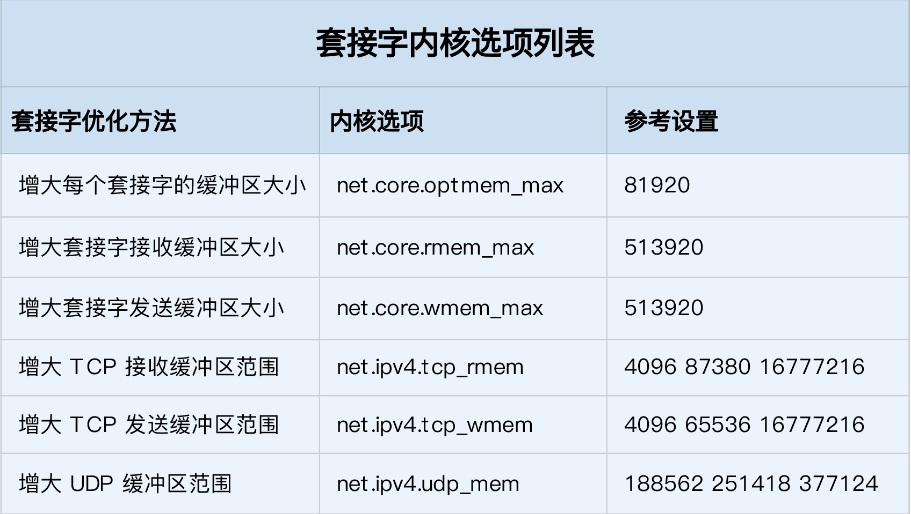

## 基础知识

###  网络包的接收流程 

1. 当一个网络帧到达网卡后，网卡会通过 DMA 方式，把这个网络包放到收包队列中；然后通过硬中断，告诉中断处理程序已经收到了网络包。
2.  接着，网卡中断处理程序会为网络帧分配内核数据结构（sk_buff），并将其拷贝到 sk_buff 缓冲区中；然后再通过软中断，通知内核收到了新的网络帧。 
3.  接下来，内核协议栈从缓冲区中取出网络帧，并通过网络协议栈，从下到上逐层处理这个网络帧。 
   1.  在链路层检查报文的合法性，找出上层协议的类型（比如 IPv4 还是 IPv6），再去掉帧头、帧尾，然后交给网络层。 
   2.  网络层取出 IP 头，判断网络包下一步的走向，比如是交给上层处理还是转发。当网络层确认这个包是要发送到本机后，就会取出上层协议的类型（比如 TCP 还是 UDP），去掉 IP 头，再交给传输层处理。 
   3.  传输层取出 TCP 头或者 UDP 头后，根据 < 源 IP、源端口、目的 IP、目的端口 > 四元组作为标识，找出对应的 Socket，并把数据拷贝到 Socket 的接收缓存中。 
4.  最后，应用程序就可以使用 Socket 接口，读取到新接收到的数据了。 


###  网络包的发送流程 

1.  首先，应用程序调用 Socket API（比如 sendmsg）发送网络包。 由于这是一个系统调用，所以会陷入到内核态的套接字层中。套接字层会把数据包放到 Socket 发送缓冲区中。  
2.  接下来，网络协议栈从 Socket 发送缓冲区中，取出数据包；再按照 TCP/IP 栈，从上到下逐层处理。比如，传输层和网络层，分别为其增加 TCP 头和 IP 头，执行路由查找确认下一跳的 IP，并按照 MTU 大小进行分片。 
3.  分片后的网络包，再送到网络接口层，进行物理地址寻址，以找到下一跳的 MAC 地址。然后添加帧头和帧尾，放到发包队列中。这一切完成后，会有软中断通知驱动程序：发包队列中有新的网络帧需要发送。 
4.  最后，驱动程序通过 DMA ，从发包队列中读出网络帧，并通过物理网卡把它发送出去。 

###  性能指标 

* 带宽，表示链路的最大传输速率，单位通常为 b/s （比特 / 秒）。 
* 吞吐量，表示单位时间内成功传输的数据量，单位通常为 b/s（比特 / 秒）或者 B/s（字节 / 秒）。吞吐量受带宽限制，而吞吐量 / 带宽，也就是该网络的使用率。 
* 延时，表示从网络请求发出后，一直到收到远端响应，所需要的时间延迟。在不同场景中，这一指标可能会有不同含义。比如，它可以表示，建立连接需要的时间（比如 TCP 握手延时），或一个数据包往返所需的时间（比如 RTT）。 
* PPS，是 Packet Per Second（包 / 秒）的缩写，表示以网络包为单位的传输速率。PPS 通常用来评估网络的转发能力，比如硬件交换机，通常可以达到线性转发（即 PPS 可以达到或者接近理论最大值）。而基于 Linux 服务器的转发，则容易受网络包大小的影响。 

除了这些指标，网络的可用性（网络能否正常通信）、并发连接数（TCP 连接数量）、丢包率（丢包百分比）、重传率（重新传输的网络包比例）等也是常用的性能指标。 

### 网络配置

```
# ifconfig ens33
ens33: flags=4163<UP,BROADCAST,RUNNING,MULTICAST>  mtu 1500
        inet 192.168.120.88  netmask 255.255.255.0  broadcast 192.168.120.255
        inet6 fe80::20c:29ff:fee1:977c  prefixlen 64  scopeid 0x20<link>
        ether 00:0c:29:e1:97:7c  txqueuelen 1000  (Ethernet)
        RX packets 198  bytes 20133 (19.6 KiB)
        RX errors 0  dropped 0  overruns 0  frame 0
        TX packets 171  bytes 25201 (24.6 KiB)
        TX errors 0  dropped 0 overruns 0  carrier 0  collisions 0
```

```
# ip -s addr show dev ens33
2: ens33: <BROADCAST,MULTICAST,UP,LOWER_UP> mtu 1500 qdisc pfifo_fast state UP group default qlen 1000
    link/ether 00:0c:29:e1:97:7c brd ff:ff:ff:ff:ff:ff
    inet 192.168.120.88/24 brd 192.168.120.255 scope global ens33
       valid_lft forever preferred_lft forever
    inet6 fe80::20c:29ff:fee1:977c/64 scope link
       valid_lft forever preferred_lft forever
    RX: bytes  packets  errors  dropped overrun mcast
    24183      248      0       0       0       0
    TX: bytes  packets  errors  dropped carrier collsns
    28037      199      0       0       0       0
```

1. 网络接口的状态标志。ifconfig 输出中的 RUNNING ，或 ip 输出中的 LOWER_UP ，都表示物理网络是连通的，即网卡已经连接到了交换机或者路由器中。如果你看不到它们，通常表示网线被拔掉了。 

2. 第二，MTU 的大小。MTU 默认大小是 1500，根据网络架构的不同（比如是否使用了 VXLAN 等叠加网络），你可能需要调大或者调小 MTU 的数值。 
3. 第三，网络接口的 IP 地址、子网以及 MAC 地址。这些都是保障网络功能正常工作所必需的，你需要确保配置正确。 
4.  网络收发的字节数、包数、错误数以及丢包情况，特别是 TX 和 RX 部分的 errors、dropped、overruns、carrier 以及 collisions 等指标不为 0 时，通常表示出现了网络 I/O 问题。其中： 
   1. errors 表示发生错误的数据包数，比如校验错误、帧同步错误等； 
   2. dropped 表示丢弃的数据包数，即数据包已经收到了 Ring Buffer，但因为内存不足等原因丢包； 
   3. overruns 表示超限数据包数，即网络 I/O 速度过快，导致 Ring Buffer 中的数据包来不及处理（队列满）而导致的丢包； 
   4. carrier 表示发生 carrirer 错误的数据包数，比如双工模式不匹配、物理电缆出现问题等； 
   5. collisions 表示碰撞数据包数。 

###  套接字信息 

```
# netstat -nlp |  head -n 3
Active Internet connections (only servers)
Proto Recv-Q Send-Q Local Address           Foreign Address         State       PID/Program name
tcp        0      0 0.0.0.0:111             0.0.0.0:*               LISTEN      1/systemd
```

```
# ss -ltnp | head -n 3
State      Recv-Q Send-Q Local Address:Port               Peer Address:Port
LISTEN     0      128          *:111                      *:*                   users:(("rpcbind",pid=8841,fd=4),("systemd",pid=1,fd=39))
LISTEN     0      128          *:22                       *:*                   users:(("sshd",pid=9172,fd=3))
```

当套接字处于连接状态（Established）时：

* Recv-Q 表示套接字缓冲还没有被应用程序取走的字节数（即接收队列长度）。
* 而 Send-Q 表示还没有被远端主机确认的字节数（即发送队列长度）。 

 当套接字处于监听状态（Listening）时：

* Recv-Q 表示全连接队列的长度。
* 而 Send-Q 表示全连接队列的最大长度。 

###  协议栈统计信息 

```
# netstat -s
...
Tcp:
    0 active connections openings
    2 passive connection openings
    0 failed connection attempts
    0 connection resets received
    2 connections established
    180 segments received
    125 segments send out
    0 segments retransmited
    0 bad segments received.
    0 resets sent
...
```

```
# ss -s
Total: 572 (kernel 663)
TCP:   8 (estab 2, closed 0, orphaned 0, synrecv 0, timewait 0/0), ports 0

Transport Total     IP        IPv6
*         663       -         -
RAW       0         0         0
UDP       6         3         3
TCP       8         5         3
INET      14        8         6
FRAG      0         0         0
```

###  网络吞吐和 PPS 

```
# sar -n DEV 1
Linux 3.10.0-957.el7.x86_64 (localhost.localdomain)     05/30/2021      _x86_64_        (2 CPU)

05:48:45 PM     IFACE   rxpck/s   txpck/s    rxkB/s    txkB/s   rxcmp/s   txcmp/s  rxmcst/s
05:48:46 PM        lo      0.00      0.00      0.00      0.00      0.00      0.00      0.00
05:48:46 PM     ens33      1.00      1.00      0.06      0.06      0.00      0.00      0.00
```

* rxpck/s 和 txpck/s 分别是接收和发送的 PPS，单位为包 / 秒。
* rxkB/s 和 txkB/s 分别是接收和发送的吞吐量，单位是 KB/ 秒。
* rxcmp/s 和 txcmp/s 分别是接收和发送的压缩数据包数，单位是包 / 秒。
* %ifutil 是网络接口的使用率，即半双工模式下为 (rxkB/s+txkB/s)/Bandwidth，而全双工模式下为 max(rxkB/s, txkB/s)/Bandwidth。 (Ubuntu 系统显示)

Bandwidth 可以用 ethtool 来查询，它的单位通常是 Gb/s 或者 Mb/s，不过注意这里小写字母 b ，表示比特而不是字节。

```
# ethtool ens33 |grep Speed
        Speed: 1000Mb/s
```

###  连通性和延时 

```
# ping qq.com
PING qq.com (123.151.137.18) 56(84) bytes of data.
64 bytes from 123.151.137.18 (123.151.137.18): icmp_seq=1 ttl=128 time=30.0 ms
64 bytes from 123.151.137.18 (123.151.137.18): icmp_seq=2 ttl=128 time=31.0 ms

--- qq.com ping statistics ---
4 packets transmitted, 4 received, 0% packet loss, time 3028ms
rtt min/avg/max/mdev = 30.015/30.733/31.273/0.525 ms
```

* 第一部分，是每个 ICMP 请求的信息，包括 ICMP 序列号（icmp_seq）、TTL（生存时间，或者跳数）以及往返延时。
* 第二部分，则是三次 ICMP 请求的汇总。 

## 基准测试

###  转发性能 

我们首先来看，网络接口层和网络层，它们主要负责网络包的封装、寻址、路由以及发送和接收。在这两个网络协议层中，每秒可处理的网络包数 PPS，就是最重要的性能指标。特别是 64B 小包的处理能力，值得我们特别关注。 

```
# modprobe pktgen
# ps -ef | grep pktgen | grep -v grep
root      10173      2  0 18:59 ?        00:00:00 [kpktgend_0]
root      10175      2  0 18:59 ?        00:00:00 [kpktgend_1]
# ls /proc/net/pktgen/
kpktgend_0  kpktgend_1  pgctrl
```

下面是 一个发包测试的示例：

```
# cat pgset.sh
#!/bin/bash
# 定义一个工具函数，方便后面配置各种测试选项
function pgset() {
    local result
    echo $1 > $PGDEV

    result=`cat $PGDEV | fgrep "Result: OK:"`
    if [ "$result" = "" ]; then
         cat $PGDEV | fgrep Result:
    fi
}

# 为0号线程绑定eth0网卡
PGDEV=/proc/net/pktgen/kpktgend_0
pgset "rem_device_all"   # 清空网卡绑定
pgset "add_device ens33"  # 添加eth0网卡

# 配置eth0网卡的测试选项
PGDEV=/proc/net/pktgen/ens33
pgset "count 1000000"    # 总发包数量
pgset "delay 5000"       # 不同包之间的发送延迟(单位纳秒)
pgset "clone_skb 0"      # SKB包复制
pgset "pkt_size 64"      # 网络包大小
pgset "dst 192.168.120.88" # 目的IP
pgset "dst_mac 00:0c:29:e1:97:7c"  # 目的MAC

# 启动测试
PGDEV=/proc/net/pktgen/pgctrl
pgset "start"
```

```
# chmod +x pgset.sh
# ./pgset.sh
```

```
# cat /proc/net/pktgen/ens33
Params: count 1000000  min_pkt_size: 64  max_pkt_size: 64
     frags: 0  delay: 5000  clone_skb: 0  ifname: ens33
     flows: 0 flowlen: 0
     queue_map_min: 0  queue_map_max: 0
     dst_min: 192.168.120.88  dst_max:
        src_min:   src_max:
     src_mac: 00:0c:29:e5:d6:5b dst_mac: 00:0c:29:e1:97:7c
     udp_src_min: 9  udp_src_max: 9  udp_dst_min: 9  udp_dst_max: 9
     src_mac_count: 0  dst_mac_count: 0
     Flags:
Current:
     pkts-sofar: 1000000  errors: 0
     started: 7891269577us  stopped: 7908710706us idle: 7740us
     seq_num: 1000001  cur_dst_mac_offset: 0  cur_src_mac_offset: 0
     cur_saddr: 192.168.120.74  cur_daddr: 192.168.120.88
     cur_udp_dst: 9  cur_udp_src: 9
     cur_queue_map: 0
     flows: 0
Result: OK: 17441128(c17433388+d7740) usec, 1000000 (64byte,0frags)
  57335pps 29Mb/sec (29355520bps) errors: 0
```

* 第一部分的 Params 是测试选项；
* 第二部分的 Current 是测试进度，其中， packts so far（pkts-sofar）表示已经发送了 100 万个包，也就表明测试已完成。
* 第三部分的 Result 是测试结果，包含测试所用时间、网络包数量和分片、PPS、吞吐量以及错误数。 

测试数据显示：57335pps、29Mb/sec 的吞吐量。

计算一下千兆交换机的 PPS。交换机可以达到线速（满负载时，无差错转发），它的 PPS 就是 1000Mbit 除以以太网帧的大小，即 1000Mbps/((64+20)*8bit) = 1.5 Mpps（其中，20B 为以太网帧前导和帧间距的大小）。 

###  TCP/UDP 性能 

iperf 和 netperf 都是最常用的网络性能测试工具，测试 TCP 和 UDP 的吞吐量。它们都以客户端和服务器通信的方式，测试一段时间内的平均吞吐量。

 以 iperf 为例，看一下 TCP 性能的测试方法：

```
# yum install -y iperf3
```

 在目标机器上启动 iperf 服务端： 

```
# -s表示启动服务端，-i表示汇报间隔，-p表示监听端口
# iperf3 -s -i 1 -p 10000
```

 在另一台机器上运行 iperf 客户端，运行测试： 

```
# -c表示启动客户端，192.168.0.30为目标服务器的IP
# -b表示目标带宽(单位是bits/s)
# -t表示测试时间
# -P表示并发数，-p表示目标服务器监听端口
# iperf3 -c 192.168.120.88 -b 1G -t 15 -P 2 -p 10000
```

目标机器统计信息：

```
- - - - - - - - - - - - - - - - - - - - - - - - -
[ ID] Interval           Transfer     Bandwidth
[  5]   0.00-15.04  sec  0.00 Bytes  0.00 bits/sec                  sender
[  5]   0.00-15.04  sec  1.73 GBytes   990 Mbits/sec                  receiver
[  7]   0.00-15.04  sec  0.00 Bytes  0.00 bits/sec                  sender
[  7]   0.00-15.04  sec  1.73 GBytes   989 Mbits/sec                  receiver
[SUM]   0.00-15.04  sec  0.00 Bytes  0.00 bits/sec                  sender
[SUM]   0.00-15.04  sec  3.46 GBytes  1.98 Gbits/sec                  receiver
-----------------------------------------------------------
```

客户端机器统计信息：

```
- - - - - - - - - - - - - - - - - - - - - - - - -
[ ID] Interval           Transfer     Bandwidth       Retr
[  4]   0.00-15.00  sec  1.74 GBytes   994 Mbits/sec   50             sender
[  4]   0.00-15.00  sec  1.73 GBytes   993 Mbits/sec                  receiver
[  6]   0.00-15.00  sec  1.73 GBytes   993 Mbits/sec   92             sender
[  6]   0.00-15.00  sec  1.73 GBytes   992 Mbits/sec                  receiver
[SUM]   0.00-15.00  sec  3.47 GBytes  1.99 Gbits/sec  142             sender
[SUM]   0.00-15.00  sec  3.46 GBytes  1.98 Gbits/sec                  receiver
```

###  HTTP 性能 

要测试 HTTP 的性能，也有大量的工具可以使用，比如 ab、webbench 等，都是常用的 HTTP 压力测试工具。其中，ab 是 Apache 自带的 HTTP 压测工具，主要测试 HTTP 服务的每秒请求数、请求延迟、吞吐量以及请求延迟的分布情况等。 

```
# Ubuntu
# apt-get install -y apache2-utils
# CentOS
# yum install -y httpd-tools
```

运行测试案例：

```
# docker run -p 80:80 -itd nginx
```

 而在另一台机器上，运行 ab 命令，测试 Nginx 的性能： 

```
# ab -c 1000 -n 10000 http://192.168.120.88/  # -c表示并发请求数为1000，-n表示总的请求数为10000
...
Server Software:        nginx/1.19.10
Server Hostname:        192.168.120.88
Server Port:            80

Document Path:          /
Document Length:        612 bytes

Concurrency Level:      1000
Time taken for tests:   2.323 seconds
Complete requests:      10000
Failed requests:        128
   (Connect: 0, Receive: 0, Length: 64, Exceptions: 64)
Write errors:           0
Total transferred:      8405856 bytes
HTML transferred:       6080832 bytes
Requests per second:    4303.89 [#/sec] (mean)
Time per request:       232.348 [ms] (mean)
Time per request:       0.232 [ms] (mean, across all concurrent requests)
Transfer rate:          3532.99 [Kbytes/sec] received

Connection Times (ms)
              min  mean[+/-sd] median   max
Connect:        1   76 234.7      5    1022
Processing:     3   61 121.7     20     926
Waiting:        0   59 121.9     19     917
Total:          6  138 284.2     29    1853

Percentage of the requests served within a certain time (ms)
  50%     29
  66%     46
  75%    109
  80%    158
  90%    270
  95%   1025
  98%   1224
  99%   1430
 100%   1853 (longest request)
```

 请求汇总部分：

* Requests per second:    4303.89
*  每个请求的延迟（Time per request）分为两行，第一行的 232ms 表示平均延迟，包括了线程运行的调度时间和网络请求响应时间，而下一行的 0.232ms ，则表示实际请求的响应时间； 
*  Transfer rate 表示吞吐量（BPS）为 3532.99 KB/s。 

 连接时间汇总部分：

 分别展示了建立连接、请求、等待以及汇总等的各类时间，包括最小、最大、平均以及中值处理时间。 

 请求延迟汇总部分：

 给出了不同时间段内处理请求的百分比，比如， 90% 的请求，都可以在 270ms 内完成。 

###  应用负载性能 

为了得到应用程序的实际性能，就要求性能工具本身可以模拟用户的请求负载，而 iperf、ab 这类工具就无能为力了。幸运的是，我们还可以用 wrk、TCPCopy、Jmeter 或者 LoadRunner 等实现这个目标。 

安装 wrk ：

```
# yum install -y gcc git
# git clone https://github.com/wg/wrk
# cd wrk
# make
# cp wrk /usr/local/bin/
```

通过wrk测试前面启动的nginx：

```
# wrk -c 1000 -t 2 http://192.168.120.88/
Running 10s test @ http://192.168.120.88/
  2 threads and 1000 connections
  Thread Stats   Avg      Stdev     Max   +/- Stdev
    Latency   108.43ms   48.28ms   2.00s    96.82%
    Req/Sec     3.87k     1.22k    7.67k    69.39%
  76317 requests in 10.07s, 61.94MB read
  Socket errors: connect 0, read 0, write 0, timeout 118
Requests/sec:   7576.62
Transfer/sec:      6.15MB
```

 这里使用 2 个线程、并发 1000 连接，重新测试了 Nginx 的性能。你可以看到，每秒请求数为 7576，吞吐量为 6.15MB，平均延迟为 108ms，比前面 ab 的测试结果要好很多。 

这也说明，性能工具本身的性能，对性能测试也是至关重要的。不合适的性能工具，并不能准确测出应用程序的最佳性能。 

## 案例一域名解析

### 域名解析

使用nslookup查询域名解析地址：

```
# nslookup time.geekbang.org
Server:         114.114.114.114
Address:        114.114.114.114#53

Non-authoritative answer:
Name:   time.geekbang.org
Address: 39.106.233.176
```

使用dig展示递归查询的整个过程：

```
# dig +trace +nodnssec time.geekbang.org

; <<>> DiG 9.9.4-RedHat-9.9.4-72.el7 <<>> +trace +nodnssec time.geekbang.org
;; global options: +cmd
.                       69978   IN      NS      e.root-servers.net.
.                       69978   IN      NS      j.root-servers.net.
.                       69978   IN      NS      g.root-servers.net.
.                       69978   IN      NS      m.root-servers.net.
.                       69978   IN      NS      b.root-servers.net.
.                       69978   IN      NS      f.root-servers.net.
.                       69978   IN      NS      h.root-servers.net.
.                       69978   IN      NS      i.root-servers.net.
.                       69978   IN      NS      k.root-servers.net.
.                       69978   IN      NS      a.root-servers.net.
.                       69978   IN      NS      l.root-servers.net.
.                       69978   IN      NS      d.root-servers.net.
.                       69978   IN      NS      c.root-servers.net.
;; Received 811 bytes from 114.114.114.114#53(114.114.114.114) in 5327 ms

org.                    172800  IN      NS      d0.org.afilias-nst.org.
org.                    172800  IN      NS      a0.org.afilias-nst.info.
org.                    172800  IN      NS      a2.org.afilias-nst.info.
org.                    172800  IN      NS      c0.org.afilias-nst.info.
org.                    172800  IN      NS      b0.org.afilias-nst.org.
org.                    172800  IN      NS      b2.org.afilias-nst.org.
;; Received 448 bytes from 192.5.5.241#53(f.root-servers.net) in 2302 ms

geekbang.org.           71410   IN      NS      dns10.hichina.com.
geekbang.org.           71410   IN      NS      dns9.hichina.com.
;; Received 408 bytes from 199.249.120.1#53(b2.org.afilias-nst.org) in 30 ms

time.geekbang.org.      600     IN      A       39.106.233.176
;; Received 62 bytes from 106.11.211.65#53(dns9.hichina.com) in 35 ms
```

1. 第一部分，是从 114.114.114.114 查到的一些根域名服务器（.）的 NS 记录。
2. 第二部分，是从 NS 记录结果中选一个（f.root-servers.net），并查询顶级域名 org. 的 NS 记录。
3. 第三部分，是从 org. 的 NS 记录中选择一个（b2.org.afilias-nst.org），并查询二级域名 geekbang.org. 的 NS 服务器。
4. 最后一部分，就是从 geekbang.org. 的 NS 服务器（dns9.hichina.com）查询最终主机 time.geekbang.org. 的 A 记录。 

###  DNS 解析失败 

运行案例：

```
# docker pull feisky/dnsutils
# cat /etc/resolv.conf
nameserver 114.114.114.114
# docker run -it --rm -v $(mktemp):/etc/resolv.conf feisky/dnsutils bash
```

执行 DNS 查询命令 ：

```
root@8822c73688d2:/# nslookup time.geekbang.org
;; connection timed out; no servers could be reached
```

你可以发现，这个命令阻塞很久后，还是失败了，报了 connection timed out 和 no servers could be reached 错误。

测试本地到 114.114.114.114 的连通性 ：

```
root@8822c73688d2:/# ping -c3 114.114.114.114
PING 114.114.114.114 (114.114.114.114): 56 data bytes
64 bytes from 114.114.114.114: icmp_seq=0 ttl=127 time=5.311 ms
64 bytes from 114.114.114.114: icmp_seq=1 ttl=127 time=7.454 ms
64 bytes from 114.114.114.114: icmp_seq=2 ttl=127 time=8.377 ms
--- 114.114.114.114 ping statistics ---
3 packets transmitted, 3 packets received, 0% packet loss
round-trip min/avg/max/stddev = 5.311/7.047/8.377/1.284 ms
```

 开启 nslookup 的调试输出，查看查询过程中的详细步骤，排查其中是否有异常 ：

```
root@8822c73688d2:/# nslookup -debug time.geekbang.org
;; Connection to 127.0.0.1#53(127.0.0.1) for time.geekbang.org failed: connection refused.
;; Connection to ::1#53(::1) for time.geekbang.org failed: network unreachable.
```

 有可能是因为容器中没有配置 DNS 服务器，查看 /etc/resolv.conf 文件确定未配置，手动配置DNS之后验证：

```
root@8822c73688d2:/# echo "nameserver 114.114.114.114" > /etc/resolv.conf
root@8822c73688d2:/# nslookup time.geekbang.org
Server:         114.114.114.114
Address:        114.114.114.114#53

Non-authoritative answer:
Name:   time.geekbang.org
Address: 39.106.233.176
```

## 案例二网络抓包

### 抓包工具使用

tcpdump 选项：


tcpdump过滤表达式：


 tcpdump 的输出格式：

```
时间戳 协议 源地址.源端口 > 目的地址.目的端口 网络包详细信息
```

终端一获取抓包数据：

```
# dig +short example.com
93.184.216.34
# tcpdump -i ens33 -nn host 93.184.216.34 -w web.pcap
```

 切换到终端二，执行下面的 curl 命令：

```
# curl http://example.com
```

再回到终端一，按下 Ctrl+C 停止 tcpdump，并把得到的 web.pcap 拷贝出来。  使用 Wireshark 打开 web.pcap ：


由于 HTTP 基于 TCP ，所以你最先看到的三个包，分别是 TCP 三次握手的包。接下来，中间的才是 HTTP 请求和响应包，而最后的四个包，则是 TCP 连接断开时的四次挥手包。 

从菜单栏中，点击 Statistics -> Flow Graph，然后，在弹出的界面中的 Flow type 选择 TCP Flows，你可以更清晰的看到，整个过程中 TCP 流的执行过程： 


这其实跟各种教程上讲到的，TCP 三次握手和四次挥手很类似，作为对比， 你通常看到的 TCP 三次握手和四次挥手的流程，基本是这样的： 


## 案例三DDoS攻击

### DDoS

DDoS 的前身是 DoS（Denail of Service），即拒绝服务攻击，指利用大量的合理请求，来占用过多的目标资源，从而使目标服务无法响应正常请求。 

DDoS（Distributed Denial of Service） 则是在 DoS 的基础上，采用了分布式架构，利用多台主机同时攻击目标主机。这样，即使目标服务部署了网络防御设备，面对大量网络请求时，还是无力应对。 

### 常见类型

1. 第一种，耗尽带宽。无论是服务器还是路由器、交换机等网络设备，带宽都有固定的上限。带宽耗尽后，就会发生网络拥堵，从而无法传输其他正常的网络报文。 
2. 第二种，耗尽操作系统的资源。网络服务的正常运行，都需要一定的系统资源，像是 CPU、内存等物理资源，以及连接表等软件资源。一旦资源耗尽，系统就不能处理其他正常的网络连接。 
3. 第三种，消耗应用程序的运行资源。应用程序的运行，通常还需要跟其他的资源或系统交互。如果应用程序一直忙于处理无效请求，也会导致正常请求的处理变慢，甚至得不到响应。 

### 案例准备

运行测试用例：

```
docker run -itd --name=nginx --network=host nginx
```

终端三验证服务是否启动：

```
curl -s -w 'Http code: %{http_code}\nTotal time:%{time_total}s\n' -o /dev/null http://192.168.120.88/
Http code: 200
Total time:0.005s
```

 在终端二中，运行 hping3 命令，来模拟 DoS 攻击： 

```

# -S参数表示设置TCP协议的SYN（同步序列号），-p表示目的端口为80
# -i u10表示每隔10微秒发送一个网络帧
# hping3 -S -p 80 -i u10 --flood 192.168.120.88
```

在终端一查看系统的PPS：

```
# sar -n DEV 1
Linux 3.10.0-957.el7.x86_64 (localhost.localdomain)     06/06/2021      _x86_64_        (2 CPU)
04:40:16 PM     IFACE   rxpck/s   txpck/s    rxkB/s    txkB/s   rxcmp/s   txcmp/s  rxmcst/s
04:40:17 PM        lo      0.00      0.00      0.00      0.00      0.00      0.00      0.00
04:40:17 PM     ens33   9674.42   4837.21    566.96    283.93      0.00      0.00      0.00
04:40:17 PM   docker0      0.00      0.00      0.00      0.00      0.00      0.00      0.00

Average:        IFACE   rxpck/s   txpck/s    rxkB/s    txkB/s   rxcmp/s   txcmp/s  rxmcst/s
Average:           lo      0.00      0.00      0.00      0.00      0.00      0.00      0.00
Average:        ens33  10486.92   5244.20    614.48    307.40      0.00      0.00      0.00
Average:      docker0      0.00      0.00      0.00      0.00      0.00      0.00      0.00
```

* rxpck/s 和 txpck/s 分别表示每秒接收、发送的网络帧数，也就是PPS。
* rxkB/s 和 txkB/s 分别表示每秒接受、发送的千字节数，也就是BPS。

网络接收的 PPS 为：10486，BPS 为：614  kB  这样每个包的大小就只有 59 B（614*1024/10486）。

 在终端一中，执行下面的 tcpdump 命令： 

```
# tcpdump -i ens33 -n tcp port 80
tcpdump: verbose output suppressed, use -v or -vv for full protocol decode
listening on ens33, link-type EN10MB (Ethernet), capture size 262144 bytes
16:41:05.532244 IP 192.168.120.74.64061 > 192.168.120.88.http: Flags [S], seq 2123789627, win 512, length 0
16:41:05.532256 IP 192.168.120.88.http > 192.168.120.74.64061: Flags [S.], seq 3737726987, ack 2123789628, win 29200, options [mss 1460], length 0
16:41:05.532291 IP 192.168.120.74.64058 > 192.168.120.88.http: Flags [R], seq 946715886, win 0, length 0
16:41:05.532296 IP 192.168.120.74.64059 > 192.168.120.88.http: Flags [R], seq 1294141230, win 0, length 0
16:41:05.532297 IP 192.168.120.74.64062 > 192.168.120.88.http: Flags [S], seq 1855301559, win 512, length 0
16:41:05.532306 IP 192.168.120.88.http > 192.168.120.74.64062: Flags [S.], seq 238233299, ack 1855301560, win 29200, options [mss 1460], length 0
16:41:05.532629 IP 192.168.120.74.64063 > 192.168.120.88.http: Flags [S], seq 434357024, win 512, length 0
16:41:05.532641 IP 192.168.120.88.http > 192.168.120.74.64063: Flags [S.], seq 3304962437, ack 434357025, win 29200, options [mss 1460], length 0
```

 这个输出中，Flags [S] 表示这是一个 SYN 包。大量的 SYN 包请求建立 TCP 连接，而服务器收到包后，会向源 IP 发送 SYN+ACK 报文，并等待三次握手的最后一次 ACK 报文，直到超时。 

这种等待状态的 TCP 连接，通常也称为半开连接。由于连接表的大小有限，大量的半开连接就会导致连接表迅速占满，从而无法建立新的 TCP 连接。 

参考下面这张 TCP 状态图，你能看到，此时，服务器端的 TCP 连接，会处于 SYN_RECEIVED 状态： 


查看 TCP 半开连接的方法，关键在于 SYN_RECEIVED 状态的连接。我们可以使用 netstat ，来查看所有连接的状态，不过要注意，SYN_REVEIVED 的状态，通常被缩写为 SYN_RECV。 

```
# netstat -n -p | grep SYN_REC
tcp        0      0 192.168.120.88:80       192.168.120.74:6351     SYN_RECV    -
tcp        0      0 192.168.120.88:80       192.168.120.74:6352     SYN_RECV    -
```

遇到这种问题可以使用 iptables 限制攻击的IP访问：

```
# iptables -I INPUT -s 192.168.120.74 -p tcp -j REJECT
```

 不过，SYN Flood 攻击中的源 IP 并不是固定的。比如，你可以在 hping3 命令中，加入 --rand-source 选项，来随机化源 IP。  你可以用以下两种方法，来限制 syn 包的速率： 

```
# 限制syn并发数为每秒1次
# iptables -A INPUT -p tcp --syn -m limit --limit 1/s -j ACCEPT

# 限制单个IP在60秒新建立的连接数为10
# iptables -I INPUT -p tcp --dport 80 --syn -m recent --name SYN_FLOOD --update --seconds 60 --hitcount 10 -j REJECT
```

 SYN Flood 会导致 SYN_RECV 状态的连接急剧增大。  执行下面的命令，你就可以看到，默认的半连接容量只有 256： 

```
# sysctl net.ipv4.tcp_max_syn_backlog
net.ipv4.tcp_max_syn_backlog = 256
```

 可以用下面的命令，将其增大为 1024： 

```
# sysctl -w net.ipv4.tcp_max_syn_backlog=1024
net.ipv4.tcp_max_syn_backlog = 1024
```

连接每个 SYN_RECV 时，如果失败的话，内核还会自动重试，并且默认的重试次数是 5 次。你可以执行下面的命令，将其减小为 1 次： 

```
# sysctl net.ipv4.tcp_synack_retries
net.ipv4.tcp_synack_retries = 5
# sysctl -w net.ipv4.tcp_synack_retries=1
net.ipv4.tcp_synack_retries = 1
```

TCP SYN Cookies 也是一种专门防御 SYN Flood 攻击的方法。SYN Cookies 基于连接信息（包括源地址、源端口、目的地址、目的端口等）以及一个加密种子（如系统启动时间），计算出一个哈希值（SHA1），这个哈希值称为 cookie。 

然后，这个 cookie 就被用作序列号，来应答 SYN+ACK 包，并释放连接状态。当客户端发送完三次握手的最后一次 ACK 后，服务器就会再次计算这个哈希值，确认是上次返回的 SYN+ACK 的返回包，才会进入 TCP 的连接状态。 

 因而，开启 SYN Cookies 后，就不需要维护半开连接状态了，进而也就没有了半连接数的限制。  开启 TCP syncookies 后，内核选项 net.ipv4.tcp_max_syn_backlog 也就无效了。 

可以通过下面的命令，开启 TCP SYN Cookies： 

```
# sysctl net.ipv4.tcp_syncookies
net.ipv4.tcp_syncookies = 1
# sysctl -w net.ipv4.tcp_syncookies=1
net.ipv4.tcp_syncookies = 1
```

## 案例四网络请求延迟

网络延迟： 网络数据传输所用的时间。  这个时间可能是单向的，指从源地址发送到目的地址的单程时间；也可能是双向的，即从源地址发送到目的地址，然后又从目的地址发回响应，这个往返全程所用的时间。 

应用程序延迟： 从应用程序接收到请求，再到发回响应，全程所用的时间。通常，应用程序延迟也指的是往返延迟，是网络数据传输时间加上数据处理时间的和。 

### 案例准备

 终端一中运行如下两个容器：

```
# docker run --network=host --name=good -itd nginx
# docker run --name nginx --network=host -itd feisky/nginx:latency
```

 在终端二中执行 curl 命令，验证两个容器已经正常启动。 

```
# curl http://192.168.120.88
# curl http://192.168.120.88:8080
```

 在终端二用 hping3 ，来测试它们的延迟：

```
# hping3 -c 3 -S -p 80 192.168.120.88
# hping3 -c 3 -S -p 8080 192.168.120.88
```

在终端二中，执行下面的新命令，分别测试案例机器并发 100 时， 80 端口和 8080 端口的性能： 

```
# wrk --latency -c 100 -t 2 --timeout 2  http://192.168.120.88
Running 10s test @ http://192.168.120.88
  2 threads and 100 connections
  Thread Stats   Avg      Stdev     Max   +/- Stdev
    Latency     7.05ms    4.75ms  53.28ms   88.35%
    Req/Sec     7.46k     1.96k   11.96k    65.83%
  Latency Distribution
     50%    6.12ms
     75%    7.29ms
     90%   12.28ms
     99%   27.16ms
  148664 requests in 10.06s, 120.66MB read
Requests/sec:  14776.16
Transfer/sec:     11.99MB
```

```
# wrk --latency -c 100 -t 2 --timeout 2  http://192.168.120.88:8080
Running 10s test @ http://192.168.120.88:8080
  2 threads and 100 connections
  Thread Stats   Avg      Stdev     Max   +/- Stdev
    Latency    42.56ms    7.13ms 100.08ms   88.01%
    Req/Sec     1.17k   167.33     1.92k    71.21%
  Latency Distribution
     50%   41.34ms
     75%   43.71ms
     90%   49.58ms
     99%   59.46ms
  23317 requests in 10.01s, 18.92MB read
Requests/sec:   2330.41
Transfer/sec:      1.89MB
```

从上面两个输出可以看到，官方 Nginx（监听在 80 端口）的平均延迟是 7.05ms，而案例 Nginx 的平均延迟（监听在 8080 端口）则是 42.56ms。从延迟的分布上来看，官方 Nginx 90% 的请求，都可以在 12.28ms 以内完成；而案例 Nginx 50% 的请求，就已经达到了 49.58ms。 

在终端一中，执行下面的 tcpdump 命令，抓取 8080 端口上收发的网络包，并保存到 nginx.pcap 文件： 

```
# tcpdump -i ens33 -nn tcp port 8080 -w nginx.pcap
```

然后切换到终端二中，重新执行 wrk 命令。 当 wrk 命令结束后，再次切换回终端一，并按下 Ctrl+C 结束 tcpdump 命令。然后，再把抓取到的 nginx.pcap 用wireshark分析。

选择一个包后，你可以单击右键并选择 “Follow” -> “TCP Stream”， 然后，关闭弹出来的对话框，回到 Wireshark 主窗口。这时候，你会发现 Wireshark 已经自动帮你设置了一个过滤表达式 tcp.stream eq xx。 


从这里，你可以看到这个 TCP 连接从三次握手开始的每个请求和响应情况。当然，这可能还不够直观，你可以继续点击菜单栏里的 Statics -> Flow Graph，选中 “Limit to display filter” 并设置 Flow type 为 “TCP Flows”： 


通过上图可以分析到每次请求响应时间总会比前次的响应时间多40-50ms，和前面使用wrk测试得到的数据相似。 实际上，这是 TCP 延迟确认（Delayed ACK）的最小超时时间。 

**延迟确认**： 这是针对 TCP ACK 的一种优化机制，也就是说，不用每次请求都发送一个 ACK，而是先等一会儿（比如 40ms），看看有没有“顺风车”。如果这段时间内，正好有其他包需要发送，那就捎带着 ACK 一起发送过去。当然，如果一直等不到其他包，那就超时后单独发送 ACK。  


上图显示信息是教程示例，为了方便分析使用。

其中， 1173 号包，就是刚才说到的延迟 ACK 包；下一行的 1175 ，则是 Nginx 发送的第二个分组包，它跟 697 号包组合起来，构成一个完整的 HTTP 响应（ACK 号都是 85）。

第二个分组没跟前一个分组（697 号）一起发送，而是等到客户端对第一个分组的 ACK 后（1173 号）才发送，这看起来跟延迟确认有点像，只不过，这儿不再是 ACK，而是发送数据。 

**Nagle 算法**： 是 TCP 协议中用于减少小包发送数量的一种优化算法，目的是为了提高实际带宽的利用率。 

举个例子，当有效负载只有 1 字节时，再加上 TCP 头部和 IP 头部分别占用的 20 字节，整个网络包就是 41 字节，这样实际带宽的利用率只有 2.4%（1/41）。往大了说，如果整个网络带宽都被这种小包占满，那整个网络的有效利用率就太低了。 

Nagle 算法正是为了解决这个问题。它通过合并 TCP 小包，提高网络带宽的利用率。Nagle 算法规定，一个 TCP 连接上，最多只能有一个未被确认的未完成分组；在收到这个分组的 ACK 前，不发送其他分组。这些小分组会被组合起来，并在收到 ACK 后，用同一个分组发送出去。 

显然，Nagle 算法本身的想法还是挺好的，但是知道 Linux 默认的延迟确认机制后，你应该就不这么想了。因为它们一起使用时，网络延迟会明显。如下图所示： 


* 当 Sever 发送了第一个分组后，由于 Client 开启了延迟确认，就需要等待 40ms 后才会回复 ACK。
* 同时，由于 Server 端开启了 Nagle，而这时还没收到第一个分组的 ACK，Server 也会在这里一直等着。
* 直到 40ms 超时后，Client 才会回复 ACK，然后，Server 才会继续发送第二个分组。 

 回到终端一中，执行下面的命令，查看案例 Nginx 的配置: 

```
# docker exec nginx cat /etc/nginx/nginx.conf | grep tcp_nodelay
    tcp_nodelay    off;
```

修改示例配置并重新演示：

```
# docker rm -f nginx
# docker run --name nginx --network=host -itd feisky/nginx:nodelay
```

切换到终端二，重新执行 wrk 测试延迟： 

```
# wrk --latency -c 100 -t 2 --timeout 2 http://192.168.120.88:8080/
Running 10s test @ http://192.168.120.88:8080/
  2 threads and 100 connections
  Thread Stats   Avg      Stdev     Max   +/- Stdev
    Latency     7.43ms    6.76ms 103.80ms   90.54%
    Req/Sec     7.69k     2.24k   13.23k    65.48%
  Latency Distribution
     50%    5.84ms
     75%    7.06ms
     90%   13.69ms
     99%   35.71ms
  152509 requests in 10.02s, 123.63MB read
Requests/sec:  15213.81
Transfer/sec:     12.33MB
```

## NAT

###  网络地址端口转换 

1. 源地址转换 SNAT，即目的地址不变，只替换源 IP 或源端口。SNAT 主要用于，多个内网 IP 共享同一个公网 IP ，来访问外网资源的场景。 
2. 目的地址转换 DNAT，即源 IP 保持不变，只替换目的 IP 或者目的端口。DNAT 主要通过公网 IP 的不同端口号，来访问内网的多种服务，同时会隐藏后端服务器的真实 IP 地址。 
3. 双向地址转换，即同时使用 SNAT 和 DNAT。当接收到网络包时，执行 DNAT，把目的 IP 转换为内网 IP；而在发送网络包时，执行 SNAT，把源 IP 替换为外部 IP。 

###  iptables 与 NAT 

 nat 表内置的三个链：

* PREROUTING，用于路由判断前所执行的规则，比如，对接收到的数据包进行 DNAT。
* POSTROUTING，用于路由判断后所执行的规则，比如，对发送或转发的数据包进行 SNAT 或 MASQUERADE。
* OUTPUT，类似于 PREROUTING，但只处理从本机发送出去的包。 

###  SNAT 

第一种方法，是为一个子网统一配置 SNAT，并由 Linux 选择默认的出口 IP。这实际上就是经常说的 MASQUERADE： 

```
iptables -t nat -A POSTROUTING -s 192.168.0.0/16 -j MASQUERADE
```

第二种方法，是为具体的 IP 地址配置 SNAT，并指定转换后的源地址： 

```
iptables -t nat -A POSTROUTING -s 192.168.0.2 -j SNAT --to-source 100.100.100.100
```

###  DNAT 

```
iptables -t nat -A PREROUTING -d 100.100.100.100 -j DNAT --to-destination 192.168.0.2
```

###  双向地址转换 

```
iptables -t nat -A POSTROUTING -s 192.168.0.2 -j SNAT --to-source 100.100.100.100
iptables -t nat -A PREROUTING -d 100.100.100.100 -j DNAT --to-destination 192.168.0.2
```

### 案例演示

安装演示所需软件：

```
yum install systemtap kernel-devel yum-utils kernel
```

终端一运行演示示例：

```
docker run --name nginx --privileged -p 8080:8080 -itd feisky/nginx:nat
```

 Nginx 启动后，你可以执行 iptables 命令，确认 DNAT 规则已经创建： 

```
# iptables -nL -t nat
Chain PREROUTING (policy ACCEPT)
target     prot opt source               destination
DOCKER     all  --  0.0.0.0/0            0.0.0.0/0            ADDRTYPE match dst-type LOCAL

Chain INPUT (policy ACCEPT)
target     prot opt source               destination

Chain OUTPUT (policy ACCEPT)
target     prot opt source               destination
DOCKER     all  --  0.0.0.0/0           !127.0.0.0/8          ADDRTYPE match dst-type LOCAL

Chain POSTROUTING (policy ACCEPT)
target     prot opt source               destination
MASQUERADE  all  --  172.20.88.0/24       0.0.0.0/0
MASQUERADE  tcp  --  172.20.88.2          172.20.88.2          tcp dpt:8080

Chain DOCKER (2 references)
target     prot opt source               destination
RETURN     all  --  0.0.0.0/0            0.0.0.0/0
DNAT       tcp  --  0.0.0.0/0            0.0.0.0/0            tcp dpt:8080 to:172.20.88.2:8080
```

 终端二中，执行 curl 命令，确认 Nginx 已经正常启动： 

```
# curl http://192.168.120.88:8080/
```

 然后，再次执行上述的 ab 命令：

```
# -c表示并发请求数为5000，-n表示总的请求数为10万
# -r表示套接字接收错误时仍然继续执行
# -s表示设置每个请求的超时时间为2s
# ab -c 5000 -n 100000 -r -s 2 http://192.168.120.88:8080/
This is ApacheBench, Version 2.3 <$Revision: 1430300 $>
Copyright 1996 Adam Twiss, Zeus Technology Ltd, http://www.zeustech.net/
Licensed to The Apache Software Foundation, http://www.apache.org/

Benchmarking 192.168.120.88 (be patient)
apr_pollset_poll: The timeout specified has expired (70007)
Total of 1020 requests completed
```

 运行 ab 时的 -s 参数，设置了每个请求的超时时间为 2s，而从输出可以看到，这次只完成了 1020个请求。 

因为已经确定了nat 问题演示，固要保证 NAT 正常工作，就至少需要两个步骤： 

* 第一，利用 Netfilter 中的钩子函数（Hook），修改源地址或者目的地址。
* 第二，利用连接跟踪模块 conntrack ，关联同一个连接的请求和响应。 

可以查看内核的 conntrack  配置选项 ：

```
# sysctl -a | grep conntrack
...
net.netfilter.nf_conntrack_buckets = 65536
net.netfilter.nf_conntrack_count = 1024
...
net.netfilter.nf_conntrack_max = 1024
...
```

这里最重要的三个指标： 

* net.netfilter.nf_conntrack_count，表示当前连接跟踪数；

* net.netfilter.nf_conntrack_max，表示最大连接跟踪数；

* net.netfilter.nf_conntrack_buckets，表示连接跟踪表的大小。 

这个输出告诉我们，当前连接跟踪数是 1024，最大连接跟踪数是 1024，连接跟踪表的大小，则是 65536。 

前面的 ab 命令，并发请求数是 5000，而请求数是 100000。显然，跟踪表设置成，只记录 1000 个连接，是远远不够的。 

 实际上，内核在工作异常时，会把异常信息记录到日志中。比如前面的 ab 测试，内核已经在日志中报出了 “nf_conntrack: table full” 的错误。执行 dmesg 命令，你就可以看到： 

```
# dmesg | tail
[19325.040028] nf_conntrack: table full, dropping packet
[19325.040261] nf_conntrack: table full, dropping packet
[19325.040374] nf_conntrack: table full, dropping packet
[19325.040715] nf_conntrack: table full, dropping packet
...
```

我们上面看到的 nf_conntrack_buckets，就是哈希表的大小。哈希表中的每一项，都是一个链表（称为 Bucket），而链表长度，就等于 nf_conntrack_max 除以 nf_conntrack_buckets。 

 比如，我们可以估算一下，上述配置的连接跟踪表占用的内存大小： 

```
# 连接跟踪对象大小为376，链表项大小为16
nf_conntrack_max*连接跟踪对象大小+nf_conntrack_buckets*链表项大小 
= 1024*376+65536*16 B
= 1.4 MB
```

 我们将 nf_conntrack_max 改大一些，比如改成 131072（即 nf_conntrack_buckets 的 2 倍）： 

```
sysctl -w net.netfilter.nf_conntrack_max=131072
sysctl -w net.netfilter.nf_conntrack_buckets=65536
```

 然后再切换到终端二中，重新执行 ab 命令。

```
# ab -c 5000 -n 100000 -r -s 2 http://192.168.120.88:8080/

Requests per second:    9414.39 [#/sec] (mean)
Time per request:       531.102 [ms] (mean)
Time per request:       0.106 [ms] (mean, across all concurrent requests)
Transfer rate:          7641.46 [Kbytes/sec] received

Connection Times (ms)
              min  mean[+/-sd] median   max
Connect:        0  342 806.6     28    7060
Processing:     6  112 360.5     23    7464
Waiting:        0  102 330.5     22    7461
Total:         15  455 911.0     54    7773

```

 可以用 conntrack 命令行工具，来查看连接跟踪表的内容。比如： 

```
# yum install -y conntrack
# conntrack -L -o extended | head
conntrack v1.4.4 (conntrack-tools): 17 flow entries have been shown.
ipv4     2 tcp      6 91 TIME_WAIT src=192.168.120.74 dst=192.168.120.88 sport=51650 dport=8080 src=172.20.88.2 dst=192.168.120.74 sport=8080 dport=51650 [ASSURED] mark=0 use=1
ipv4     2 tcp      6 90 TIME_WAIT src=192.168.120.74 dst=192.168.120.88 sport=45390 dport=8080 src=172.20.88.2 dst=192.168.120.74 sport=8080 dport=45390 [ASSURED] mark=0 use=1
ipv4     2 tcp      6 91 TIME_WAIT src=192.168.120.74 dst=192.168.120.88 sport=51652 dport=8080 src=172.20.88.2 dst=192.168.120.74 sport=8080 dport=51652 [ASSURED] mark=0 use=1
...
```

 可以用 awk、sort 等工具，对其进行统计分析。 在终端二启动 ab 命令后，再回到终端一中，执行下面的命令： 

```
# 统计总的连接跟踪数
# conntrack -L -o extended | wc -l
18491

# 统计TCP协议各个状态的连接跟踪数
# conntrack -L -o extended | awk '/^.*tcp.*$/ {sum[$6]++} END {for(i in sum) print i, sum[i]}'
conntrack v1.4.4 (conntrack-tools): 20249 flow entries have been shown.
LAST_ACK 293
SYN_RECV 5
ESTABLISHED 1498
FIN_WAIT 2
SYN_SENT 3485
TIME_WAIT 14966

# 统计各个源IP的连接跟踪数
# conntrack -L -o extended | awk '{print $7}' | cut -d "=" -f 2 | sort | uniq -c | sort -nr | head -n 10
  20932 192.168.120.74
      1 192.168.120.88
      1 192.168.120.1
```

这里统计了总连接跟踪数，TCP 协议各个状态的连接跟踪数，以及各个源 IP 的连接跟踪数。你可以看到，大部分 TCP 的连接跟踪，都处于 TIME_WAIT 状态，并且它们大都来自于 192.168.120.74 这个 IP 地址。

这些处于 TIME_WAIT 的连接跟踪记录，会在超时后清理，而默认的超时时间是 120s，你可以执行下面的命令来查看： 

```
# sysctl net.netfilter.nf_conntrack_tcp_timeout_time_wait
net.netfilter.nf_conntrack_tcp_timeout_time_wait = 120
```

NAT 和  Netfilter 参考：

https://mp.weixin.qq.com/s/VYBs8iqf0HsNg9WAxktzYQ

https://www.kernel.org/doc/Documentation/networking/nf_conntrack-sysctl.txt

## 网络优化

###  确定优化目标 

网络接口层和网络层： 每秒可处理的网络包数 PPS，就是它们最重要的性能指标（特别是在小包的情况下）。你可以用内核自带的发包工具 pktgen ，来测试 PPS 的性能。 

传输层 ： 吞吐量（BPS）、连接数以及延迟，就是最重要的性能指标。你可以用 iperf 或 netperf ，来测试传输层的性能。 

应用层 ： 需要关注的是吞吐量（BPS）、每秒请求数以及延迟等指标。你可以用 wrk、ab 等工具，来测试应用程序的性能。 

###  应用程序 

从网络 I/O 的角度来说：

第一种是最常用的 I/O 多路复用技术 epoll，主要用来取代 select 和 poll。这其实是解决 C10K 问题的关键，也是目前很多网络应用默认使用的机制。 

第二种是使用异步 I/O（Asynchronous I/O，AIO）。AIO 允许应用程序同时发起很多 I/O 操作，而不用等待这些操作完成。等到 I/O 完成后，系统会用事件通知的方式，告诉应用程序结果。 

从进程的工作模型来说：

第一种，主进程 + 多个 worker 子进程。其中，主进程负责管理网络连接，而子进程负责实际的业务处理。这也是最常用的一种模型。 

第二种，监听到相同端口的多进程模型。在这种模型下，所有进程都会监听相同接口，并且开启 SO_REUSEPORT 选项，由内核负责，把请求负载均衡到这些监听进程中去。 

应用层的网络协议优化：

* 使用长连接取代短连接，可以显著降低 TCP 建立连接的成本。在每秒请求次数较多时，这样做的效果非常明显。 
* 使用内存等方式，来缓存不常变化的数据，可以降低网络 I/O 次数，同时加快应用程序的响应速度。 
* 使用 Protocol Buffer 等序列化的方式，压缩网络 I/O 的数据量，可以提高应用程序的吞吐。 
* 使用 DNS 缓存、预取、HTTPDNS 等方式，减少 DNS 解析的延迟，也可以提升网络 I/O 的整体速度。 

###  套接字 

套接字可以屏蔽掉 Linux 内核中不同协议的差异，为应用程序提供统一的访问接口。每个套接字，都有一个读写缓冲区。 

* 读缓冲区，缓存了远端发过来的数据。如果读缓冲区已满，就不能再接收新的数据。
* 写缓冲区，缓存了要发出去的数据。如果写缓冲区已满，应用程序的写操作就会被阻塞。 

所以，为了提高网络的吞吐量，你通常需要调整这些缓冲区的大小。比如： 

* 增大每个套接字的缓冲区大小 net.core.optmem_max；
* 增大套接字接收缓冲区大小 net.core.rmem_max 和发送缓冲区大小 net.core.wmem_max；
* 增大 TCP 接收缓冲区大小 net.ipv4.tcp_rmem 和发送缓冲区大小 net.ipv4.tcp_wmem。 



 不过有几点需要你注意：

* tcp_rmem 和 tcp_wmem 的三个数值分别是 min，default，max，系统会根据这些设置，自动调整 TCP 接收 / 发送缓冲区的大小。
* udp_mem 的三个数值分别是 min，pressure，max，系统会根据这些设置，自动调整 UDP 发送缓冲区的大小。 

 除此之外，套接字接口还提供了一些配置选项，用来修改网络连接的行为： 

* 为 TCP 连接设置 TCP_NODELAY 后，就可以禁用 Nagle 算法；
* 为 TCP 连接开启 TCP_CORK 后，可以让小包聚合成大包后再发送（注意会阻塞小包的发送）；
* 使用 SO_SNDBUF 和 SO_RCVBUF ，可以分别调整套接字发送缓冲区和接收缓冲区的大小。 

###  传输层

第一类，在请求数比较大的场景下，你可能会看到大量处于 TIME_WAIT 状态的连接，它们会占用大量内存和端口资源。这时，我们可以优化与 TIME_WAIT 状态相关的内核选项，比如采取下面几种措施。 

1. 增大处于 TIME_WAIT 状态的连接数量 net.ipv4.tcp_max_tw_buckets ，并增大连接跟踪表的大小 net.netfilter.nf_conntrack_max。
2. 减小 net.ipv4.tcp_fin_timeout 和 net.netfilter.nf_conntrack_tcp_timeout_time_wait ，让系统尽快释放它们所占用的资源。
3. 开启端口复用 net.ipv4.tcp_tw_reuse。这样，被 TIME_WAIT 状态占用的端口，还能用到新建的连接中。
4. 增大本地端口的范围 net.ipv4.ip_local_port_range 。这样就可以支持更多连接，提高整体的并发能力。
5. 增加最大文件描述符的数量。你可以使用 fs.nr_open 和 fs.file-max ，分别增大进程和系统的最大文件描述符数；或在应用程序的 systemd 配置文件中，配置 LimitNOFILE ，设置应用程序的最大文件描述符数。 

第二类，为了缓解 SYN FLOOD 等，利用 TCP 协议特点进行攻击而引发的性能问题，你可以考虑优化与 SYN 状态相关的内核选项，比如采取下面几种措施。 

1. 增大 TCP 半连接的最大数量 net.ipv4.tcp_max_syn_backlog ，或者开启 TCP SYN Cookies net.ipv4.tcp_syncookies ，来绕开半连接数量限制的问题（注意，这两个选项不可同时使用）。
2. 减少 SYN_RECV 状态的连接重传 SYN+ACK 包的次数 net.ipv4.tcp_synack_retries。 

第三类，在长连接的场景中，通常使用 Keepalive 来检测 TCP 连接的状态，以便对端连接断开后，可以自动回收。但是，系统默认的 Keepalive 探测间隔和重试次数，一般都无法满足应用程序的性能要求。所以，这时候你需要优化与 Keepalive 相关的内核选项，比如： 

1. 缩短最后一次数据包到 Keepalive 探测包的间隔时间 net.ipv4.tcp_keepalive_time；
2. 缩短发送 Keepalive 探测包的间隔时间 net.ipv4.tcp_keepalive_intvl；
3. 减少 Keepalive 探测失败后，一直到通知应用程序前的重试次数 net.ipv4.tcp_keepalive_probes。 


###  网络层 

第一种，从路由和转发的角度出发，你可以调整下面的内核选项。 

1. 在需要转发的服务器中，比如用作 NAT 网关的服务器或者使用 Docker 容器时，开启 IP 转发，即设置 net.ipv4.ip_forward = 1。
2. 调整数据包的生存周期 TTL，比如设置 net.ipv4.ip_default_ttl = 64。注意，增大该值会降低系统性能。
3. 开启数据包的反向地址校验，比如设置 net.ipv4.conf.eth0.rp_filter = 1。这样可以防止 IP 欺骗，并减少伪造 IP 带来的 DDoS 问题。 

第二种，从分片的角度出发，最主要的是调整 MTU（Maximum Transmission Unit）的大小。 

通常，MTU 的大小应该根据以太网的标准来设置。以太网标准规定，一个网络帧最大为 1518B，那么去掉以太网头部的 18B 后，剩余的 1500 就是以太网 MTU 的大小。 

在使用 VXLAN、GRE 等叠加网络技术时，要注意，网络叠加会使原来的网络包变大，导致 MTU 也需要调整。 

比如，就以 VXLAN 为例，它在原来报文的基础上，增加了 14B 的以太网头部、 8B 的 VXLAN 头部、8B 的 UDP 头部以及 20B 的 IP 头部。换句话说，每个包比原来增大了 50B。

所以，我们就需要把交换机、路由器等的 MTU，增大到 1550， 或者把 VXLAN 封包前（比如虚拟化环境中的虚拟网卡）的 MTU 减小为 1450。 

另外，现在很多网络设备都支持巨帧，如果是这种环境，你还可以把 MTU 调大为 9000，以提高网络吞吐量。 

第三种，从 ICMP 的角度出发，为了避免 ICMP 主机探测、ICMP Flood 等各种网络问题，你可以通过内核选项，来限制 ICMP 的行为。 

* 比如，你可以禁止 ICMP 协议，即设置 net.ipv4.icmp_echo_ignore_all = 1。这样，外部主机就无法通过 ICMP 来探测主机。
* 或者，你还可以禁止广播 ICMP，即设置 net.ipv4.icmp_echo_ignore_broadcasts = 1。 

###  链路层 

由于网卡收包后调用的中断处理程序（特别是软中断），需要消耗大量的 CPU。所以，将这些中断处理程序调度到不同的 CPU 上执行，就可以显著提高网络吞吐量。这通常可以采用下面两种方法。 

* 比如，你可以为网卡硬中断配置 CPU 亲和性（smp_affinity），或者开启 irqbalance 服务。
* 再如，你可以开启 RPS（Receive Packet Steering）和 RFS（Receive Flow Steering），将应用程序和软中断的处理，调度到相同 CPU 上，这样就可以增加 CPU 缓存命中率，减少网络延迟。 

在单机并发 1000 万的场景中可以用两种方式来优化：

1. 第一种，使用 DPDK 技术，跳过内核协议栈，直接由用户态进程用轮询的方式，来处理网络请求。同时，再结合大页、CPU 绑定、内存对齐、流水线并发等多种机制，优化网络包的处理效率。
2. 第二种，使用内核自带的 XDP 技术，在网络包进入内核协议栈前，就对其进行处理，这样也可以实现很好的性能。 