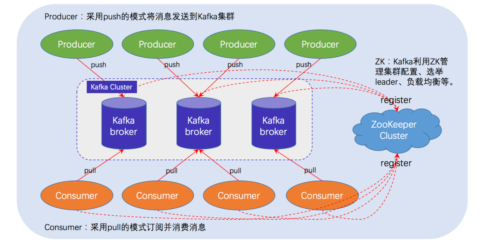

## kafka 架构

### 初步认识

一个典型的 Kafka 体系架构包括若干 Producer（消息生产者），若干 broker（作为 Kafka 节点的服务器），若干 Consumer（Group），以及一个 ZooKeeper 集群。Kafka通过 ZooKeeper 管理集群配置、选举 Leader 以及在 consumer group 发生变化时进行 Rebalance（即消费者负载均衡，在下一课介绍）。Producer 使用 push（推）模式将消息发布到 broker，Consumer 使用 pull（拉）模式从 broker 订阅并消费消息。

https://gitbook.cn/books/5ae1e77197c22f130e67ec4e/index.html

consumer_offsets

