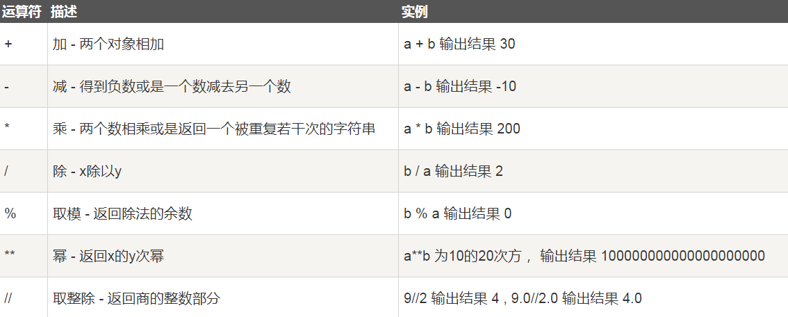
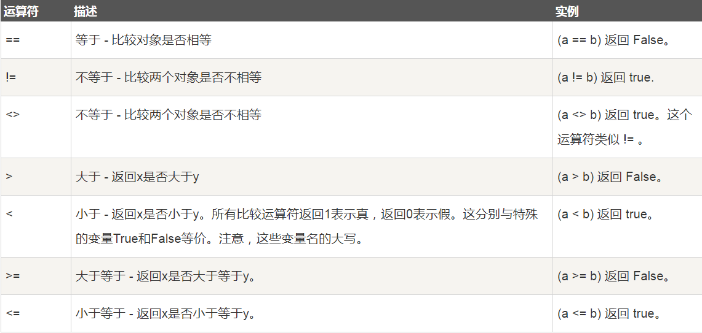
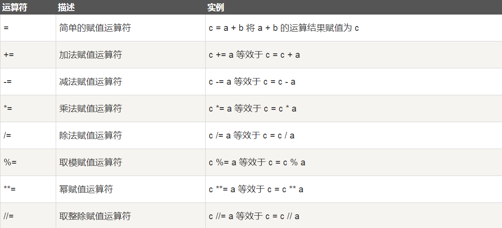
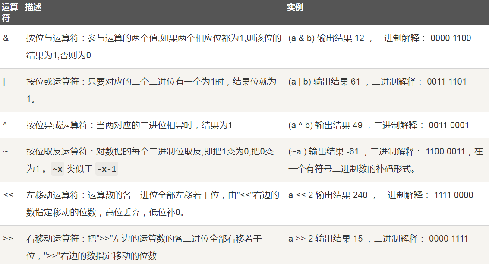
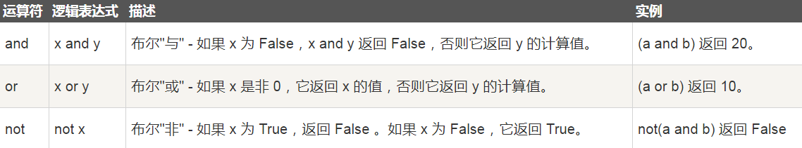
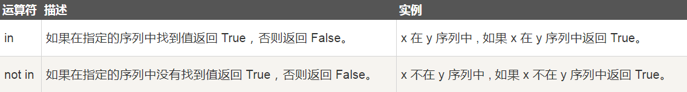
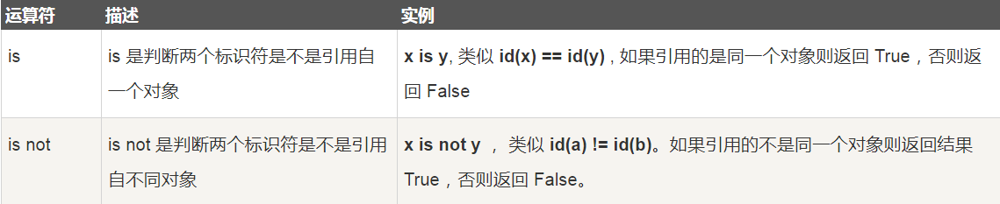
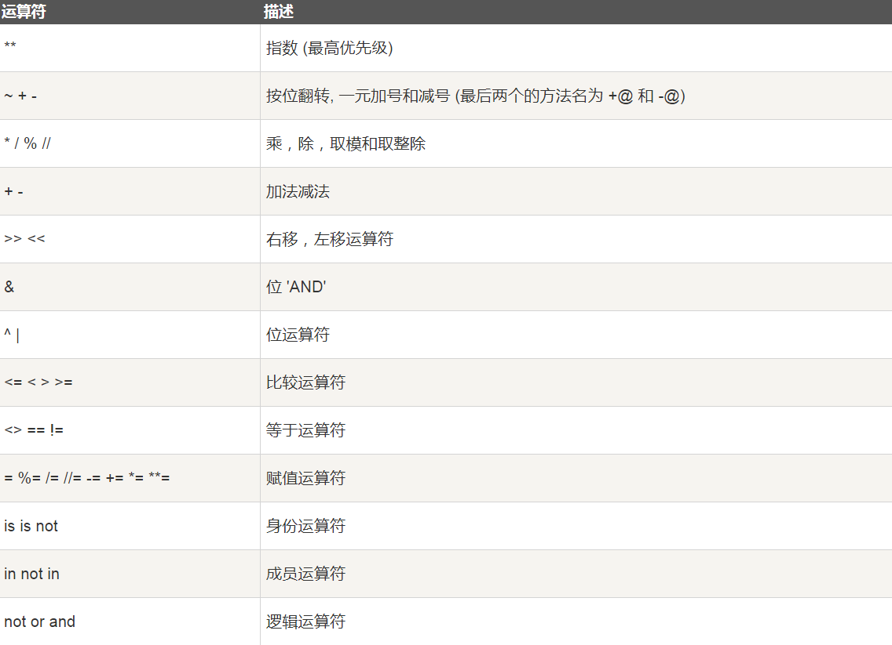
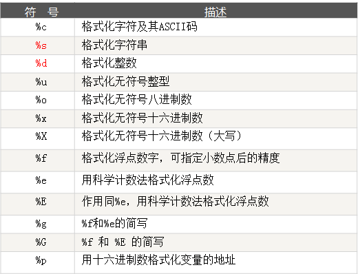
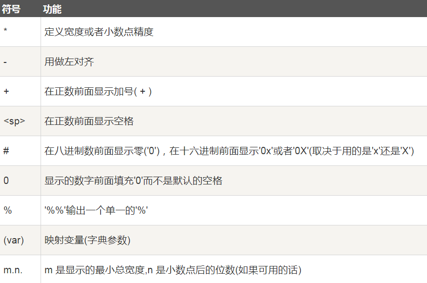

## 基础知识

### Pycharm 配置文件模板

Editor-->File and Code Templates-->Python Script

```
#!/usr/bin/env python
# -*- coding:utf-8 -*-
# @Time : ${DATE} ${TIME}
# @Author : hpf
# @Site : ${SITE}
# @File : ${NAME}.py
# @Software : ${PRODUCT_NAME}
```

### Python变量

* 变量不需要声明类型，用 "=" 号给变量赋值并且变量在使用前必须赋值。
* 可以使用`a=b=c=1` 同时为多个变量赋值，也可以使用`a, b, c = 1, 2, 3` 方式通过逗号逐一赋值。

* 变量名必须是大小写英文、数字和下划线(_) 的组合，且不能以数字开头

* 赋值（比如a= "ABC"）时，Python解释器做了两件事：
  * 在内存中创建一个 "ABC" 的字符串
  * 在内存中创建一个名为a的变量，并把它指向 "ABC"

代码规范：

* 变量名全部小写，常量名全部大写
* 函数的方法名用小写加下划线
* 类名用大写驼峰体
* 模块和包名字用小写

### 关键字

```
import keyword

print(keyword.kwlist)
['False', 'None', 'True', 'and', 'as', 'assert', 'async', 'await', 'break', 'class', 'continue', 'def', 'del', 'elif', 'else', 'except', 'finally', 'for', 'from', 'global', 'if', 'import', 'in', 'is', 'lambda', 'nonlocal', 'not', 'or', 'pass', 'raise', 'return', 'try', 'while', 'with', 'yield']
```

## 运算符

### 算术运算符

 a=10，b=20： 



Python 除法`/`结果为浮点数，如果要结果为整数则使用`//`。

如果想同时得到商和余数可以用：`divmod(10,3)` 方法获得。

如果想计算浮点数则参考下列方法：

```
from decimal import Decimal
from decimal import getcontext
getcontext().prec = 4   # 设置全局精度
print(Decimal('0.1')/Decimal('0.3'))
```

### 比较运算符

 变量a为10，变量b为20： 



### 赋值运算符

 变量a为10，变量b为20： 



### 位运算符

 变量 a 为 60，b 为 13：



### 逻辑运算符

 Python语言支持逻辑运算符，但是没有其它语言中的`&&`和`||`语法，取而代之的是更加人性化的英文单词`and or not`（全部都是小写字母）。变量 a 为 10, b为 20: 



### 成员运算符

 `in 与 not in`是Python独有的运算符（全部都是小写字母），用于判断对象是否某个集合的元素之一，非常好用，并且运行速度很快。返回的结果是布尔值类型的True或者False。 



### 身份运算符



### 运算符优先级



## 输入与输出函数

### input

获取用户输入，保存成一个**字符串**。

**判断输入的字符类型：**

```python
age = input("请输入数字年龄: ")
print(type(age))
if age.isdigit():
    age = int(age)
    print("你的年龄是:", age)
else:
    print("输入不合法!")
```

```
请输入数字年龄: 11
<class 'str'>
你的年龄是: 11
```

**去除开头的空白lstrip,去除结尾的空白rstrip以及去除两端的空白strip**：

```
name = input("请输入姓名: ")
name = name.strip()
print("你输入的姓名为:", name)
```

```
请输入姓名:    ame   
你输入的姓名为: ame
```

### print

函数原型：` print(self, *args, sep=' ', end='\n', file=None) `

**sep参数**: 分隔的符号，默认是一个空格； 

**end参数**: 打印后的结束方式，默认为换行符`\n`。如果，设置`end=''`，则可以不换行，让print在一行内连续打印。 

 **%百分号格式化输出**：

```
print("name: %s Age: %d country: %s" % ("ame", 22, "CN"))
print("name: %(name)s Age: %(age)d country: %(country)s" % {"name": "ame", "age": 18, "country": "CN"})
print("www", "baidu", "com", sep=".")
print("echo: ", end="")
print("hello world!", end="\n")
```

```
name: ame Age: 22 country: CN
name: ame Age: 18 country: CN
www.baidu.com
echo: hello world!
```

  **str.format()的方式输出：**

```
print("name: {0} Age: {1} country: {2}".format("ame", 22, "CN"))
```

```
name: ame Age: 22 country: CN
```

 格式化符号: 



 格式化操作符辅助指令: 



```
print("percent %.2f" % 99.97623)
print("i am %(pp).2f" % {"pp": 123.45678,})
print("i am %.2f %%" % 123.456)
```

```
percent 99.98
i am 123.46
i am 123.46 %
```

