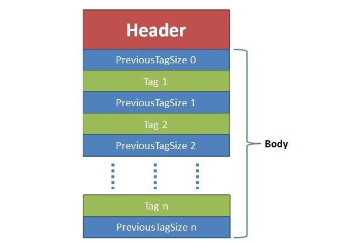

### 流媒体 （Stream media）

流媒体（英语：Streaming media）是指将一连串的多媒体资料压缩后，经过网际网路分段传送资料，在网际网路上即时传输影音以供观赏的一种技术与过程，此技术使得资料封包得以像流水一样发送，如果不使用此技术，就必须在使用前下载整个媒体文件。

###  **流媒体开发** 

网络层(socket或st)负责传输，协议层(rtmp或hls)负责网络打包，封装层(flv、ts)负责编解码数据的封装，编码层(h.264和aac)负责图像，音频压缩。 

### 

## 视频播放器原理

视音频技术主要包含以下几点：封装技术，视频压缩编码技术以及音频压缩编码技术。如果考虑到网络传输的话，还包括流媒体协议技术 。

视频播放器播放一个互联网上的视频文件，需要经过以下几个步骤：解协议，解封装，解码视音频，视音频同步。如果播放本地文件则不需要解协议，为以下几个步骤：解封装，解码视音频，视音频同步。他们的过程如图所示。 

* **解协议**的作用，就是将流媒体协议的数据，解析为标准的相应的封装格式数据。视音频在网络上传播的时候，常常采用各种流媒体协议，例如HTTP，RTMP，或是MMS等等。这些协议在传输视音频数据的同时，也会传输一些信令数据。这些信令数据包括对播放的控制（播放，暂停，停止），或者对网络状态的描述等。解协议的过程中会去除掉信令数据而只保留视音频数据。例如，采用RTMP协议传输的数据，经过解协议操作后，输出FLV格式的数据。

* **解封装**的作用，就是将输入的封装格式的数据，分离成为音频流压缩编码数据和视频流压缩编码数据。封装格式种类很多，例如MP4，MKV，RMVB，TS，FLV，AVI等等，它的作用就是将已经压缩编码的视频数据和音频数据按照一定的格式放到一起。例如，FLV格式的数据，经过解封装操作后，输出H.264编码的视频码流和AAC编码的音频码流。

* **解码**的作用，就是将视频/音频压缩编码数据，解码成为非压缩的视频/音频原始数据。音频的压缩编码标准包含AAC，MP3，AC-3等等，视频的压缩编码标准则包含H.264，MPEG2，VC-1等等。解码是整个系统中最重要也是最复杂的一个环节。通过解码，压缩编码的视频数据输出成为非压缩的颜色数据，例如YUV420P，RGB等等；压缩编码的音频数据输出成为非压缩的音频抽样数据，例如PCM数据。
*  **视音频同步**的作用，就是根据解封装模块处理过程中获取到的参数信息，同步解码出来的视频和音频数据，并将视频音频数据送至系统的显卡和声卡播放出来。 

## 传输协议

### HLS

HTTP Live Streaming（缩写是HLS）是由苹果公司提出基于HTTP的流媒体网络传输协议。是苹果公司QuickTime X和iPhone软件系统的一部分。它的工作原理是把整个流分成一个个小的基于HTTP的文件来下载，每次只下载一些。当媒体流正在播放时，客户端可以选择从许多不同的备用源中以不同的速率下载同样的资源，允许流媒体会话适应不同的数据速率。在开始一个流媒体会话时，客户端会下载一个包含元数据的extended M3U (m3u8) playlist文件，用于寻找可用的媒体流。

HLS只请求基本的HTTP报文，与实时传输协议（RTP）不同，HLS可以穿过任何允许HTTP数据通过的防火墙或者代理服务器。它也很容易使用内容分发网络来传输媒体流。

### RTMP

RTMP，全称 Real Time Messaging Protocol，即实时消息传送协议。Adobe 公司为 Flash 播放器和服务器之间音视频数据传输开发的私有协议。工作在 TCP 之上的明文协议，默认使用端口 1935。协议中的基本数据单元成为消息（Message），传输的过程中消息会被拆分为更小的消息块（Chunk）单元。最后将分割后的消息块通过 TCP 协议传输，接收端再反解接收的消息块恢复成流媒体数据。

RTMP 主要有以下几个优点：RTMP 是专为流媒体开发的协议，对底层的优化比其它协议更加优秀，同时它 Adobe Flash 支持好，基本上所有的编码器（摄像头之类）都支持 RTMP 输出。现在 PC 市场巨大，PC 主要是 Windows，Windows 的浏览器基本上都支持 Flash。另外RTMP适合长时间播放，曾经有过测试，连续 100 万秒，即 10 天多连续播放没有出现问题。最后 RTMP 的延迟相对较低，一般延时在 1-3s 之间，一般的视频会议，互动式直播，完全是够用的。

当然 RTMP 并没有尽善尽美，它也有不足的地方。一方面是它是基于 TCP 传输，非公共端口，可能会被防火墙阻拦；另一方面，也是比较坑的一方面是 RTMP 为 Adobe 私有协议，很多设备无法播放，特别是在 iOS 端，需要使用第三方解码器才能播放。

###  HTTP-FLV 

HTTP-FLV 即将流媒体数据封装成 FLV 格式，然后通过 HTTP 协议传输给客户端。

HTTP-FLV 依靠 MIME 的特性，根据协议中的 Content-Type 来选择相应的程序去处理相应的内容，使得流媒体可以通过 HTTP 传输。相较于 RTMP 协议，HTTP-FLV 能够好的穿透防火墙，它是基于 HTTP/80 传输，有效避免被防火墙拦截。除此之外，它可以通过 HTTP 302 跳转灵活调度/负载均衡，支持使用 HTTPS 加密传输，也能够兼容支持 Android，iOS 的移动端。

说了这么多优点，也来顺便说下 HTTP-FLV 的缺点，由于它的传输特性，会让流媒体资源缓存在本地客户端，在保密性方面不够好。因为网络流量较大，它也不适合做拉流协议。

### DASH

DASH（MPEG-DASH）是 Dynamic Adaptive Streaming over HTTP的缩写，是国际标准组 MPEG 2014年推出的技术标准, 主要目标是形成IP网络承载单一格式的流媒体并提供高效与高质量服务的统一方案, 解决多制式传输方案(HTTP Live Streaming, Microsoft Smooth Streaming, HTTP Dynamic Streaming)并存格局下的存储与服务能力浪费、运营高成本与复杂度、系统间互操作弱等问题.

DASH是基于HTTP的动态自适应的比特率流技术，使用的传输协议是TCP(有些老的客户端直播会采用UDP协议直播, 例如YY, 齐齐视频等). 和HLS, HDS技术类似， 都是把视频分割成一小段一小段， 通过HTTP协议进行传输，客户端得到之后进行播放；不同的是MPEG-DASH支持MPEG-2 TS、MP4等多种格式, 可以将视频按照多种编码切割, 下载下来的媒体格式既可以是ts文件也可以是mp4文件, 所以当客户端加载视频时, 按照当前的网速和支持的编码加载相应的视频片段进行播放.

| 协议           | http flv | rtmp    | hls        | dash         |
| -------------- | -------- | ------- | ---------- | ------------ |
| 传输层         | http流   | tcp流   | http       | http         |
| 视频格式       | flv      | flv tag | Ts文件     | Mp4 3gp webm |
| 延时           | 低       | 低      | 很高       | 高           |
| 数据分段       | 连续流   | 连续流  | 切片文件   | 切片文件     |
| Html5播放      | 暂不支持 | 不支持  | 大部分支持 | 极大部分支持 |
| 服务器编程难易 | 简单     | 一般    | 一般+      | 中等         |

## 封装层

### FLV

FLV (Flash Video) 是 Adobe 公司推出的另一种视频格式，是一种在网络上传输的流媒体数据存储容器格式。其格式相对简单轻量，不需要很大的媒体头部信息。整个 FLV 由 The FLV Header, The FLV Body 以及其它 Tag 组成。因此加载速度极快。采用 FLV 格式封装的文件后缀为 .flv。

### TS

MPEG2-TS 传输流（MPEG-2 Transport Stream；又称MPEG-TS、MTS、TS）是一种传输和存储包含视频、音频与通信协议各种数据的标准格式，用于数字电视广播系统，如DVB、ATSC、ISDB[3]:118、IPTV等等。

## 编码层

###  h.264 

###  h.265

### AAC

