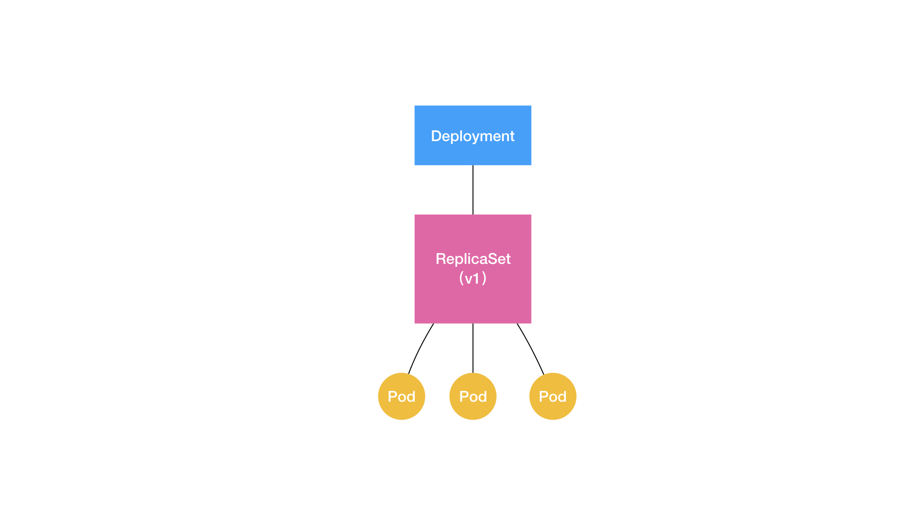

## 控制器

### deployment 控制器介绍

通过前面的学习，我们可以感觉到Pod 这个看似复杂的 API 对象，实际上就是对容器的进一步抽象和封装而已。Pod 对象，其实就是容器的升级版。它对容器进行了组合，添加了更多的属性和字段。这就好比给集装箱四面安装了吊环，使得 Kubernetes 这架“吊车”，可以更轻松地操作它。而 Kubernetes 操作这些“集装箱”的逻辑，都由控制器（Controller）完成。

下面创建一个 nginx-deployment 的例子：

```yaml
apiVersion: apps/v1
kind: Deployment
metadata:
  name: nginx-deployment
spec:
  selector:
    matchLabels:
      app: nginx:1.14.2
  replicas: 2
  template:
    metadata:
      labels:
        app: nginx
    spec:
      containers:
      - name: nginx
        image: nginx:1.7.9
        ports:
        - containerPort: 80
```

该Deployment的功能为：确保携带了 app=nginx 标签的 Pod 的个数，永远等于 spec.replicas 指定的个数，即 2 个。这就意味着，如果在这个集群中，携带 app=nginx 标签的 Pod 的个数大于 2 的时候，就会有旧的 Pod 被删除；反之，就会有新的 Pod 被创建。

### 控制循环

在前面学习Kubernetes 架构的时候，曾经提到过一个叫作 kube-controller-manager 的组件。这个组件，就是一系列控制器的集合。我们可以查看一下 Kubernetes 项目的 pkg/controller 目录。[点击查看](<https://github.com/kubernetes/kubernetes/tree/master/pkg/controller>) 。

这些控制器之所以被统一放在 pkg/controller 目录下，就是因为它们都遵循 Kubernetes 项目中的一个通用编排模式，即：控制循环（control loop）。

比如，现在有一种待编排的对象 X，它有一个对应的控制器。那么，我就可以用一段 Go 语言风格的伪代码，为你描述这个控制循环：

```go
for {
  实际状态 := 获取集群中对象 X 的实际状态（Actual State）
  期望状态 := 获取集群中对象 X 的期望状态（Desired State）
  if 实际状态 == 期望状态{
    什么都不做
  } else {
    执行编排动作，将实际状态调整为期望状态
  }
}
```

在具体实现中，实际状态往往来自于 Kubernetes 集群本身。比如，kubelet 通过心跳汇报的容器状态和节点状态，或者监控系统中保存的应用监控数据，或者控制器主动收集的它自己感兴趣的信息，这些都是常见的实际状态的来源。

**而期望状态，一般来自于用户提交的 YAML 文件。**

比如，Deployment 对象中 Replicas 字段的值。很明显，这些信息往往都保存在 Etcd 中。

接下来，以 Deployment 为例，简单描述一下它对控制器模型的实现：

1. Deployment 控制器从 Etcd 中获取到所有携带了“app: nginx”标签的 Pod，然后统计它们的数量，这就是实际状态；
2. Deployment 对象的 Replicas 字段的值就是期望状态；
3. Deployment 控制器将两个状态做比较，然后根据比较结果，确定是创建 Pod，还是删除已有的 Pod。

一个 Kubernetes 对象的主要编排逻辑，实际上是在第三步的“对比”阶段完成的。这个操作，通常被叫作调谐（Reconcile）。这个调谐的过程，则被称作“Reconcile Loop”（调谐循环）或者 “Sync Loop”（同步循环）。这些词语指的都是同一个东西：控制循环。而调谐的最终结果，往往都是对被控制对象的某种写操作。

比如，增加 Pod，删除已有的 Pod，或者更新 Pod 的某个字段。这也是 Kubernetes 项目“面向 API 对象编程”的一个直观体现。像 Deployment 这种控制器的设计原理，就是用一种对象管理另一种对象”的“艺术”。

其中，这个控制器对象本身，负责定义被管理对象的期望状态。比如，Deployment 里的 replicas=2 这个字段。而被控制对象的定义，则来自于一个“模板”。比如，Deployment 里的 template 字段。

可以看到，Deployment 这个 template 字段里的内容，跟一个标准的 Pod 对象的 API 定义，丝毫不差。而所有被这个 Deployment 管理的 Pod 实例，其实都是根据这个 template 字段的内容创建出来的。像 Deployment 定义的 template 字段，在 Kubernetes 项目中有一个专有的名字，叫作 PodTemplate（Pod 模板）。

我们就可以对 Deployment 以及其他类似的控制器，做一个简单总结了：


如上图所示，类似 Deployment 这样的一个控制器，实际上都是由上半部分的控制器定义（包括期望状态），加上下半部分的被控制对象的模板组成的。这就是为什么，在所有 API 对象的 Metadata 里，都有一个字段叫作 ownerReference，用于保存当前这个 API 对象的拥有者（Owner）的信息。

对于一个 Deployment 所管理的 Pod，它的 ownerReference 就是：ReplicaSet。

### ReplicaSet

Deployment 看似简单，但实际上，它实现了 Kubernetes 项目中一个非常重要的功能：Pod 的“水平扩展 / 收缩”（horizontal scaling out/in）。这个功能，是从 PaaS 时代开始，一个平台级项目就必须具备的编排能力。

举个例子，如果你更新了 Deployment 的 Pod 模板（比如，修改了容器的镜像），那么 Deployment 就需要遵循一种叫作“滚动更新”（rolling update）的方式，来升级现有的容器。

而这个能力的实现，依赖的是 Kubernetes 项目中的一个非常重要的概念（API 对象）：ReplicaSet。

通过下面的yaml文件的格式可以看下ReplicaSet的结构：

```yaml
apiVersion: apps/v1
kind: ReplicaSet
metadata:
  name: nginx-set
  labels:
    app: nginx
spec:
  replicas: 3
  selector:
    matchLabels:
      app: nginx
  template:
    metadata:
      labels:
        app: nginx
    spec:
      containers:
      - name: nginx
        image: nginx:1.14.2
```

从这个 YAML 文件中，我们可以看到，一个 ReplicaSet 对象，其实就是由副本数目的定义和一个 Pod 模板组成的。不难发现，它的定义其实是 Deployment 的一个子集。更重要的是，Deployment 控制器实际操纵的，正是这样的 ReplicaSet 对象，而不是 Pod 对象。

### ReplicaSet、Deployment和Pod关系

通过下面的 Deployment 来进行学习：

```yaml
apiVersion: apps/v1
kind: Deployment
metadata:
  name: nginx-deployment
  labels:
    app: nginx
spec:
  replicas: 3
  selector:
    matchLabels:
      app: nginx
  template:
    metadata:
      labels:
        app: nginx
    spec:
      containers:
      - name: nginx
        image: nginx:1.14.2
        ports:
        - containerPort: 80
```

这个 Deployment 定义的 Pod 副本个数是 3（spec.replicas=3）。Deployment，与 ReplicaSet，以及 Pod 的关系如下图：




通过这张图，我们就很清楚的看到，一个定义了 replicas=3 的 Deployment，与它的 ReplicaSet，以及 Pod 的关系，实际上是一种“层层控制”的关系。

其中，ReplicaSet 负责通过“控制器模式”，保证系统中 Pod 的个数永远等于指定的个数（比如，3 个）。这也正是 Deployment 只允许容器的 restartPolicy=Always 的主要原因：只有在容器能保证自己始终是 Running 状态的前提下，ReplicaSet 调整 Pod 的个数才有意义。

而在此基础上，Deployment 同样通过“控制器模式”，来操作 ReplicaSet 的个数和属性，进而实现“水平扩展 / 收缩”和“滚动更新”这两个编排动作。

#### 水平扩展/收缩

其中，“水平扩展 / 收缩”非常容易实现，Deployment Controller 只需要修改它所控制的 ReplicaSet 的 Pod 副本个数就可以了。比如，把这个值从 3 改成 4，那么 Deployment 所对应的 ReplicaSet，就会根据修改后的值自动创建一个新的 Pod。这就是“水平扩展”了；“水平收缩”则反之。

如果进行水平扩展则通过如下命令：

```shell
# kubectl create -f test-nginx-deployment.yaml
deployment.apps/nginx-deployment created
# kubectl get deployment
NAME               DESIRED   CURRENT   UP-TO-DATE   AVAILABLE   AGE
nginx-deployment   3         3         3            3           1m
# kubectl get pods
NAME                                READY     STATUS    RESTARTS   AGE
nginx-deployment-6796c569c5-nkdgf   1/1       Running   0          22s
nginx-deployment-6796c569c5-w9x99   1/1       Running   0          22s
nginx-deployment-6796c569c5-zgdkl   1/1       Running   0          22s
# kubectl scale deployment nginx-deployment --replicas=4
deployment.extensions/nginx-deployment scaled
# kubectl get deployment
NAME               DESIRED   CURRENT   UP-TO-DATE   AVAILABLE   AGE
nginx-deployment   4         4         4            4           11m
# kubectl get pods
NAME                                READY     STATUS    RESTARTS   AGE
nginx-deployment-6796c569c5-27bk9   1/1       Running   0          13s
nginx-deployment-6796c569c5-nkdgf   1/1       Running   0          11m
nginx-deployment-6796c569c5-w9x99   1/1       Running   0          11m
nginx-deployment-6796c569c5-zgdkl   1/1       Running   0          11m
```

如果进行水平收缩则进行如下操作：

```shell
# kubectl scale deployment nginx-deployment --replicas=2
deployment.extensions/nginx-deployment scaled
# kubectl get deployment
NAME               DESIRED   CURRENT   UP-TO-DATE   AVAILABLE   AGE
nginx-deployment   2         2         2            2           17m
# kubectl get pod
NAME                                READY     STATUS    RESTARTS   AGE
nginx-deployment-6796c569c5-nkdgf   1/1       Running   0          16m
nginx-deployment-6796c569c5-zgdkl   1/1       Running   0          16m
```

#### 滚动更新

下面是重新创建 nginx-deployment ，请注意添加的 `--record` 参数。其主要功能是记录下你每次操作所执行的命令。

```shell
# kubectl delete -f test-nginx-deployment.yaml 
deployment.apps "nginx-deployment" deleted
# kubectl create -f test-nginx-deployment.yaml --record
deployment.apps/nginx-deployment created
# kubectl get deployment
NAME               DESIRED   CURRENT   UP-TO-DATE   AVAILABLE   AGE
nginx-deployment   3         3         3            3           18s
```

通过 `kubectl get deployment` 获取的信息中，各列的意思为：

* DESIRED：用户期望的 Pod 副本个数（spec.replicas 的值）；

* CURRENT：当前处于 Running 状态的 Pod 的个数；

* UP-TO-DATE：当前处于最新版本的 Pod 的个数，所谓最新版本指的是 Pod 的 Spec 部分与 Deployment 里 Pod 模板里定义的完全一致；

* AVAILABLE：当前已经可用的 Pod 的个数，即：既是 Running 状态，又是最新版本，并且已经处于 Ready（健康检查正确）状态的 Pod 的个数。

其中只有 AVAILABLE 字段，描述的才是用户所期望的最终状态。而 Kubernetes 项目还为我们提供了一条指令，让我们可以实时查看 Deployment 对象的状态变化。这个指令就是 kubectl rollout status：

```shell
# kubectl rollout status deployment/nginx-deployment
deployment "nginx-deployment" successfully rolled out
```

下面使查看这个 Deployment 所控制的 ReplicaSet：

```shell
# kubectl get rs
NAME                          DESIRED   CURRENT   READY     AGE
nginx-deployment-6796c569c5   3         3         3         7m
```

如上所示，在用户提交了一个 Deployment 对象后，Deployment Controller 就会立即创建一个 Pod 副本个数为 3 的 ReplicaSet。这个 ReplicaSet 的名字，则是由 Deployment 的名字和一个随机字符串共同组成。

这个随机字符串叫作 pod-template-hash，在我们这个例子里就是：6796c569c5。ReplicaSet 会把这个随机字符串加在它所控制的所有 Pod 的标签里，从而保证这些 Pod 不会与集群里的其他 Pod 混淆。

而 ReplicaSet 的 DESIRED、CURRENT 和 READY 字段的含义，和 Deployment 中是一致的。所以，相比之下，Deployment 只是在 ReplicaSet 的基础上，添加了 UP-TO-DATE 这个跟版本有关的状态字段。这个时候，如果我们修改了 Deployment 的 Pod 模板，“滚动更新”就会被自动触发。

修改Deployment的方式一，通过 `kubectl edit` 指令编辑Etcd 里的 API 对象：

```shell
# kubectl edit deployment/nginx-deployment --record
...
    spec:
      containers:
      - image: nginx:1.16.0
        imagePullPolicy: IfNotPresent
        name: nginx
        ports:
        - containerPort: 80
          protocol: TCP
...
"/tmp/kubectl-edit-26ocm.yaml" 72L, 2067C written
```

这个 kubectl edit 指令，会帮你直接打开 nginx-deployment 的 API 对象。上面是把nginx的版本升级到1.16.0。这种方式只是把API对象下载到本机的/tmp 目录下，让你修改之后在提交上去。在我们保存退出之后，Kubernetes 就会立刻触发“滚动更新”的过程。

更新的过程中可以使用`kubectl rollout status `命令查看nginx-deployment的状态变化：

```shell
# kubectl rollout status deployment/nginx-deployment
Waiting for deployment "nginx-deployment" rollout to finish: 2 out of 3 new replicas have been updated...
Waiting for deployment "nginx-deployment" rollout to finish: 2 out of 3 new replicas have been updated...
Waiting for deployment "nginx-deployment" rollout to finish: 2 out of 3 new replicas have been updated...
Waiting for deployment "nginx-deployment" rollout to finish: 1 old replicas are pending termination...
Waiting for deployment "nginx-deployment" rollout to finish: 1 old replicas are pending termination...
deployment "nginx-deployment" successfully rolled out
```

同时你还可以查看deployment 的Events来更详细的的了解滚动更新”的流程：

```shell
# kubectl describe deployment nginx-deployment
...
Events:
  Type    Reason             Age   From                   Message
  ----    ------             ----  ----                   -------
  Normal  ScalingReplicaSet  1m    deployment-controller  Scaled up replica set nginx-deployment-7c9ddf5847 to 1
  Normal  ScalingReplicaSet  1m    deployment-controller  Scaled down replica set nginx-deployment-6796c569c5 to 2
  Normal  ScalingReplicaSet  1m    deployment-controller  Scaled up replica set nginx-deployment-7c9ddf5847 to 2
  Normal  ScalingReplicaSet  1m    deployment-controller  Scaled down replica set nginx-deployment-6796c569c5 to 1
  Normal  ScalingReplicaSet  1m    deployment-controller  Scaled up replica set nginx-deployment-7c9ddf5847 to 3
  Normal  ScalingReplicaSet  1m    deployment-controller  Scaled down replica set nginx-deployment-6796c569c5 to 0
```

1. 当你修改了 Deployment 里的 Pod 定义之后，Deployment Controller 会使用这个修改后的 Pod 模板，创建一个新的 ReplicaSet（hash=7c9ddf5847），这个新的 ReplicaSet 的初始 Pod 副本数是：0。
2. 然后事件的第一行显示，deployment-controller 开始将这个新的ReplicaSet所控制的Pod副本数从0个变成1个，即“水平扩展”出一个副本。
3. 紧接着，在事件的第二行deployment-controller又将旧的ReplicaSet （hash=6796c569c5）所控制的旧Pod副本数减少一个，变成2个，即“水平收缩”成两个副本。
4. 如此交替进行，新 ReplicaSet 管理的 Pod 副本数，从 0 个变成 1 个，再变成 2 个，最后变成 3 个。而旧的 ReplicaSet 管理的 Pod 副本数则从 3 个变成 2 个，再变成 1 个，最后变成 0 个。这样，就完成了这一组 Pod 的版本升级过程。

像这样，将一个集群中正在运行的多个 Pod 版本，交替地逐一升级的过程，就是“滚动更新”。

在这个“滚动更新”过程完成之后，你可以查看一下新、旧两个 ReplicaSet 的最终状态：

```shell
# kubectl get rs
NAME                          DESIRED   CURRENT   READY     AGE
nginx-deployment-6796c569c5   0         0         0         3h
nginx-deployment-7c9ddf5847   3         3         3         39m
```

上述升级过程中，在升级刚开始的时候，集群里只有 1 个新版本的 Pod。如果这时，新版本 Pod 有问题启动不起来，那么“滚动更新”就会停止，从而允许开发和运维人员介入。而在这个过程中，由于应用本身还有两个旧版本的 Pod 在线，所以服务并不会受到太大的影响。

当然，这也就要求你一定要使用 Pod 的 Health Check 机制检查应用的运行状态，而不是简单地依赖于容器的 Running 状态。要不然的话，虽然容器已经变成 Running 了，但服务很有可能尚未启动，“滚动更新”的效果也就达不到了。

而为了进一步保证服务的连续性，Deployment Controller 还会确保，在任何时间窗口内，只有指定比例的 Pod 处于离线状态。同时，它也会确保，在任何时间窗口内，只有指定比例的新 Pod 被创建出来。这两个比例的值都是可以配置的，默认都是 DESIRED 值的 25%。

所以，在上面这个 Deployment 的例子中，它有 3 个 Pod 副本，那么控制器在“滚动更新”的过程中永远都会确保至少有 2 个 Pod 处于可用状态，至多只有 4 个 Pod 同时存在于集群中。这个策略，是 Deployment 对象的一个字段，名叫 RollingUpdateStrategy，如下所示：

```yaml
apiVersion: apps/v1
kind: Deployment
metadata:
  name: nginx-deployment
  labels:
    app: nginx
spec:
...
  strategy:
    type: RollingUpdate
    rollingUpdate:
      maxSurge: 1
      maxUnavailable: 1
```

在上面这个 RollingUpdateStrategy 的配置中，maxSurge 指定的是除了 DESIRED 数量之外，在一次“滚动”中，Deployment 控制器还可以创建多少个新 Pod；而 maxUnavailable 指的是，在一次“滚动”中，Deployment 控制器可以删除多少个旧 Pod。

同时，这两个配置还可以用前面我们介绍的百分比形式来表示，比如：maxUnavailable=50%，指的是我们最多可以一次删除“50%*DESIRED 数量”个 Pod。

结合以上讲述，现在我们可以扩展一下 Deployment、ReplicaSet 和 Pod 的关系图了。


如上所示，Deployment 的控制器，实际上控制的是 ReplicaSet 的数目，以及每个 ReplicaSet 的属性。而一个应用的版本，对应的正是一个 ReplicaSet；这个版本应用的 Pod 数量，则由 ReplicaSet 通过它自己的控制器（ReplicaSet Controller）来保证。通过这样的多个 ReplicaSet 对象，Kubernetes 项目就实现了对多个“应用版本”的描述。

### Deployment 版本控制

前面通过 Deployment 升级是使用`kubectl edit`的方式，下面是通过`kubectl set image` 的指令进行，直接修改 nginx-deployment 所使用的镜像。这个命令的好处就是，你可以不用像 kubectl edit 那样需要打开编辑器。

下面的举例中故意将镜像的名字写错，这样，这个 Deployment 就会出现一个升级失败的版本。

```shell
# kubectl set image deployment/nginx-deployment nginx=nginx:1.91 --record
deployment.extensions/nginx-deployment image updated
```

由于这个 nginx:1.91 镜像在 Docker Hub 中并不存在，所以这个 Deployment 的“滚动更新”被触发后，会立刻报错并停止。

这时，我们来检查一下 ReplicaSet 的状态，如下所示：

```shell
# kubectl get rs
NAME                          DESIRED   CURRENT   READY     AGE
nginx-deployment-58c7645486   1         1         0         17s
nginx-deployment-6796c569c5   0         0         0         5m
nginx-deployment-7c9ddf5847   3         3         3         3m
# kubectl get pods
NAME                                READY     STATUS             RESTARTS   AGE
nginx-deployment-58c7645486-8c974   0/1       ImagePullBackOff   0          48s
nginx-deployment-7c9ddf5847-bd2nr   1/1       Running            0          3m
nginx-deployment-7c9ddf5847-gpt6w   1/1       Running            0          3m
nginx-deployment-7c9ddf5847-kvfcm   1/1       Running            0          3m
```

通过这个返回结果，我们可以看到，新版本的 ReplicaSet（hash=58c7645486）的“水平扩展”已经停止。而且此时，它已经创建了一个 Pod，但是它们都没有进入 READY 状态。这当然是因为这一个 Pod 拉取不到有效的镜像。与此同时，旧版本的 ReplicaSet（hash=7c9ddf5847）的“水平收缩”，也自动停止了。

我们可以执行一条 `kubectl rollout undo` 命令，就能把整个 Deployment 回滚到上一个版本：

```shell
# kubectl rollout undo deployment/nginx-deployment 
deployment.extensions/nginx-deployment
# kubectl get rs
NAME                          DESIRED   CURRENT   READY     AGE
nginx-deployment-58c7645486   0         0         0         39m
nginx-deployment-6796c569c5   0         0         0         5h
nginx-deployment-7c9ddf5847   3         3         3         3h
# kubectl get pods
NAME                                READY     STATUS    RESTARTS   AGE
nginx-deployment-7c9ddf5847-bd2nr   1/1       Running   0          38m
nginx-deployment-7c9ddf5847-gpt6w   1/1       Running   0          38m
nginx-deployment-7c9ddf5847-kvfcm   1/1       Running   0          38m
```

很容易想到，在具体操作上，Deployment 的控制器，其实就是让这个旧 ReplicaSet（hash=7c9ddf5847）再次“扩展”成 3 个 Pod，而让新的 ReplicaSet（hash=58c7645486）重新“收缩”到 0 个 Pod。

如果想回滚到更早之前的版本，则可以通过如下的操作进行：

首先，我需要使用 kubectl rollout history 命令，查看每次 Deployment 变更对应的版本。而由于我们在创建这个 Deployment 的时候，指定了–record 参数，所以我们创建这些版本时执行的 kubectl 命令，都会被记录下来。下面的是在没有执行 `kubectl rollout undo`  进行回滚上一条时的历史记录：

```shell
# kubectl rollout history deployment/nginx-deployment
deployments "nginx-deployment"
REVISION  CHANGE-CAUSE
1         kubectl create --filename=test-nginx-deployment.yaml --record=true
2         kubectl edit deployment/nginx-deployment --record=true
3         kubectl set image deployment/nginx-deployment nginx=nginx:1.91 --record=true
```

可以看到，我们前面执行的创建和更新操作，分别对应了版本 1 和版本 2，而那次失败的更新操作，则对应的是版本 3。

```shell
# kubectl rollout history deployment/nginx-deployment
deployments "nginx-deployment"
REVISION  CHANGE-CAUSE
1         kubectl create --filename=test-nginx-deployment.yaml --record=true
3         kubectl set image deployment/nginx-deployment nginx=nginx:1.91 --record=true
4         kubectl edit deployment/nginx-deployment --record=true
```

而在我们执行了 `kubectl rollout undo` 进行回滚上一个版本的时候其版本号变成 4 ，其余的并没有什么变化，只是想原先版本号为 2 的命令变成为版本 4 的命令。

当然，你还可以通过这个 `kubectl rollout history` 指令，看到每个版本对应的 Deployment 的 API 对象的细节，具体命令如下所示：

```shell
# kubectl rollout history deployment/nginx-deployment --revision=4
deployments "nginx-deployment" with revision #4
Pod Template:
  Labels:       app=nginx
        pod-template-hash=3758891403
  Annotations:  kubernetes.io/change-cause=kubectl edit deployment/nginx-deployment --record=true
  Containers:
   nginx:
    Image:      nginx:1.16.0
    Port:       80/TCP
    Host Port:  0/TCP
    Environment:        <none>
    Mounts:     <none>
  Volumes:      <none>
```

然后，我们就可以在 kubectl rollout undo 命令行最后，加上要回滚到的指定版本的版本号，就可以回滚到指定版本的版本号，就可以回滚到指定版本了。这个指令的用法如下：

```shell
# kubectl rollout undo deployment/nginx-deployment --to-revision=1
deployment.extensions/nginx-deployment
# kubectl rollout history deployment/nginx-deployment             
deployments "nginx-deployment"
REVISION  CHANGE-CAUSE
3         kubectl set image deployment/nginx-deployment nginx=nginx:1.91 --record=true
4         kubectl edit deployment/nginx-deployment --record=true
5         kubectl create --filename=test-nginx-deployment.yaml --record=true
# kubectl rollout history deployment/nginx-deployment --revision=5
deployments "nginx-deployment" with revision #5
Pod Template:
  Labels:       app=nginx
        pod-template-hash=2352712571
  Annotations:  kubernetes.io/change-cause=kubectl create --filename=test-nginx-deployment.yaml --record=true
  Containers:
   nginx:
    Image:      nginx:1.14.2
    Port:       80/TCP
    Host Port:  0/TCP
    Environment:        <none>
    Mounts:     <none>
  Volumes:      <none>
```

这样，Deployment Controller 还会按照“滚动更新”的方式，完成对 Deployment 的降级操作。

前面的操作中，我们每一次对Deployment进行操作都会生成一个新的ReplicaSet对象。为了避免资源的不必要浪费，Kubernetes 项目还提供了一个指令，使得我们对 Deployment 的多次更新操作，最后 只生成一个 ReplicaSet。

具体的做法是，在更新 Deployment 前，你要先执行一条 kubectl rollout pause 指令。它的用法如下所示：

```shell
# kubectl rollout pause deployment/nginx-deployment
deployment.extensions/nginx-deployment paused
```

这个 kubectl rollout pause 的作用，是让这个 Deployment 进入了一个“暂停”状态。 所以接下来，你就可以随意使用 kubectl edit 或者 kubectl set image 指令，修改这个 Deployment 的内容了。由于此时 Deployment 正处于“暂停”状态，所以我们对 Deployment 的所有修改，都不会触发新的“滚动更新”，也不会创建新的 ReplicaSet。

而等到我们对 Deployment 修改操作都完成之后，只需要再执行一条 kubectl rollout resume 指令，就可以把这个 Deployment“恢复”回来，如下所示：

```shell
# kubectl set image deployment/nginx-deployment nginx=nginx:1.17.0 --record
deployment.extensions/nginx-deployment image updated
# kubectl get rs
NAME                          DESIRED   CURRENT   READY     AGE
nginx-deployment-58c7645486   0         0         0         1h
nginx-deployment-6796c569c5   3         3         1         1h
nginx-deployment-7c9ddf5847   0         0         0         1h
# kubectl describe rs nginx-deployment-6796c569c5  
...
  Containers:
   nginx:
    Image:        nginx:1.14.2
    Port:         80/TCP
    Host Port:    0/TCP
...
# kubectl rollout history deployment/nginx-deployment 
deployments "nginx-deployment"
REVISION  CHANGE-CAUSE
3         kubectl set image deployment/nginx-deployment nginx=nginx:1.91 --record=true
4         kubectl edit deployment/nginx-deployment --record=true
5         kubectl create --filename=test-nginx-deployment.yaml --record=true
# kubectl rollout resume deployment/nginx-deployment
deployment.extensions/nginx-deployment resumed
# kubectl rollout history deployment/nginx-deployment       
deployments "nginx-deployment"
REVISION  CHANGE-CAUSE
3         kubectl set image deployment/nginx-deployment nginx=nginx:1.91 --record=true
4         kubectl edit deployment/nginx-deployment --record=true
5         kubectl create --filename=test-nginx-deployment.yaml --record=true
6         kubectl set image deployment/nginx-deployment nginx=nginx:1.17.0 --record=true
# kubectl get rs
NAME                          DESIRED   CURRENT   READY     AGE
nginx-deployment-58c7645486   0         0         0         2h
nginx-deployment-645ff4b954   3         3         3         5m
nginx-deployment-6796c569c5   0         0         0         2h
nginx-deployment-7c9ddf5847   0         0         0         2h
# kubectl describe rs nginx-deployment-645ff4b954 
...
  Containers:
   nginx:
    Image:        nginx:1.17.0
    Port:         80/TCP
    Host Port:    0/TCP
...
```

而在这个 kubectl rollout resume 指令执行之前，在 kubectl rollout pause 指令之后的这段时间里，我们对 Deployment 进行的所有修改，最后只会触发一次“滚动更新”。

控制历史ReplicaSet数量可以使用一个叫作 spec.revisionHistoryLimit 字段，就是 Kubernetes 为 Deployment 保留的“历史版本”个数。所以，如果把它设置为 0，你就再也不能做回滚操作。


