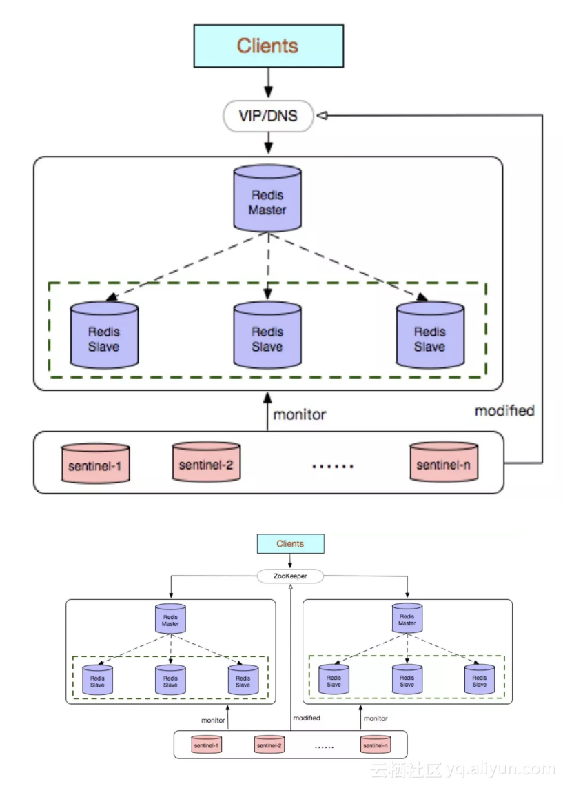

## Redis 集群介绍

### Redis 多副本 （主从）

Redis多副本，采用主从（replication）部署结构，相较于单副本而言最大的特点就是主从实例间数据实时同步，并且提供数据持久化和备份策略。主从实例部署在不同的物理服务器上，可以结合 keepalived 做到 Redis 的高可用。

**优点**

* 高可靠性：一方面，采用双机主备架构，能够在主库出现故障时自动进行主备切换，从库提升为主库提供服务，保证服务平稳运行；另一方面，开启数据持久化功能和配置合理的备份策略，能有效的解决数据误操作和数据异常丢失的问题；

* 读写分离策略：从节点可以扩展主库节点的读能力，有效应对大并发量的读操作。

**缺点**

* 故障恢复复杂，如果没有RedisHA系统（需要开发），当主库节点出现故障时，需要手动将一个从节点晋升为主节点，同时需要通知业务方变更配置，并且需要让其它的从库节点去复制新主库节点数据，整个过程需要人为干预，比较繁琐；
* 通过 keepalived 搭建高可用环境较为复杂，故障转移部分需要手动写脚本配合 keepalived 进行。

* 主库的写能力和存储能力受到单机的限制。

### Redis Sentinel

Redis Sentinel是社区版本推出的原生高可用解决方案，其部署架构主要包括两部分：Redis Sentinel集群和Redis数据集群。

其中Redis Sentinel集群是由若干Sentinel节点组成的分布式集群，可以实现故障发现、故障自动转移、配置中心和客户端通知。Redis Sentinel的节点数量要满足2n+1（n>=1）的奇数个。



**优点**

* Redis Sentinel集群部署简单；
* 能够解决Redis主从模式下的高可用切换问题；
* 很方便实现Redis数据节点的线形扩展，轻松突破Redis自身单线程瓶颈，可极大满足Redis大容量或高性能的业务需求；
* 可以实现一套Sentinel监控一组Redis数据节点或多组数据节点。

**缺点**

* 部署相对Redis主从模式要复杂一些，原理理解更繁琐；
* 资源浪费，Redis数据节点中slave节点作为备份节点不提供服务；
* Redis Sentinel主要是针对Redis数据节点中的主节点的高可用切换，对Redis的数据节点做失败判定分为主观下线和客观下线两种，对于Redis的从节点中有对节点做主观下线操作，并不执行故障转移。
* 不能解决读写分离问题，实现起来相对复杂。

### Redis Cluster

Redis Cluster是社区版推出的Redis分布式集群解决方案，主要解决Redis分布式方面的需求，比如，当遇到单机内存，并发和流量等瓶颈的时候，Redis Cluster能起到很好的负载均衡的目的。

Redis Cluster集群节点最小配置6个节点以上（3主3从），其中主节点提供读写操作，从节点作为备用节点，不提供请求，只作为故障转移使用。

Redis Cluster采用虚拟槽分区，所有的键根据哈希函数映射到0～16383个整数槽内，每个节点负责维护一部分槽以及槽所印映射的键值数据。


**优点**

* 无中心架构；
* 数据按照slot存储分布在多个节点，节点间数据共享，可动态调整数据分布；
* 可扩展性：可线性扩展到1000多个节点，节点可动态添加或删除；
* 高可用性：部分节点不可用时，集群仍可用。通过增加Slave做standby数据副本，能够实现故障自动failover，节点之间通过gossip协议交换状态信息，用投票机制完成Slave到Master的角色提升；
* 降低运维成本，提高系统的扩展性和可用性。

**缺点**

* Client实现复杂，驱动要求实现Smart Client，缓存slots mapping信息并及时更新，提高了开发难度，客户端的不成熟影响业务的稳定性。目前仅JedisCluster相对成熟，异常处理部分还不完善，比如常见的“max redirect exception”。
* 节点会因为某些原因发生阻塞（阻塞时间大于clutser-node-timeout），被判断下线，这种failover是没有必要的。
* 数据通过异步复制，不保证数据的强一致性。
* 多个业务使用同一套集群时，无法根据统计区分冷热数据，资源隔离性较差，容易出现相互影响的情况。
* Slave在集群中充当“冷备”，不能缓解读压力，当然可以通过SDK的合理设计来提高Slave资源的利用率。
* Key批量操作限制，如使用mset、mget目前只支持具有相同slot值的Key执行批量操作。对于映射为不同slot值的Key由于Keys不支持跨slot查询，所以执行mset、mget、sunion等操作支持不友好。
* Key事务操作支持有限，只支持多key在同一节点上的事务操作，当多个Key分布于不同的节点上时无法使用事务功能。
* Key作为数据分区的最小粒度，不能将一个很大的键值对象如hash、list等映射到不同的节点。
* 不支持多数据库空间，单机下的redis可以支持到16个数据库，集群模式下只能使用1个数据库空间，即db 0。
* 复制结构只支持一层，从节点只能复制主节点，不支持嵌套树状复制结构。
* 避免产生hot-key，导致主库节点成为系统的短板。
* 避免产生big-key，导致网卡撑爆、慢查询等。
* 重试时间应该大于cluster-node-time时间。
* Redis Cluster不建议使用pipeline和multi-keys操作，减少max redirect产生的场景。

## 搭建

### Redis Sentinel

#### 环境说明

| IP             | 端口 | 角色     | 版本        |
| -------------- | ---- | -------- | ----------- |
| 192.168.122.11 | 7001 | master   | redis-5.0.5 |
| 192.168.122.12 | 7001 | slave    | redis-5.0.5 |
| 192.168.122.13 | 7001 | slave    | redis-5.0.5 |
| 192.168.122.11 | 7002 | sentinel | redis-5.0.5 |
| 192.168.122.12 | 7002 | sentinel | redis-5.0.5 |
| 192.168.122.13 | 7002 | sentinel | redis-5.0.5 |

#### 安装搭建

**master**

```shell
mkdir /opt/redis/ -p
cp -d /usr/local/bin/redis-* /opt/redis/
cp /root/redis-5.0.5/redis.conf /opt/redis/7001.conf
sed -i "s/^bind 127.0.0.1/bind 192.168.122.11/g" /opt/redis/7001.conf
sed -i "s/daemonize no/daemonize yes/g" /opt/redis/7001.conf
sed -i "s/^port 6379/port 7001/g" /opt/redis/7001.conf
```

**slave**

```shell
mkdir /opt/redis/ -p
cp -d /usr/local/bin/redis-* /opt/redis/
cp /root/redis-5.0.5/redis.conf /opt/redis/7001.conf
sed -i "s/^bind 127.0.0.1/bind 192.168.122.12/g" /opt/redis/7001.conf
sed -i "s/daemonize no/daemonize yes/g" /opt/redis/7001.conf
sed -i "s/^port 6379/port 7001/g" /opt/redis/7001.conf
sed -i "/^# replicaof/a replicaof 192.168.122.11 7001" /opt/redis/7001.conf
```

两个slave做相同的操作，但是注意IP地址的变动。

**启动**

```shell
cd /opt/redis
/opt/redis/redis-server /opt/redis/7001.conf
```

**验证主从**

```shell
# redis-cli -h 192.168.122.11 -p 7001
192.168.122.11:7001> info replication
# Replication
role:master
connected_slaves:2
slave0:ip=192.168.122.12,port=7001,state=online,offset=140,lag=1
slave1:ip=192.168.122.13,port=7001,state=online,offset=140,lag=1
master_replid:9fb02eb5f8c27e09bfbf18fbe2bba41f132af65b
master_replid2:0000000000000000000000000000000000000000
master_repl_offset:140
second_repl_offset:-1
repl_backlog_active:1
repl_backlog_size:1048576
repl_backlog_first_byte_offset:1
repl_backlog_histlen:140
192.168.122.11:7001> set a amd
OK
# redis-cli -h 192.168.122.12 -p 7001
192.168.122.12:7001> KEYS *
1) "a"
192.168.122.12:7001> get a
"amd"
```

**Sentinel 安装**

```shell
cp /root/redis-5.0.5/sentinel.conf /opt/redis/
sed -i "s/port 26379/port 7002/g" /opt/redis/sentinel.conf
sed -i "s/daemonize no/daemonize yes/g" /opt/redis/sentinel.conf
sed -i "s/127.0.0.1 6379/192.168.122.11 7001/g" /opt/redis/sentinel.conf # 该项不需修改IP
sed -i "/^# bind/a bind 192.168.122.11" /opt/redis/sentinel.conf
```

**Sentinel 启动**

```shell
cd /opt/redis
/opt/redis/redis-sentinel /opt/redis/sentinel.conf
```

同理将 192.168.122.12 和 192.168.122.13 两台机器在修改完 bind IP 配置后启动 Sentinel。

#### 验证 Sentinel

```shell
# redis-cli -h 192.168.122.11 -p 7002
192.168.122.11:7002> info sentinel
# Sentinel
sentinel_masters:1
sentinel_tilt:0
sentinel_running_scripts:0
sentinel_scripts_queue_length:0
sentinel_simulate_failure_flags:0
master0:name=mymaster,status=ok,address=192.168.122.11:7001,slaves=2,sentinels=3
```

通过上面登录 Sentinel 可以看出有两个从和三个Sentinel，下面模拟master故障，在查看集群状态。

```shell
# redis-cli -h 192.168.122.11 -p 7001
192.168.122.11:7001> SHUTDOWN
# redis-cli -h 192.168.122.11 -p 7002
192.168.122.11:7002> info sentinel
# Sentinel
sentinel_masters:1
sentinel_tilt:0
sentinel_running_scripts:0
sentinel_scripts_queue_length:0
sentinel_simulate_failure_flags:0
master0:name=mymaster,status=ok,address=192.168.122.12:7001,slaves=2,sentinels=3
192.168.122.11:7002> sentinel get-master-addr-by-name mymaster
1) "192.168.122.12"
2) "7001"
```

通过上面的方式可以看到master节点已经转移到192.168.122.12这台机器的redis上了。

### Redis Cluster

#### 环境说明

| IP             | Redis 端口 | 版本        |
| -------------- | ---------- | ----------- |
| 192.168.122.11 | 7001、7002 | redis-5.0.5 |
| 192.168.122.12 | 7001、7002 | redis-5.0.5 |
| 192.168.122.13 | 7001、7002 | redis-5.0.5 |

#### 搭建（192.168.122.11）

redis 安装这里不做介绍，配置文件为默认的配置文件。下面是相关文件的路径：

```shell
mkdir -p /opt/redis/{7001,7002}
for i in 1 2;do cp -d /usr/local/bin/redis-* /opt/redis/700$i/ ;done
for i in 1 2;do cp /root/redis-5.0.5/redis.conf /opt/redis/700$i/700$i.conf ;done
# tree /opt/redis/
/opt/redis/
├── 7001
│   ├── 7001.conf
│   ├── redis-benchmark
│   ├── redis-check-aof
│   ├── redis-check-rdb
│   ├── redis-cli
│   ├── redis-sentinel -> redis-server
│   └── redis-server
└── 7002
    ├── 7002.conf
    ├── redis-benchmark
    ├── redis-check-aof
    ├── redis-check-rdb
    ├── redis-cli
    ├── redis-sentinel -> redis-server
    └── redis-server

2 directories, 14 files
```

配置文件修改：

```shell
sed -i "s/^bind 127.0.0.1/bind 192.168.122.11/g" /opt/redis/700*/700*.conf
sed -i "s/daemonize no/daemonize yes/g" /opt/redis/700*/700*.conf
sed -i "s/# cluster-enabled yes/cluster-enabled yes/g" /opt/redis/700*/700*.conf
sed -i "s/# cluster-node-timeout 15000/cluster-node-timeout 15000/g" /opt/redis/700*/700*.conf
for i in 1 2;do sed -i "s/6379/700$i/g" /opt/redis/700$i/700$i.conf;done
for i in 1 2;do sed -i "s/# cluster-config-file nodes-700$i.conf/cluster-config-file nodes-700$i.conf/g" /opt/redis/700$i/700$i.conf;done
```

启动Redis：

```shell
for i in 1 2;do cd /opt/redis/700$i/ && /opt/redis/700$i/redis-server /opt/redis/700$i/700$i.conf;done
```

192.168.122.12 和 192.168.122.13 俩节点的Redis启动参考 192.168.122.11 上的方式，注意IP地址的变动。

创建集群：

```shell
# redis-cli --cluster create 192.168.122.11:7001 192.168.122.11:7002 192.168.122.12:7001 192.168.122.12:7002 192.168.122.13:7001 192.168.122.13:7002 --cluster-replicas 1
>>> Performing hash slots allocation on 6 nodes...
Master[0] -> Slots 0 - 5460
Master[1] -> Slots 5461 - 10922
Master[2] -> Slots 10923 - 16383
Adding replica 192.168.122.12:7002 to 192.168.122.11:7001
Adding replica 192.168.122.13:7002 to 192.168.122.12:7001
Adding replica 192.168.122.11:7002 to 192.168.122.13:7001
M: c0d9b949de4669552c0f1d6f324011c5603789ec 192.168.122.11:7001
   slots:[0-5460] (5461 slots) master
S: 04678097b3e864f11af384dddf4c29a928b1581f 192.168.122.11:7002
   replicates d850ea5ec15049459b2f789ca788fd06846d468e
M: 97f85b8317b20770bbd3cdf0f6cf0c30f683c29f 192.168.122.12:7001
   slots:[5461-10922] (5462 slots) master
S: fdf165f1e0600cbef02a67d5983e17611687dd13 192.168.122.12:7002
   replicates c0d9b949de4669552c0f1d6f324011c5603789ec
M: d850ea5ec15049459b2f789ca788fd06846d468e 192.168.122.13:7001
   slots:[10923-16383] (5461 slots) master
S: cf4153c8c05a82e2cff60b38c3c3240c70742304 192.168.122.13:7002
   replicates 97f85b8317b20770bbd3cdf0f6cf0c30f683c29f
Can I set the above configuration? (type 'yes' to accept): yes 
>>> Nodes configuration updated
>>> Assign a different config epoch to each node
>>> Sending CLUSTER MEET messages to join the cluster
Waiting for the cluster to join
..
>>> Performing Cluster Check (using node 192.168.122.11:7001)
M: c0d9b949de4669552c0f1d6f324011c5603789ec 192.168.122.11:7001
   slots:[0-5460] (5461 slots) master
   1 additional replica(s)
M: d850ea5ec15049459b2f789ca788fd06846d468e 192.168.122.13:7001
   slots:[10923-16383] (5461 slots) master
   1 additional replica(s)
S: 04678097b3e864f11af384dddf4c29a928b1581f 192.168.122.11:7002
   slots: (0 slots) slave
   replicates d850ea5ec15049459b2f789ca788fd06846d468e
S: fdf165f1e0600cbef02a67d5983e17611687dd13 192.168.122.12:7002
   slots: (0 slots) slave
   replicates c0d9b949de4669552c0f1d6f324011c5603789ec
M: 97f85b8317b20770bbd3cdf0f6cf0c30f683c29f 192.168.122.12:7001
   slots:[5461-10922] (5462 slots) master
   1 additional replica(s)
S: cf4153c8c05a82e2cff60b38c3c3240c70742304 192.168.122.13:7002
   slots: (0 slots) slave
   replicates 97f85b8317b20770bbd3cdf0f6cf0c30f683c29f
[OK] All nodes agree about slots configuration.
>>> Check for open slots...
>>> Check slots coverage...
[OK] All 16384 slots covered.
```

连接集群：

```shell
# redis-cli -c -h 192.168.122.13 -p 7001
```

添加节点：

```shell
redis-cli --cluster add-node IP:PORT IP:PORT
```

查看节点：

```shell
# redis-cli -c -h 192.168.122.11 -p 7001 cluster nodes
04678097b3e864f11af384dddf4c29a928b1581f 192.168.122.11:7002@17002 slave d850ea5ec15049459b2f789ca788fd06846d468e 0 1572331618000 5 connected
97f85b8317b20770bbd3cdf0f6cf0c30f683c29f 192.168.122.12:7001@17001 master - 0 1572331620993 3 connected 5461-10922
c0d9b949de4669552c0f1d6f324011c5603789ec 192.168.122.11:7001@17001 myself,master - 0 1572331616000 1 connected 0-5460
fdf165f1e0600cbef02a67d5983e17611687dd13 192.168.122.12:7002@17002 slave c0d9b949de4669552c0f1d6f324011c5603789ec 0 1572331617985 4 connected
cf4153c8c05a82e2cff60b38c3c3240c70742304 192.168.122.13:7002@17002 slave 97f85b8317b20770bbd3cdf0f6cf0c30f683c29f 0 1572331619990 6 connected
d850ea5ec15049459b2f789ca788fd06846d468e 192.168.122.13:7001@17001 master - 0 1572331619000 5 connected 10923-16383
```

删除节点：

```shell
redis-cli --cluster del-node IP:PORT NODE-ID  # 需要先获取节点node-id
```


