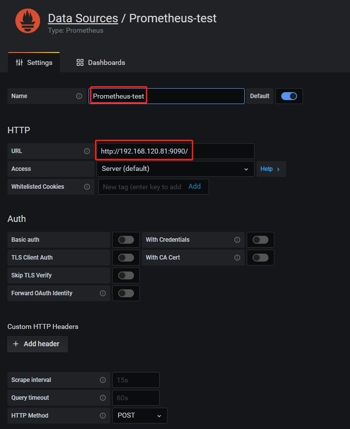
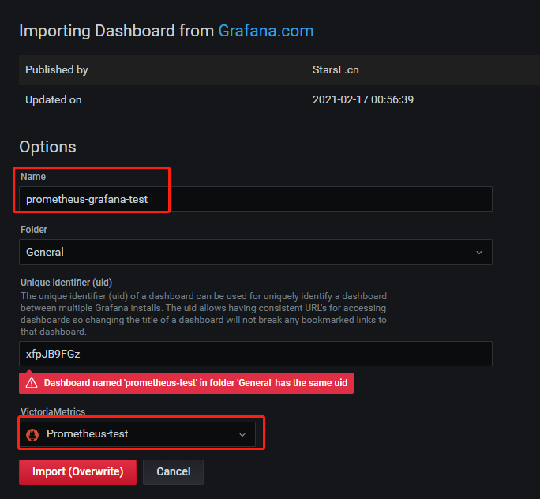

## 环境安装

### 下载软件

server端下载地址：https://github.com/prometheus/prometheus/releases/download/v2.27.1/prometheus-2.27.1.linux-amd64.tar.gz

node端下载地址：https://github.com/prometheus/node_exporter/releases/download/v1.1.2/node_exporter-1.1.2.linux-amd64.tar.gz

### 服务端配置

```
# tar -xf prometheus-2.27.1.linux-amd64.tar.gz -C /opt/
# ln -sv /opt/prometheus-2.27.1.linux-amd64 /opt/prometheus
# ln -sv /opt/prometheus/prometheus /usr/local/bin/prometheus
# mkdir /data/log/prometheus/ /data/prometheus -p
```

```
# yum install -y supervisor
# cat /etc/supervisord.d/prometheus.ini
[program:prometheus]
command=prometheus --config.file="/opt/prometheus/prometheus.yml" --storage.tsdb.path="/data/prometheus"
directory=/opt/prometheus
autostart=true
autorestart=true
startretries=5
startsecs=1
user=root
priority=999
stderr_logfile=/data/log/prometheus/prometheus.err.log
stdout_logfile=/data/log/prometheus/prometheus.out.log
```

```
# systemctl start supervisord
# systemctl enable supervisord
# supervisorctl update
# supervisorctl status
prometheus                       RUNNING   pid 27528, uptime 0:04:41
```

### 配置文件简介

```
# egrep -v '^$|^#' prometheus.yml
global:
  scrape_interval:     15s # Set the scrape interval to every 15 seconds. Default is every 1 minute.
  evaluation_interval: 15s # Evaluate rules every 15 seconds. The default is every 1 minute.
  # scrape_timeout is set to the global default (10s).
alerting:
  alertmanagers:
  - static_configs:
    - targets:
      # - alertmanager:9093
rule_files:
  # - "first_rules.yml"
  # - "second_rules.yml"
scrape_configs:
  # The job name is added as a label `job=<job_name>` to any timeseries scraped from this config.
  - job_name: 'prometheus'
    # metrics_path defaults to '/metrics'
    # scheme defaults to 'http'.
    static_configs:
    - targets: ['localhost:9090']
```

- global 块：Prometheus 的全局配置，比如 `scrape_interval` 表示 Prometheus 多久抓取一次数据，`evaluation_interval` 表示多久检测一次告警规则；
- alerting 块：关于 Alertmanager 的配置，这个我们后面再看；
- rule_files 块：告警规则，这个我们后面再看；
- scrape_config 块：这里定义了 Prometheus 要抓取的目标，我们可以看到默认已经配置了一个名称为 `prometheus` 的 job，这是因为 Prometheus 在启动的时候也会通过 HTTP 接口暴露自身的指标数据，这就相当于 Prometheus 自己监控自己，虽然这在真正使用 Prometheus 时没啥用处，但是我们可以通过这个例子来学习如何使用 Prometheus；可以访问 `http://localhost:9090/metrics` 查看 Prometheus 暴露了哪些指标；

https://prometheus.io/docs/prometheus/latest/configuration/configuration/

### node_exporter配置

```
# tar -xf node_exporter-1.1.2.linux-amd64.tar.gz -C /opt/
# ln -sv /opt/node_exporter-1.1.2.linux-amd64 /opt/node_exporter
# ln -sv /opt/node_exporter/node_exporter /usr/local/bin/
```

supervisor 方式启动：

```
# mkdir -p /data/log/node_exporter/
# sudo tee /etc/supervisord.d/node_exporter.ini <<"EOF"
[program:node_exporter]
command=node_exporter
directory=/opt/node_exporter
autostart=true
autorestart=true
startretries=5
startsecs=1
user=root
priority=999
stderr_logfile=/data/log/node_exporter/node_exporter.err.log
stdout_logfile=/data/log/node_exporter/node_exporter.out.log
EOF
```

```
# supervisorctl update
```

如果docker运行建议如下操作：

```
docker run -d \
  --net="host" \
  --pid="host" \
  -v "/:/host:ro,rslave" \
  quay.io/prometheus/node-exporter \
  --path.rootfs /host
```

systemdl 方式启动：

```
# id prometheus || useradd -r -M -s /sbin/nologin prometheus
# sudo tee /usr/lib/systemd/system/node_exporter.service <<"EOF"
[Unit]
Description=Node Exporter
Documentation=https://prometheus.io/
After=network.target

[Service]
Type=simple
User=prometheus
Group=prometheus
EnvironmentFile=-/opt/node_exporter/node_exporter.yml
ExecStart=/opt/node_exporter/node_exporter $OPTIONS
Restart=on-failure

[Install]
WantedBy=multi-user.target
EOF
```

### blackbox_exporter配置

```
# tar -xf blackbox_exporter-0.19.0.linux-amd64.tar.gz -C /opt/
# mv /opt/blackbox_exporter-0.19.0.linux-amd64 /opt/blackbox_exporter
# id prometheus || useradd -r -M -s /sbin/nologin prometheus
# sudo tee /usr/lib/systemd/system/blackbox_exporter.service <<"EOF"
[Unit]
Description=Blackbox Exporter
Documentation=https://prometheus.io/
After=network.target

[Service]
Type=simple
User=prometheus
Group=prometheus
EnvironmentFile=-/opt/blackbox_exporter/blackbox.yml
ExecStart=/opt/blackbox_exporter/blackbox_exporter --config.file=/opt/blackbox_exporter/blackbox.yml
Restart=on-failure

[Install]
WantedBy=multi-user.target
EOF
```

### 添加监控主机

方式一在prometheus.yml配置文件的scrape_configs段中添加：

```
  - job_name: 'test-120-82'
    static_configs:
    - targets: ['192.168.120.82:9100']

  - job_name: 'test-120-83'
    static_configs:
    - targets: ['192.168.120.83:9100']
```

方式二在prometheus.yml配置文件的scrape_configs段中添加：

```
  - job_name: 'node-testEnv'
    file_sd_configs:
    - files: ['/opt/prometheus/hosts/testEnv.yml']
      refresh_interval: 5s
```

```
# vim /opt/prometheus/hosts/testEnv.yml
- targets: ["192.168.120.82:9100"]
  labels:
    instance: test-120-82

- targets: ["192.168.120.83:9100"]
  labels:
    instance: test-120-83
```

载入配置文件：

```
# killall -HUP prometheus
```

### 使用Grafana创建可视化Dashboard

在 Configuration 中找到 Data Sources 点击 Add data source ，选择 Prometheus 当作数据源，根据实际情况输入之后点击 Save & Test 按钮保存。



在 Create 中点击 Import ，在 Import via grafana.com 的选项框输入 11074 ，然后点击 Load 按钮。按照实际情况输入配置即可查看到监控画面。



## PromQL 介绍

### 使用PromQL查询监控数据


